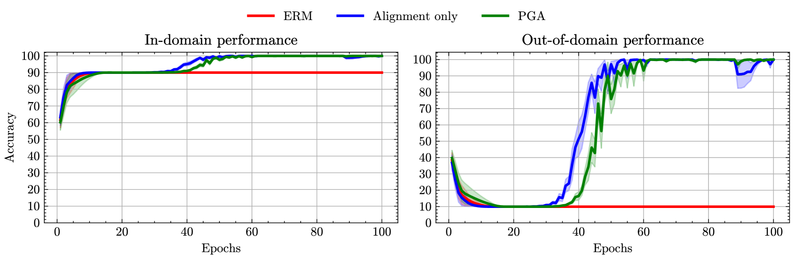
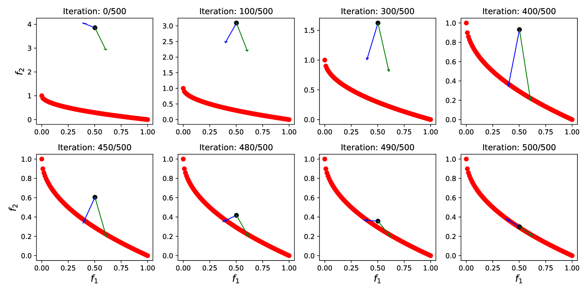

# 利用提示梯度对齐提升领域适应能力

发布时间：2024年06月13日

`RAG

理由：这篇论文主要讨论了无监督域适应（UDA）的方法，特别是通过提示学习来同时学习域不变和特定特征。这种方法涉及到在表示、输出或提示空间上施加不变性约束，以及通过多目标优化和对齐梯度来增强域之间的协同。这些内容与RAG（Retrieval-Augmented Generation）模型中的概念相似，即通过结合检索（retrieval）和生成（generation）来增强模型的性能和适应性。因此，这篇论文更适合归类于RAG。` `计算机视觉` `机器学习`

> Enhancing Domain Adaptation through Prompt Gradient Alignment

# 摘要

> 以往的无监督域适应（UDA）方法倾向于训练域不变特征提取器，这可能限制了模型学习判别性特征的能力。为此，一些研究采用提示学习，借助大规模预训练的视觉-语言模型，通过域无关和域特定的可学习提示，同时学习域不变和特定特征。这些研究通常通过在表示、输出或提示空间上施加不变性约束来实现。而我们则将UDA视为多目标优化问题，每个目标对应一个域损失，并通过对齐各目标梯度来增强它们之间的协同。为防止深度学习架构微调时的过拟合，我们引入了梯度范数的惩罚机制。我们设计的梯度更新策略适用于单源和多源UDA，并在多个UDA基准测试中显著优于其他基于提示的方法。

> Prior Unsupervised Domain Adaptation (UDA) methods often aim to train a domain-invariant feature extractor, which may hinder the model from learning sufficiently discriminative features. To tackle this, a line of works based on prompt learning leverages the power of large-scale pre-trained vision-language models to learn both domain-invariant and specific features through a set of domain-agnostic and domain-specific learnable prompts. Those studies typically enforce invariant constraints on representation, output, or prompt space to learn such prompts. Differently, we cast UDA as a multiple-objective optimization problem in which each objective is represented by a domain loss. Under this new framework, we propose aligning per-objective gradients to foster consensus between them. Additionally, to prevent potential overfitting when fine-tuning this deep learning architecture, we penalize the norm of these gradients. To achieve these goals, we devise a practical gradient update procedure that can work under both single-source and multi-source UDA. Empirically, our method consistently surpasses other prompt-based baselines by a large margin on different UDA benchmarks

[Arxiv](https://arxiv.org/abs/2406.09353)