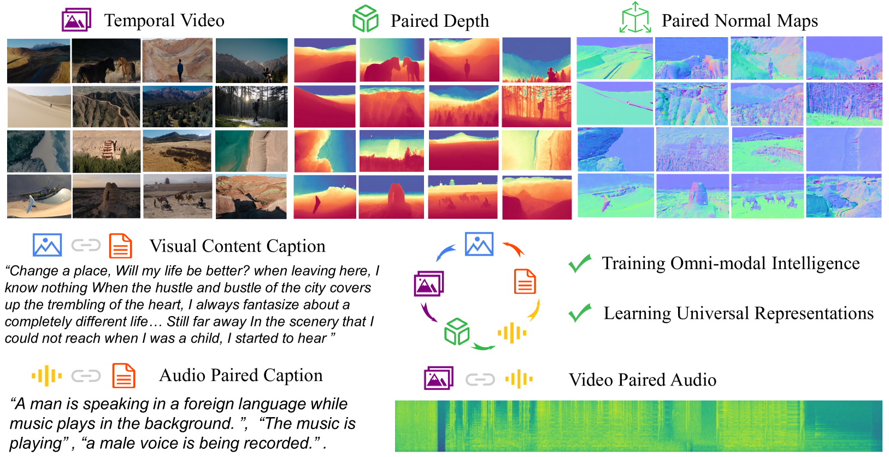
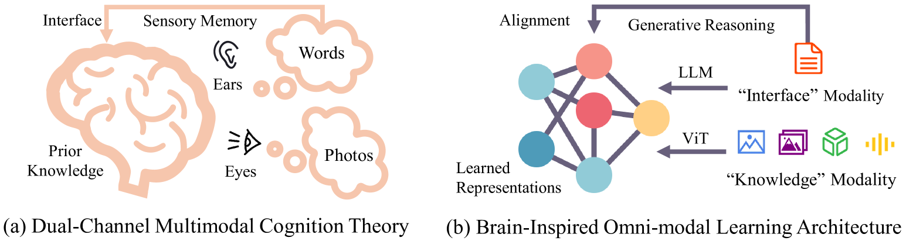
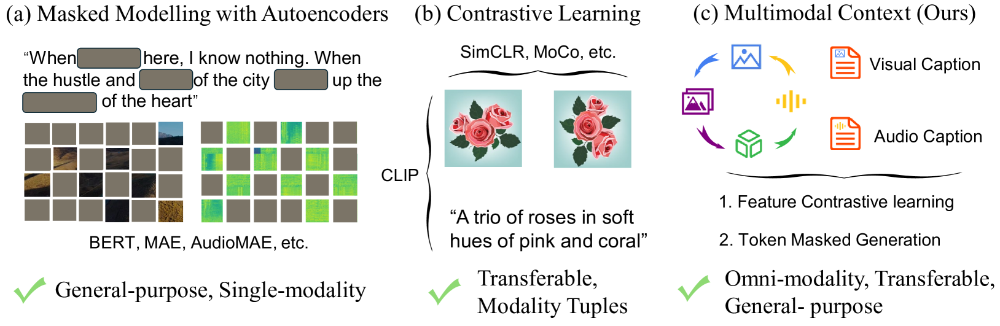
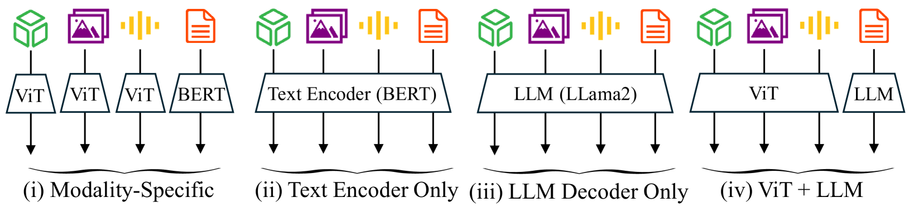
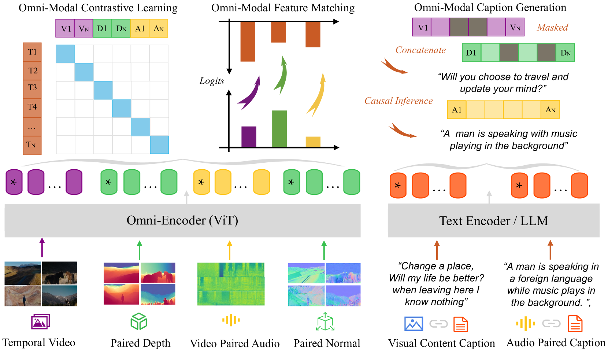
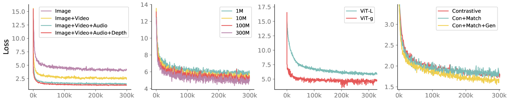

# 探究大规模下全模态预训练的边界

发布时间：2024年06月13日

`RAG

理由：这篇论文介绍了一种名为多模态上下文（MiCo）的预训练方法，该方法旨在构建全模态智能，即理解和学习各种模态的通用表示。这种方法在多模态学习领域展示了新的能力，并在多个跨模态理解任务和多模态大型语言模型基准中取得了显著的性能提升。因此，这篇论文更符合RAG（Retrieval-Augmented Generation）的分类，因为它涉及到了模型的预训练和增强，以及在多模态环境下的应用。` `人工智能` `多模态学习`

> Explore the Limits of Omni-modal Pretraining at Scale

# 摘要

> 我们提出了一种全模态智能的构建方案，旨在理解和学习各种模态的通用表示。为此，我们开发了一种名为多模态上下文（MiCo）的可扩展预训练方法，该方法在预训练阶段同步扩展了模态、数据和模型参数的数量。MiCo使得预训练模型在多模态学习领域展现出卓越的新能力，这些能力在包括10种模态的感知基准、25项跨模态理解任务（如检索、问答和标题生成）以及18项多模态大型语言模型基准中得到了验证。我们的模型刷新了37项最先进性能的记录。我们期待这项研究能推动全模态智能的进步，相关代码和模型已公开于https://github.com/invictus717/MiCo。

> We propose to build omni-modal intelligence, which is capable of understanding any modality and learning universal representations. In specific, we propose a scalable pretraining paradigm, named Multimodal Context (MiCo), which can scale up the numbers of modalities and amount of data, together with the model parameters, in the pretraining process. With MiCo, the pretrained models show significant emergent abilities in multimodal learning, which are evaluated on the following tasks: i) single-modality perception benchmarks of 10 different modalities, ii) 25 cross-modality understanding tasks of retrieval, question-answering, captioning, and iii) 18 multimodal large language model benchmarks. Our models establish 37 new records for state-of-the-art performance. We hope that our research could contribute to the development of omni-modal intelligence. Code and Models are at https://github.com/invictus717/MiCo

[Arxiv](https://arxiv.org/abs/2406.09412)