# 傅里叶低秩适应（FouRA）

发布时间：2024年06月13日

`LLM应用

这篇论文介绍了一种名为FouRA的创新方法，用于改进大型模型的微调过程，特别是在文本到图像扩散模型中。论文关注的是通过低秩方法在傅里叶域中学习投影，并采用了一种灵活的输入依赖适配器秩选择策略来解决图像生成中的多样性不足和数据复制问题。尽管这种方法是为视觉任务设计的，但它在语言任务中也显示出了优势。因此，这篇论文属于LLM应用类别，因为它专注于改进和应用大型语言模型（LLM）的技术，以提高其在特定任务上的性能。` `图像处理` `机器学习`

> FouRA: Fourier Low Rank Adaptation

# 摘要

> LoRA虽能高效微调大型模型，但其微调的文本到图像扩散模型生成的图像多样性不足，常模仿训练样本。特别是在适配器强度高和针对小数据集微调的高秩适配器中，这一问题更为突出。为此，我们开发了FouRA，一种创新的低秩方法，它不仅在傅里叶域中学习投影，还采用了一种灵活的输入依赖适配器秩选择策略。实验证明，FouRA有效解决了数据复制和分布崩溃问题，大幅提升了图像质量。其自适应秩选择策略增强了模型的泛化能力，且在频域中学到的投影在合并多个适配器时表现出色。虽然FouRA专为视觉任务设计，但它在GLUE基准的语言任务中也展现了其优势。

> While Low-Rank Adaptation (LoRA) has proven beneficial for efficiently fine-tuning large models, LoRA fine-tuned text-to-image diffusion models lack diversity in the generated images, as the model tends to copy data from the observed training samples. This effect becomes more pronounced at higher values of adapter strength and for adapters with higher ranks which are fine-tuned on smaller datasets. To address these challenges, we present FouRA, a novel low-rank method that learns projections in the Fourier domain along with learning a flexible input-dependent adapter rank selection strategy. Through extensive experiments and analysis, we show that FouRA successfully solves the problems related to data copying and distribution collapse while significantly improving the generated image quality. We demonstrate that FouRA enhances the generalization of fine-tuned models thanks to its adaptive rank selection. We further show that the learned projections in the frequency domain are decorrelated and prove effective when merging multiple adapters. While FouRA is motivated for vision tasks, we also demonstrate its merits for language tasks on the GLUE benchmark.

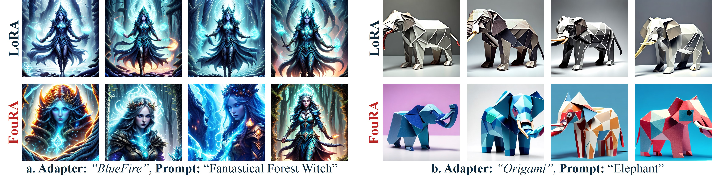

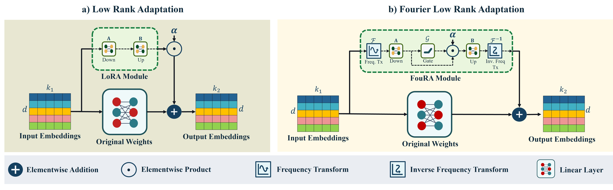

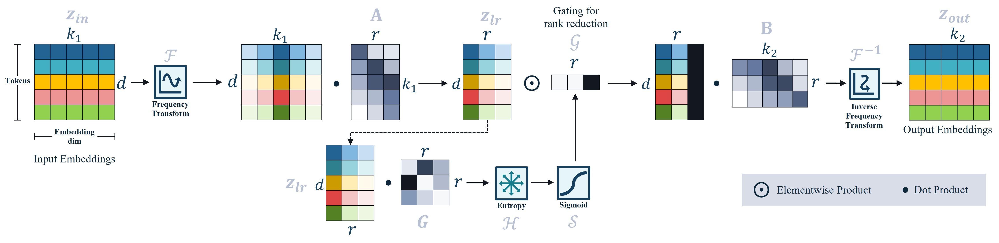

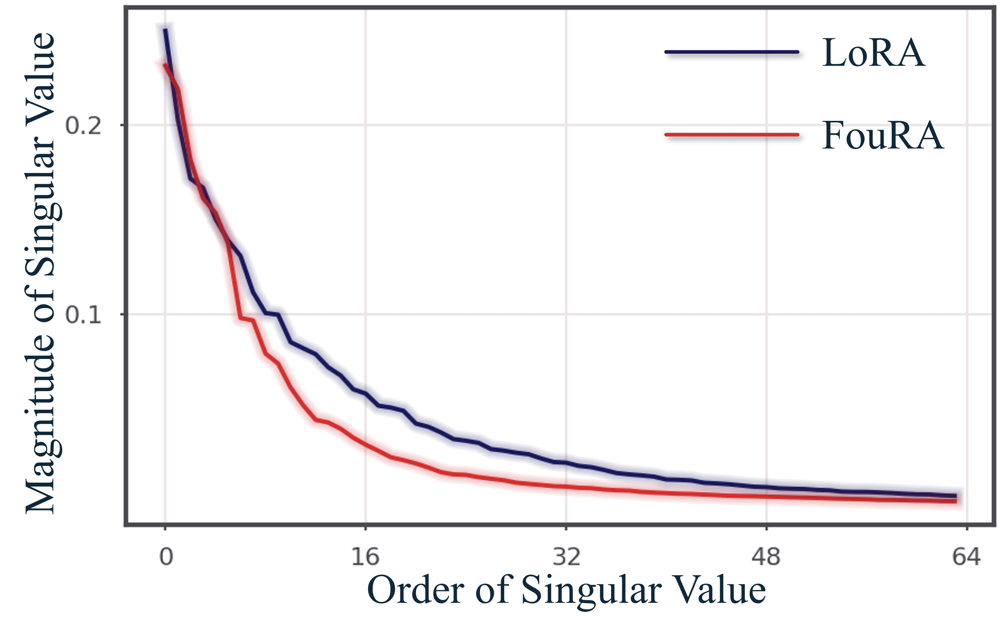

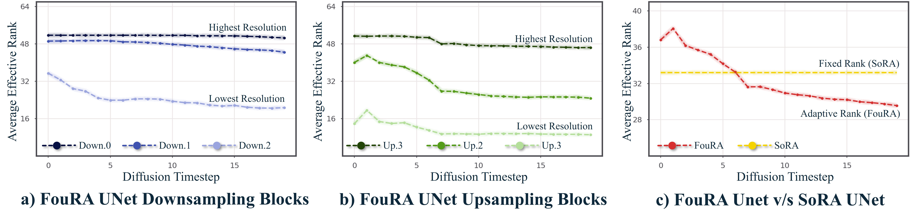

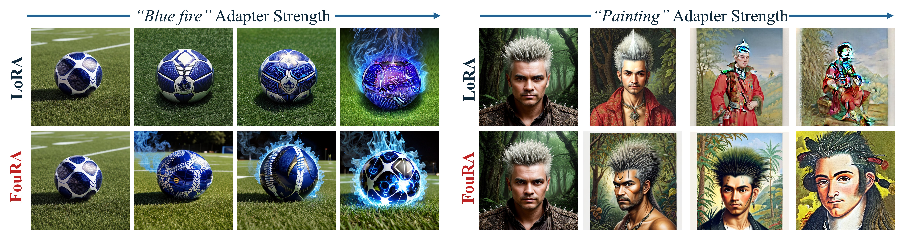

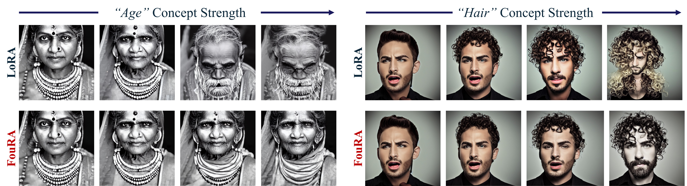

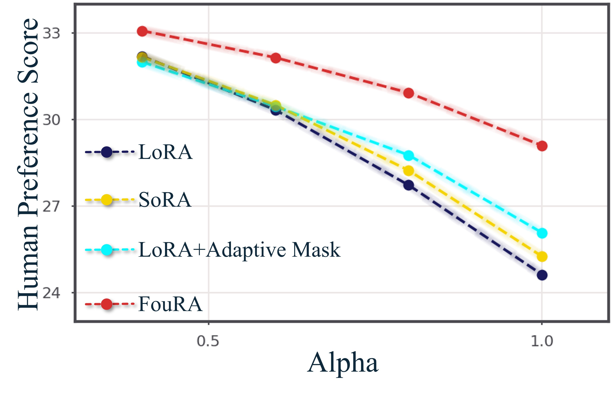

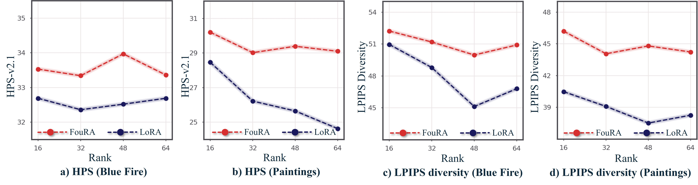

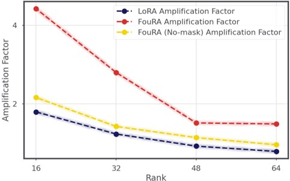

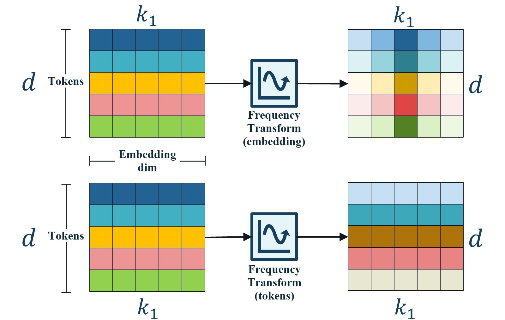

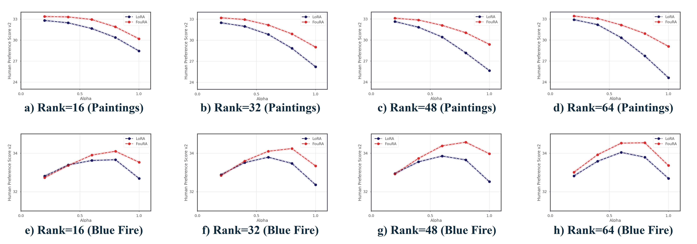

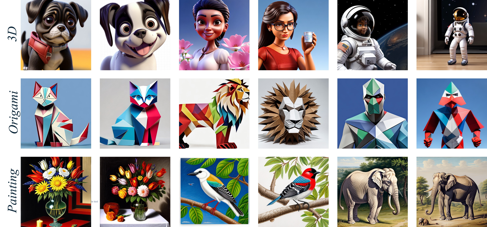

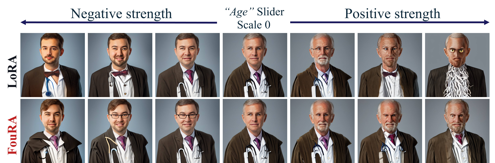

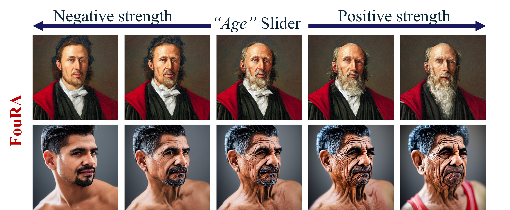

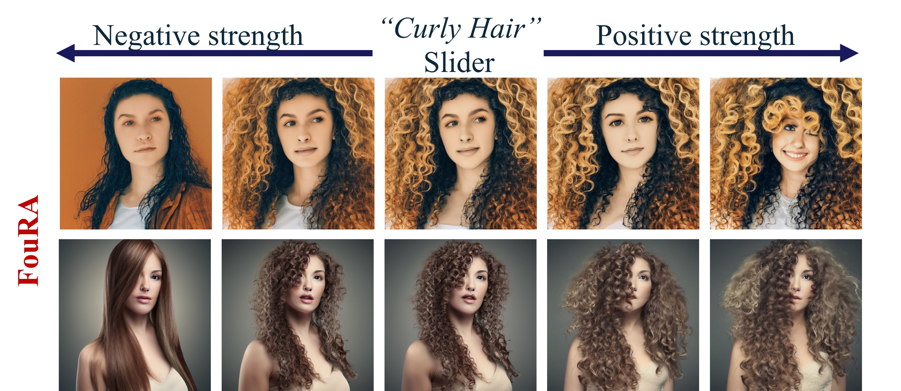

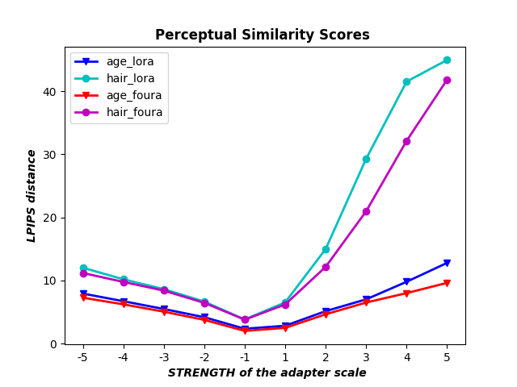

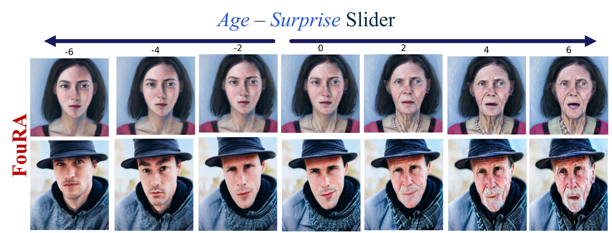

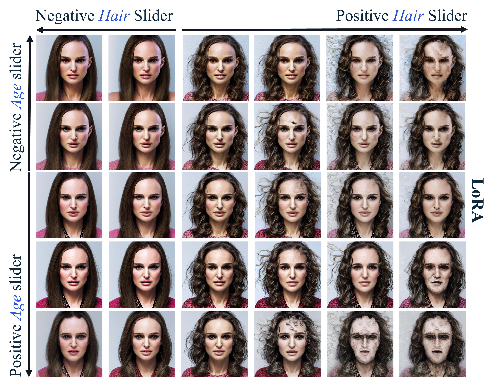

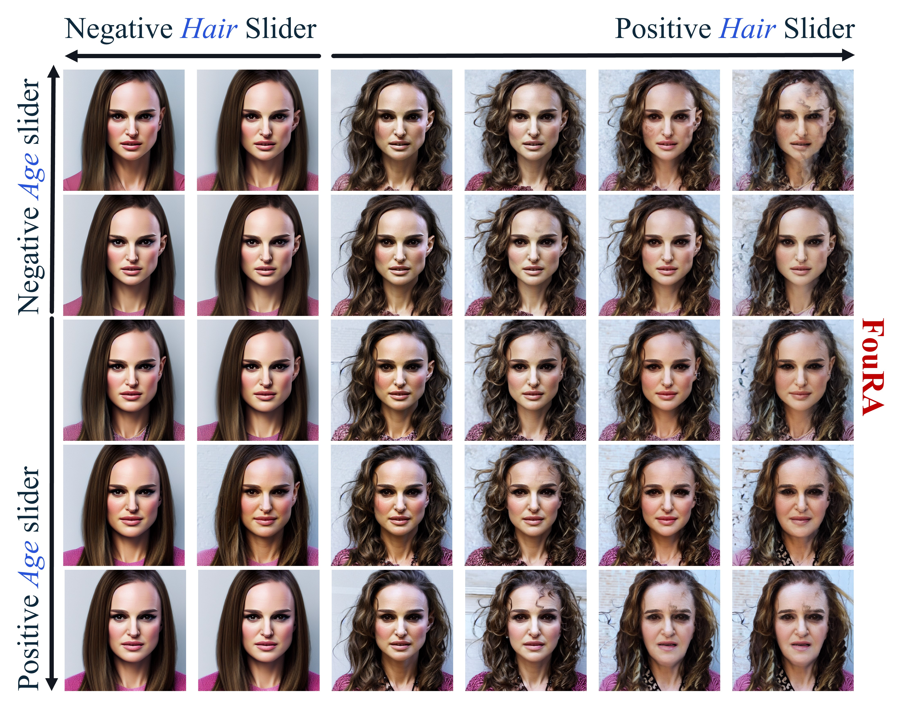

[Arxiv](https://arxiv.org/abs/2406.08798)