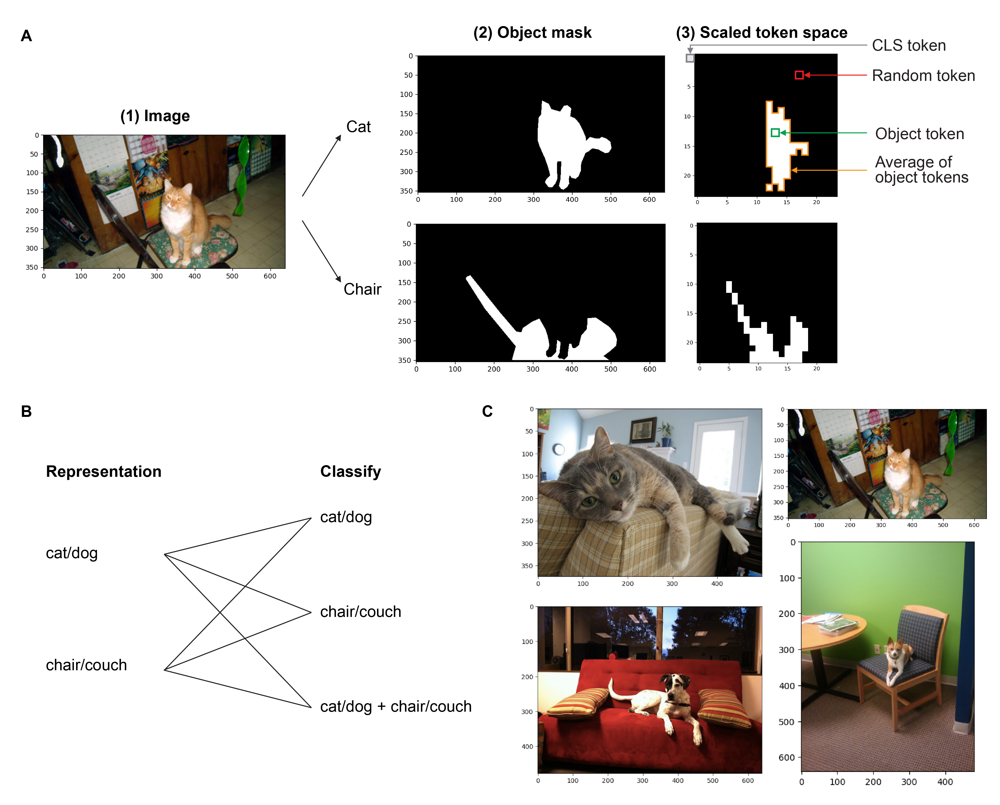
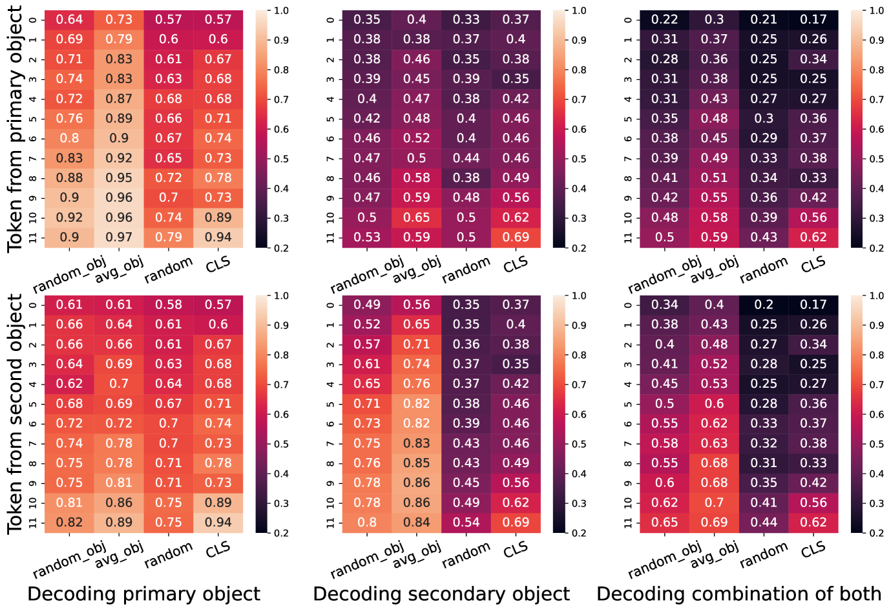
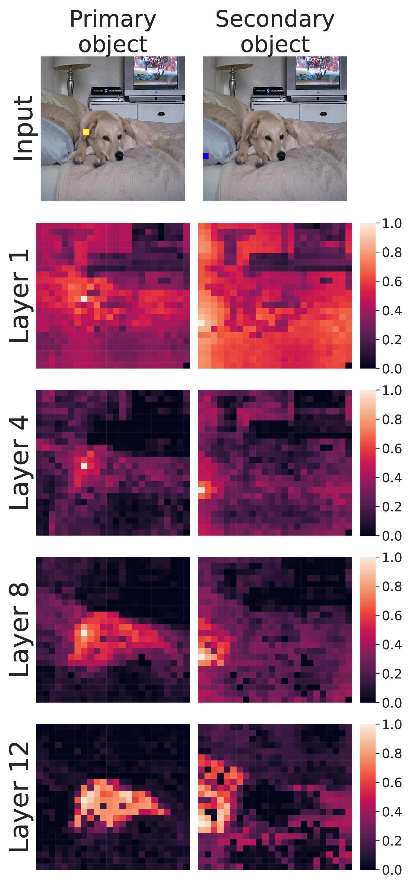
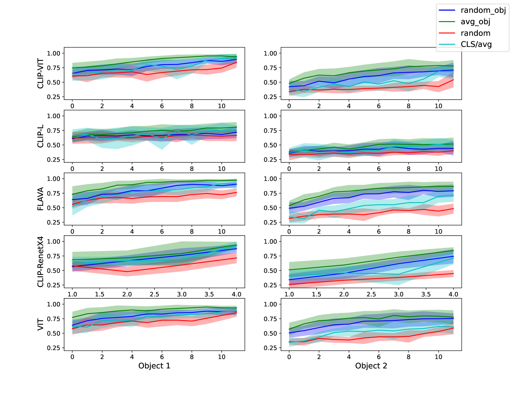
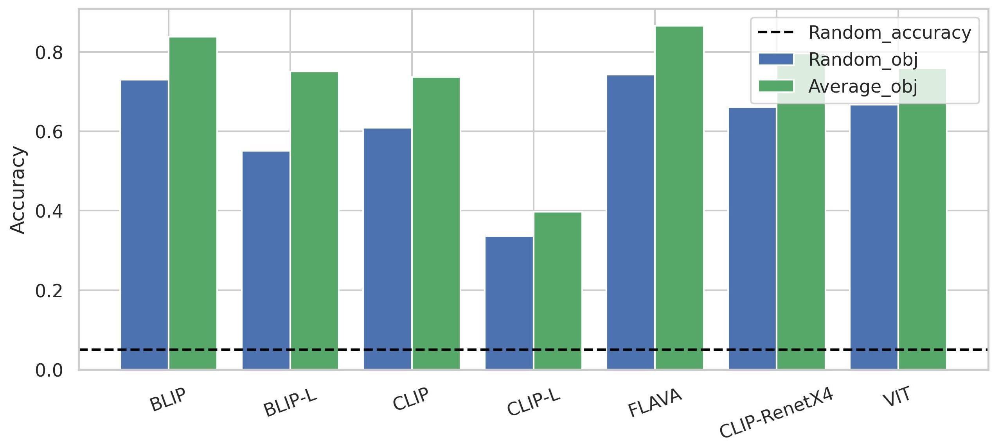
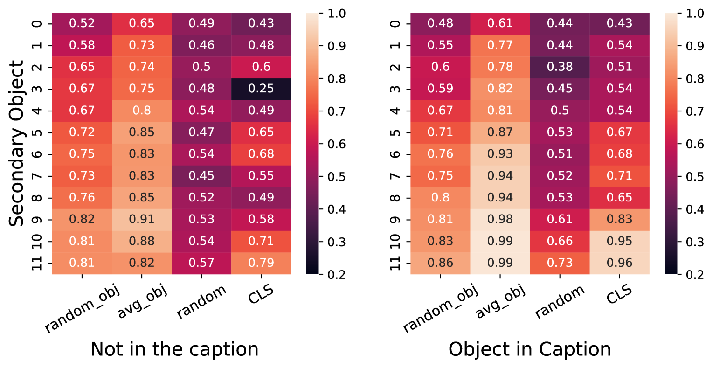
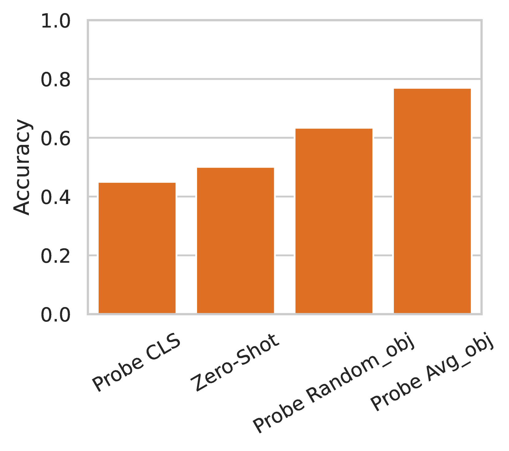

# Transformer视觉编码器中的表示结构化程度如何？本文深入探讨了视觉-语言模型中多对象表示的组织方式。

发布时间：2024年06月13日

`LLM应用

这篇论文主要关注大型视觉-语言预训练模型中的图像编码器的结构化表示，并分析了这些表示在符号结构化推理方面的性能。研究通过测试多个模型的表示空间，并使用COCO数据集进行解码任务，来评估这些模型在处理多对象场景时的表现。虽然论文涉及了模型的内部表示和推理能力，但其核心关注点在于模型的应用层面，即如何通过分析和改进模型的结构化表示来提高其在特定任务上的性能。因此，这篇论文更适合归类为LLM应用。` `计算机视觉`

> How structured are the representations in transformer-based vision encoders? An analysis of multi-object representations in vision-language models

# 摘要

> 在视觉编码器中，形成和使用类似符号的结构化表示对于推理和泛化新输入至关重要。本研究评估了大型视觉-语言预训练模型中图像编码器的结构化表示状态，并探讨了它们在符号结构化推理方面的不足。我们通过测试VIT、BLIP、CLIP和FLAVA等模型的表示空间，并使用COCO数据集中的多对象场景进行解码任务，来分析对象表示的分布。研究发现，尽管用于下游任务的CLS令牌仅关注特定对象，但网络中的其他令牌能够单独准确地表示各个对象。然而，场景信息的广泛分布表明，信息在令牌中的纠缠程度高于理想的符号表示。这些发现揭示了模型在处理多对象场景下游任务时可能遇到的失败模式。

> Forming and using symbol-like structured representations for reasoning has been considered essential for generalising over novel inputs. The primary tool that allows generalisation outside training data distribution is the ability to abstract away irrelevant information into a compact form relevant to the task. An extreme form of such abstract representations is symbols. Humans make use of symbols to bind information while abstracting away irrelevant parts to utilise the information consistently and meaningfully. This work estimates the state of such structured representations in vision encoders. Specifically, we evaluate image encoders in large vision-language pre-trained models to address the question of which desirable properties their representations lack by applying the criteria of symbolic structured reasoning described for LLMs to the image models. We test the representation space of image encoders like VIT, BLIP, CLIP, and FLAVA to characterise the distribution of the object representations in these models. In particular, we create decoding tasks using multi-object scenes from the COCO dataset, relating the token space to its input content for various objects in the scene. We use these tasks to characterise the network's token and layer-wise information modelling. Our analysis highlights that the CLS token, used for the downstream task, only focuses on a few objects necessary for the trained downstream task. Still, other individual objects are well-modelled separately by the tokens in the network originating from those objects. We further observed a widespread distribution of scene information. This demonstrates that information is far more entangled in tokens than optimal for representing objects similar to symbols. Given these symbolic properties, we show the network dynamics that cause failure modes of these models on basic downstream tasks in a multi-object scene.

[Arxiv](https://arxiv.org/abs/2406.09067)