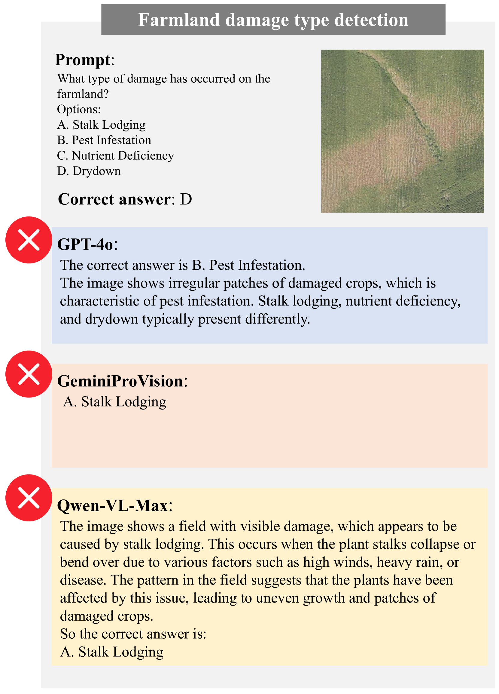

# INS-MMBench：全面检验大型视觉语言模型在保险行业表现的综合基准

发布时间：2024年06月13日

`LLM应用

理由：这篇论文主要关注大型视觉-语言模型（LVLMs）在保险领域的应用，特别是通过创建一个专门的基准（INS-MMBench）来评估和分析这些模型在多模态任务上的表现。论文的重点在于实际应用和评估，而不是理论探讨或Agent的设计与实现，因此最合适的分类是LLM应用。` `多模态任务`

> INS-MMBench: A Comprehensive Benchmark for Evaluating LVLMs' Performance in Insurance

# 摘要

> 大型视觉-语言模型（LVLMs）在图像识别和视觉推理等通用多模态应用中表现卓越，且在特定领域展现出潜力。然而，其在保险领域的应用潜力——这一领域场景丰富、数据多模态——尚未充分挖掘。保险领域缺乏对多模态任务的系统分析，也缺少专门评估LVLMs能力的基准。为此，本文系统梳理了汽车保险、财产保险、健康保险和农业保险四大类保险的多模态任务，并推出了首个保险领域专用的LVLMs基准——INS-MMBench。该基准包含2.2K精心设计的多选题，覆盖12个元任务和22个基础任务。我们评估了包括GPT-4o在内的多个LVLMs，以及开源模型如BLIP-2，不仅验证了基准的有效性，还深入分析了LVLMs在保险领域多模态任务上的表现。我们期待INS-MMBench能推动LVLMs在保险领域的应用，并促进跨学科发展。相关数据集和评估代码已公开于https://github.com/FDU-INS/INS-MMBench。

> Large Vision-Language Models (LVLMs) have demonstrated outstanding performance in various general multimodal applications such as image recognition and visual reasoning, and have also shown promising potential in specialized domains. However, the application potential of LVLMs in the insurance domain-characterized by rich application scenarios and abundant multimodal data-has not been effectively explored. There is no systematic review of multimodal tasks in the insurance domain, nor a benchmark specifically designed to evaluate the capabilities of LVLMs in insurance. This gap hinders the development of LVLMs within the insurance domain. In this paper, we systematically review and distill multimodal tasks for four representative types of insurance: auto insurance, property insurance, health insurance, and agricultural insurance. We propose INS-MMBench, the first comprehensive LVLMs benchmark tailored for the insurance domain. INS-MMBench comprises a total of 2.2K thoroughly designed multiple-choice questions, covering 12 meta-tasks and 22 fundamental tasks. Furthermore, we evaluate multiple representative LVLMs, including closed-source models such as GPT-4o and open-source models like BLIP-2. This evaluation not only validates the effectiveness of our benchmark but also provides an in-depth performance analysis of current LVLMs on various multimodal tasks in the insurance domain. We hope that INS-MMBench will facilitate the further application of LVLMs in the insurance domain and inspire interdisciplinary development. Our dataset and evaluation code are available at https://github.com/FDU-INS/INS-MMBench.

[Arxiv](https://arxiv.org/abs/2406.09105)