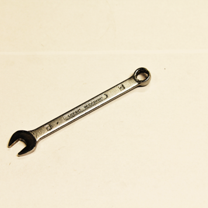

# 工业场景下的视觉基础模型适配：工业语言-图像数据集（ILID）探索

发布时间：2024年06月13日

`RAG

这篇论文主要关注的是在工业领域中利用大型语言模型（LLM）和计算机视觉技术进行自监督或半监督学习，特别是通过开发一个流程来生成工业语言-图像数据集（ILID），并展示了基于ILID的自监督迁移学习。这种方法不需要人工标注，能够有效应对工业领域的特定挑战。因此，这篇论文更符合RAG（检索增强生成）分类，因为它涉及到了多模态数据集的生成和应用，以及在特定领域（工业）中的迁移学习策略。` `计算机视觉`

> Industrial Language-Image Dataset (ILID): Adapting Vision Foundation Models for Industrial Settings

# 摘要

> 近年来，大型语言模型的发展也推动了计算机视觉领域对大规模多模态数据集的探索，采用自监督或半监督方法训练模型，如CLIP，这些模型在日常场景中表现卓越，甚至在未训练的下游任务上也有出色表现。但在工业等特定领域的应用仍是一个待解之谜。为此，我们开发了一个流程，利用网络数据生成工业语言-图像数据集（ILID），并展示了基于ILID的自监督迁移学习，无需人工标注，有效应对工业领域的挑战。我们的工作将最新研究成果，包括基础模型、迁移学习策略及应用，成功引入工业界，为该领域的发展贡献了力量。

> In recent years, the upstream of Large Language Models (LLM) has also encouraged the computer vision community to work on substantial multimodal datasets and train models on a scale in a self-/semi-supervised manner, resulting in Vision Foundation Models (VFM), as, e.g., Contrastive Language-Image Pre-training (CLIP). The models generalize well and perform outstandingly on everyday objects or scenes, even on downstream tasks, tasks the model has not been trained on, while the application in specialized domains, as in an industrial context, is still an open research question. Here, fine-tuning the models or transfer learning on domain-specific data is unavoidable when objecting to adequate performance. In this work, we, on the one hand, introduce a pipeline to generate the Industrial Language-Image Dataset (ILID) based on web-crawled data; on the other hand, we demonstrate effective self-supervised transfer learning and discussing downstream tasks after training on the cheaply acquired ILID, which does not necessitate human labeling or intervention. With the proposed approach, we contribute by transferring approaches from state-of-the-art research around foundation models, transfer learning strategies, and applications to the industrial domain.

[Arxiv](https://arxiv.org/abs/2406.09637)