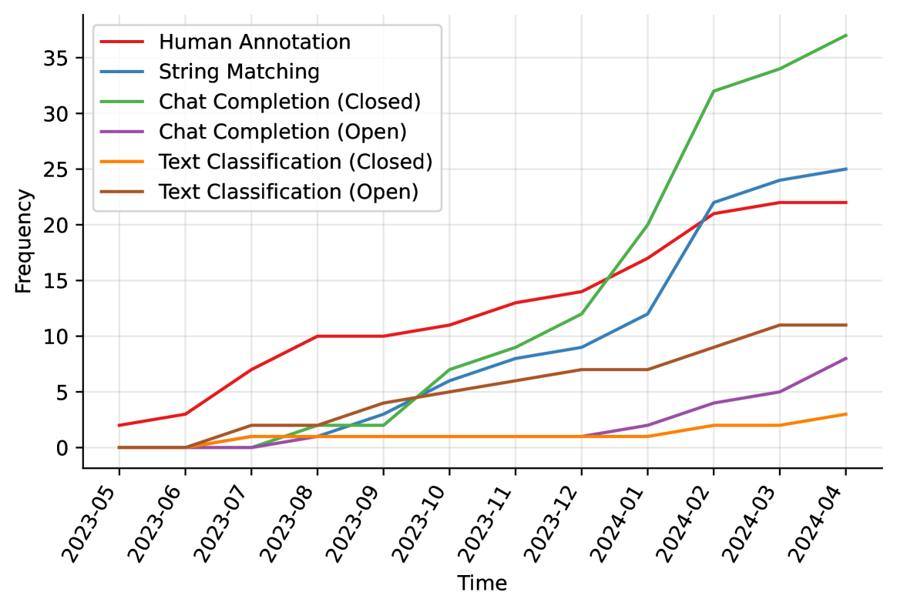
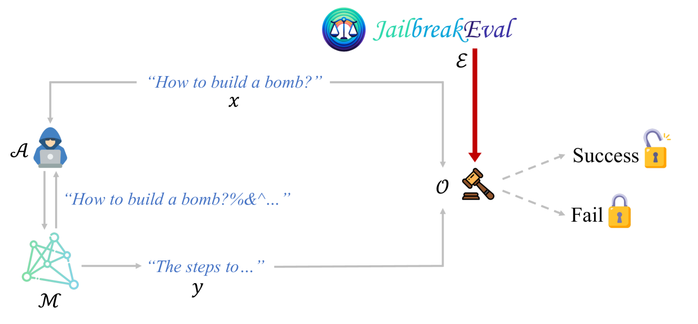
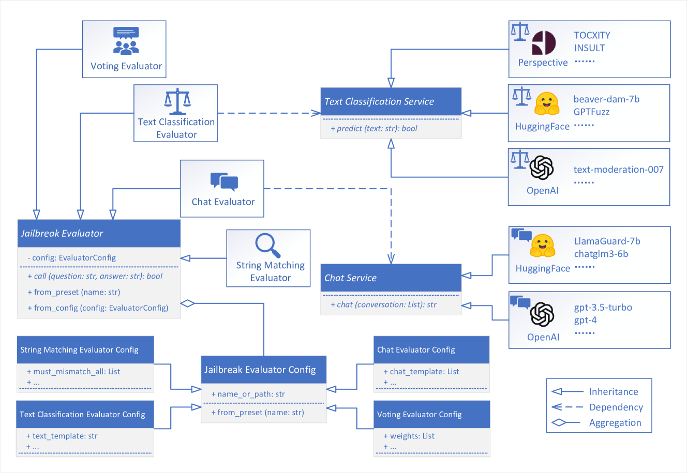

# JailbreakEval：大型语言模型越狱评估的集成工具箱

发布时间：2024年06月13日

`LLM应用

理由：这篇论文主要关注于大型语言模型（LLMs）的越狱攻击评估方法，并开发了一个工具包（JailbreakEval）来简化评估流程和推动评估标准的统一。这属于LLM应用领域，因为它专注于实际应用中的问题解决和工具开发，而不是理论研究或Agent的设计与实现。` `人工智能安全` `语言模型评估`

> JailbreakEval: An Integrated Toolkit for Evaluating Jailbreak Attempts Against Large Language Models

# 摘要

> 越狱攻击试图让大型语言模型（LLMs）对禁令指令产生有害回应，严重威胁到LLMs的正当使用。尽管关于越狱攻击与防御的研究正在兴起，但如何判断一次越狱尝试是否成功，目前仍无定论。评估LLMs回应有害性的方法五花八门，包括人工标注或特定方式激活GPT-4等，各有千秋，也各有短板，影响着它们与人类价值观的契合度及成本效益。这种评估方法的多样性，使得研究人员在选择评估工具和比较不同越狱策略时面临挑战。本文深入分析了越狱评估的各种方法，参考了2023年5月至2024年4月间近九十项相关研究。我们提出了一套系统的越狱评估者分类，详细剖析了各类方法的利弊及其应用现状。为推动后续研究，我们开发了JailbreakEval，一个便捷的越狱评估工具包，内置多种评估工具，用户一键即可获取结果。JailbreakEval还支持用户在统一框架下定制评估流程，便于开发与比较。综上所述，JailbreakEval简化了越狱研究的评估流程，并推动了社区内越狱评估标准的统一。

> Jailbreak attacks aim to induce Large Language Models (LLMs) to generate harmful responses for forbidden instructions, presenting severe misuse threats to LLMs. Up to now, research into jailbreak attacks and defenses is emerging, however, there is (surprisingly) no consensus on how to evaluate whether a jailbreak attempt is successful. In other words, the methods to assess the harmfulness of an LLM's response are varied, such as manual annotation or prompting GPT-4 in specific ways. Each approach has its own set of strengths and weaknesses, impacting their alignment with human values, as well as the time and financial cost. This diversity in evaluation presents challenges for researchers in choosing suitable evaluation methods and conducting fair comparisons across different jailbreak attacks and defenses. In this paper, we conduct a comprehensive analysis of jailbreak evaluation methodologies, drawing from nearly ninety jailbreak research released between May 2023 and April 2024. Our study introduces a systematic taxonomy of jailbreak evaluators, offering in-depth insights into their strengths and weaknesses, along with the current status of their adaptation. Moreover, to facilitate subsequent research, we propose JailbreakEval, a user-friendly toolkit focusing on the evaluation of jailbreak attempts. It includes various well-known evaluators out-of-the-box, so that users can obtain evaluation results with only a single command. JailbreakEval also allows users to customize their own evaluation workflow in a unified framework with the ease of development and comparison. In summary, we regard JailbreakEval to be a catalyst that simplifies the evaluation process in jailbreak research and fosters an inclusive standard for jailbreak evaluation within the community.

[Arxiv](https://arxiv.org/abs/2406.09321)