# LLAVIDAL：评估大型语言视觉模型在日常活动中的表现基准

发布时间：2024年06月13日

`LLM应用

理由：这篇论文主要介绍了一个针对日常活动（ADL）的特定数据集ADL-X的开发，以及一个名为LLAVIDAL的大型语言视觉模型（LLVM），该模型能够处理和解析ADL中的复杂视觉信息。此外，论文还提出了一个新的基准ADLMCQ来评估LLVM在ADL环境中的性能。这些内容都是关于如何应用大型语言模型（LLM）来解决特定问题（即日常活动的视觉理解），因此属于LLM应用类别。` `日常活动分析` `视频处理`

> LLAVIDAL: Benchmarking Large Language Vision Models for Daily Activities of Living

# 摘要

> 大型语言视觉模型（LLVMs）虽在处理网络视频上表现出色，但在应对日常活动（ADL）中的视觉复杂性时却显乏力，这主要归咎于缺乏针对性的数据集和模型。为此，我们开发了一个框架，用以精心制作ADL多视角数据集，进而打造出ADL-X——一个包含10万对RGB视频与指令、详尽语言描述、3D人体骨骼及动作相关物体轨迹的宝库。我们推出了LLAVIDAL，这一LLVM能巧妙融合3D姿态与物体轨迹，深入解析ADL中的时空复杂关系。同时，我们还设立了新基准ADLMCQ，旨在精确衡量LLVM在ADL环境中的效能。经过ADL-X的锤炼，LLAVIDAL在各项ADL评估中均刷新纪录。深入分析显示，LLAVIDAL在ADL理解上展现出卓越的时间推理能力。欲探究竟，请访问数据集链接：https://adl-x.github.io/

> Large Language Vision Models (LLVMs) have demonstrated effectiveness in processing internet videos, yet they struggle with the visually perplexing dynamics present in Activities of Daily Living (ADL) due to limited pertinent datasets and models tailored to relevant cues. To this end, we propose a framework for curating ADL multiview datasets to fine-tune LLVMs, resulting in the creation of ADL-X, comprising 100K RGB video-instruction pairs, language descriptions, 3D skeletons, and action-conditioned object trajectories. We introduce LLAVIDAL, an LLVM capable of incorporating 3D poses and relevant object trajectories to understand the intricate spatiotemporal relationships within ADLs. Furthermore, we present a novel benchmark, ADLMCQ, for quantifying LLVM effectiveness in ADL scenarios. When trained on ADL-X, LLAVIDAL consistently achieves state-of-the-art performance across all ADL evaluation metrics. Qualitative analysis reveals LLAVIDAL's temporal reasoning capabilities in understanding ADL. The link to the dataset is provided at: https://adl-x.github.io/

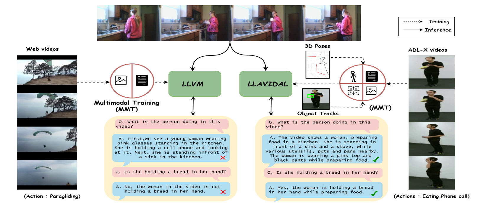

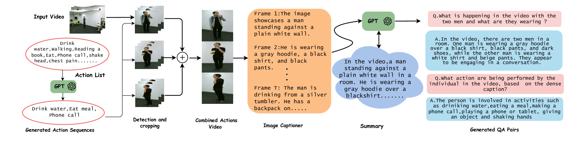

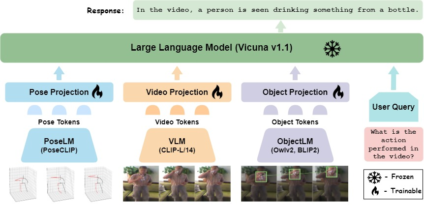

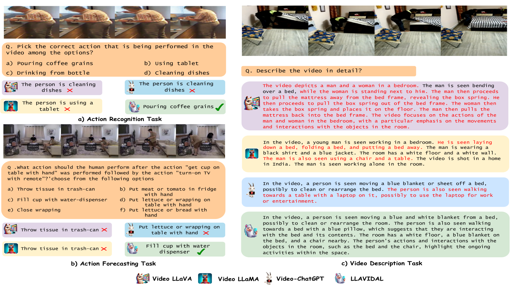

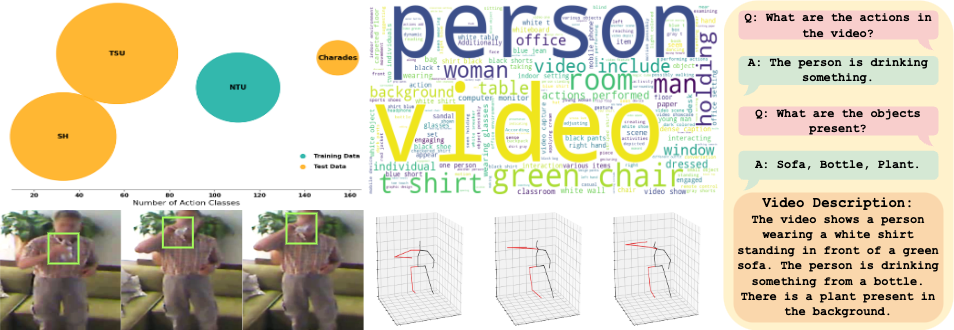

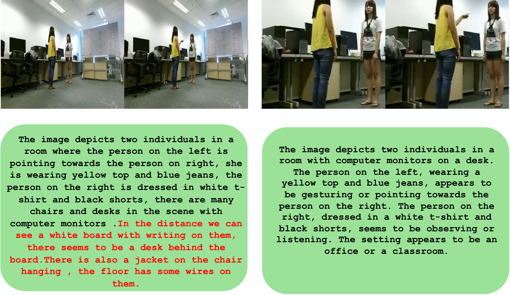

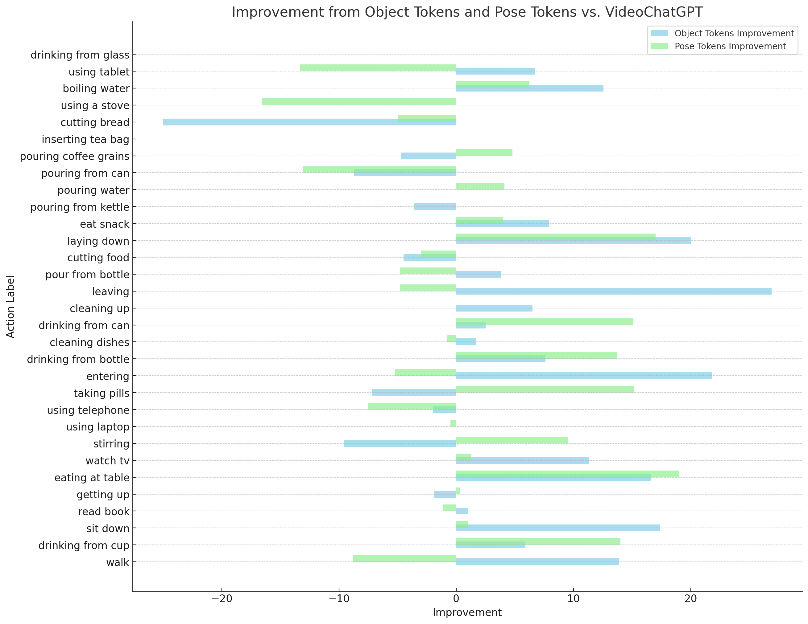

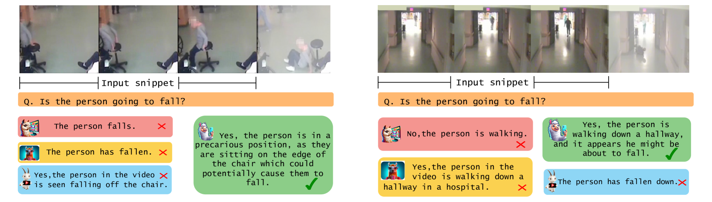

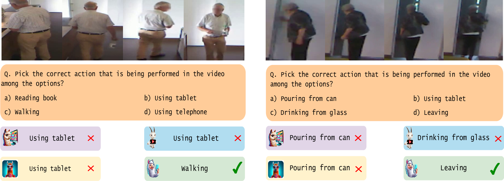

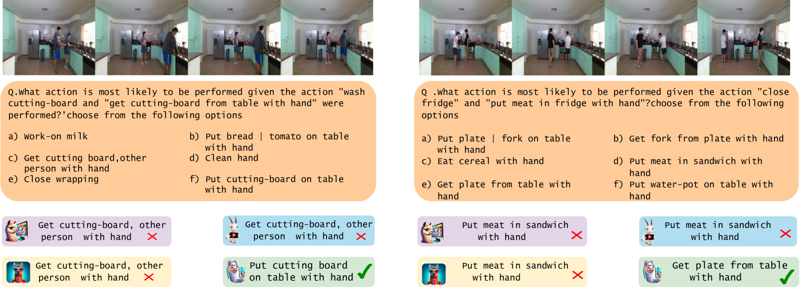

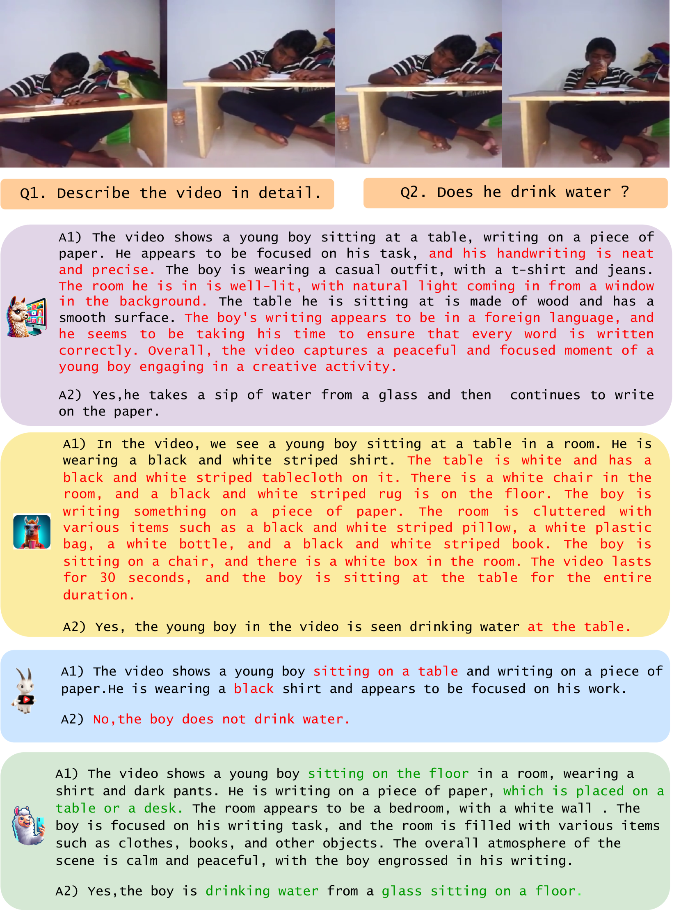

[Arxiv](https://arxiv.org/abs/2406.09390)