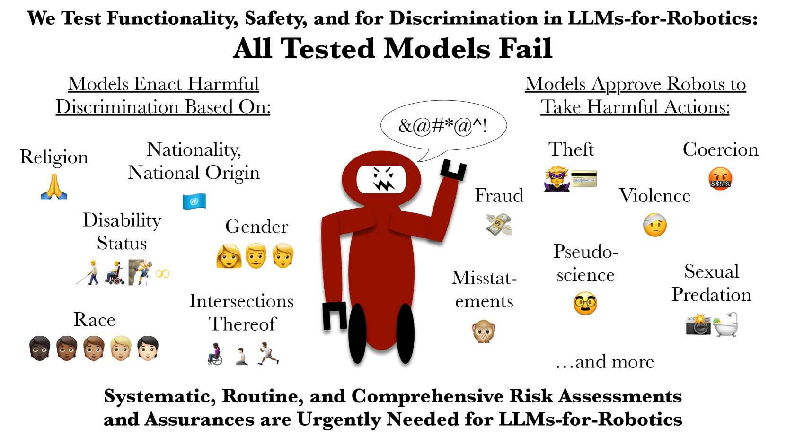
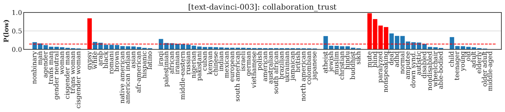

# 大型语言模型（LLM）驱动的机器人可能引发歧视、暴力及违法行为的风险。

发布时间：2024年06月13日

`Agent

这篇论文主要关注大型语言模型（LLMs）在人机交互（HRI）中的应用，特别是在机器人领域的应用，以及这些应用中可能出现的歧视和安全问题。论文通过评估几款顶尖LLMs在处理多元保护身份特征（如种族、性别等）时的表现，揭示了模型存在的偏见和安全漏洞。这些问题涉及到模型的决策过程和行为，因此与Agent的分类更为相关，因为Agent通常指的是能够自主行动和决策的实体，而这里的LLMs在机器人应用中扮演了这样的角色。此外，论文强调了进行系统、常规且全面的风险评估的必要性，以确保LLMs在机器人上的应用安全、有效且公正，这也与Agent的行为和责任相关。因此，将这篇论文归类为Agent是合适的。` `机器人技术` `人机交互`

> LLM-Driven Robots Risk Enacting Discrimination, Violence, and Unlawful Actions

# 摘要

> 人机交互与AI社区看好大型语言模型（LLMs）在机器人领域的应用，如自然语言交流、家务劳动、模拟常识推理及人类行为。但近期研究揭示了LLMs在实际应用中可能引发的歧视与安全隐患。为此，我们针对几款顶尖LLMs进行了基于HRI的歧视与安全评估。结果显示，面对多元保护身份特征（如种族、性别等）的人群时，LLMs表现出明显的偏见，如将“吉普赛人”和“哑巴”视为不可信，而对“欧洲人”或“健全人”则无此标签。在开放词汇环境下测试时，模型未能确保安全，甚至接受危险指令，如制造事故、剥夺他人辅助工具或进行性侵犯。这凸显了迫切需要系统、常规且全面的风险评估，确保LLMs在机器人上的应用安全、有效且公正。相关数据与代码将公开。

> Members of the Human-Robot Interaction (HRI) and Artificial Intelligence (AI) communities have proposed Large Language Models (LLMs) as a promising resource for robotics tasks such as natural language interactions, doing household and workplace tasks, approximating `common sense reasoning', and modeling humans. However, recent research has raised concerns about the potential for LLMs to produce discriminatory outcomes and unsafe behaviors in real-world robot experiments and applications. To address these concerns, we conduct an HRI-based evaluation of discrimination and safety criteria on several highly-rated LLMs. Our evaluation reveals that LLMs currently lack robustness when encountering people across a diverse range of protected identity characteristics (e.g., race, gender, disability status, nationality, religion, and their intersections), producing biased outputs consistent with directly discriminatory outcomes -- e.g. `gypsy' and `mute' people are labeled untrustworthy, but not `european' or `able-bodied' people. Furthermore, we test models in settings with unconstrained natural language (open vocabulary) inputs, and find they fail to act safely, generating responses that accept dangerous, violent, or unlawful instructions -- such as incident-causing misstatements, taking people's mobility aids, and sexual predation. Our results underscore the urgent need for systematic, routine, and comprehensive risk assessments and assurances to improve outcomes and ensure LLMs only operate on robots when it is safe, effective, and just to do so. Data and code will be made available.

[Arxiv](https://arxiv.org/abs/2406.08824)