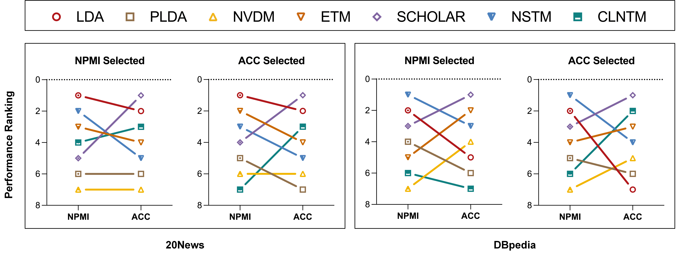
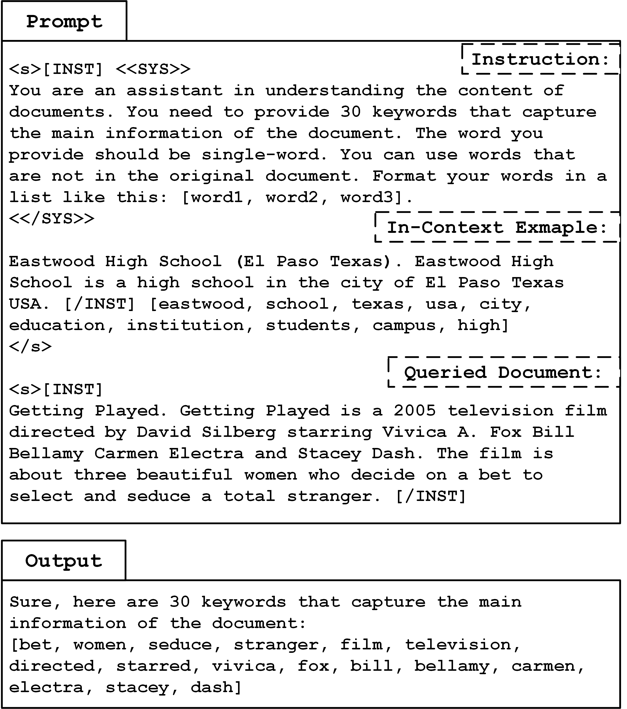
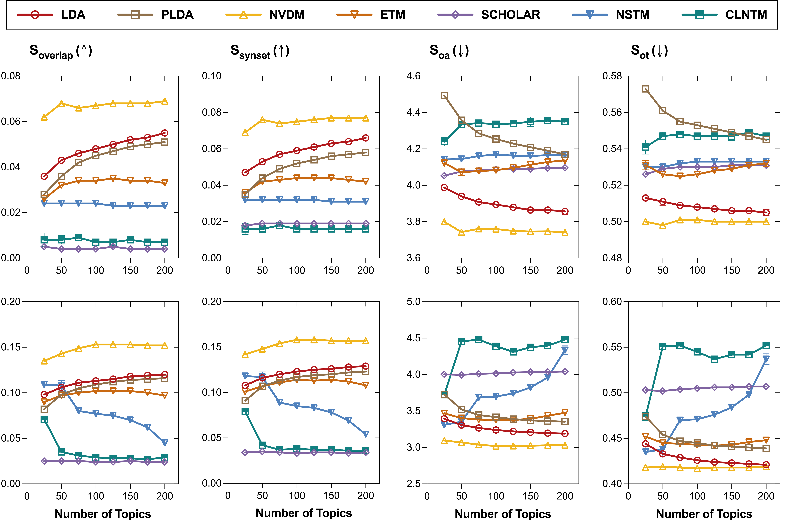
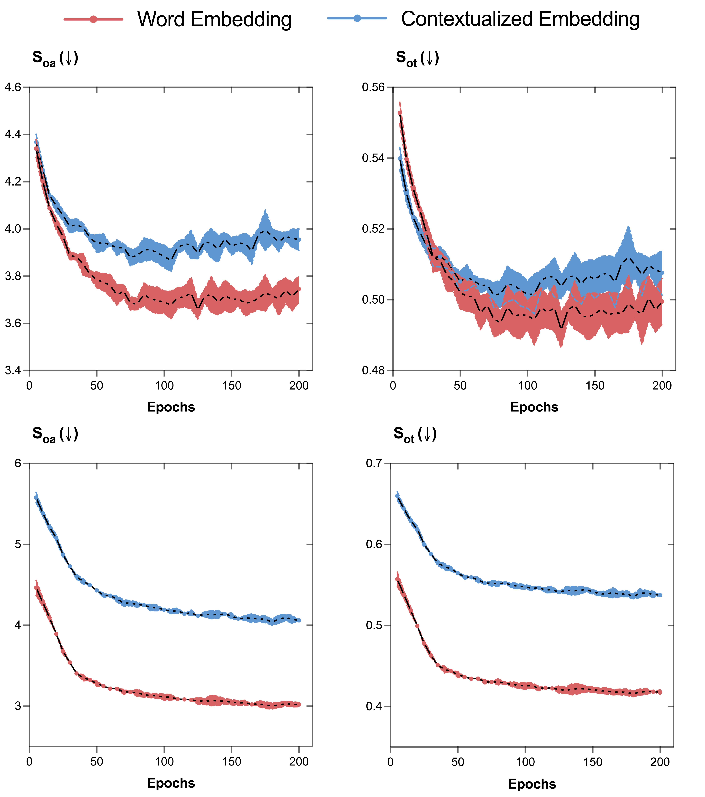

# 大型语言模型解读主题脉络：利用大型语言模型自动评估主题模型的有效性

发布时间：2024年06月13日

`LLM应用

这篇论文摘要介绍了一种新的评估方法WALM，该方法结合了大型语言模型（LLMs）的力量来全面评估主题建模的性能。这种方法旨在解决现有评估方法的局限性，如缺乏跨模型比较性和仅关注单一维度的问题。WALM通过实验验证，显示了与人类判断的契合度，并能作为现有评估方法的补充，为主题建模领域提供新的洞察。此外，论文还提到了将软件包公开在GitHub上，以便与主流主题模型集成使用。因此，这篇论文属于LLM应用类别，因为它展示了如何应用LLM技术来改进现有的文本分析工具和方法。` `文本分析` `主题建模`

> LLM Reading Tea Leaves: Automatically Evaluating Topic Models with Large Language Models

# 摘要

> 主题建模在无监督文本分析中扮演着重要角色，但其全面评估仍是一大挑战。现有评估方法要么缺乏跨模型比较性，要么仅关注单一维度，难以全面衡量模型性能。为此，我们提出了WALM（Words Agreement with Language Model），一种结合大型语言模型（LLMs）力量的新评估方法，旨在全面评估文档表示与主题的语义质量。通过多样的实验验证，WALM不仅与人类判断相契合，还能作为现有评估方法的有力补充，为主题建模领域带来新的洞察。我们的软件包将在https://github.com/Xiaohao-Yang/Topic_Model_Evaluation上线，便于与主流主题模型集成使用。

> Topic modeling has been a widely used tool for unsupervised text analysis. However, comprehensive evaluations of a topic model remain challenging. Existing evaluation methods are either less comparable across different models (e.g., perplexity) or focus on only one specific aspect of a model (e.g., topic quality or document representation quality) at a time, which is insufficient to reflect the overall model performance. In this paper, we propose WALM (Words Agreement with Language Model), a new evaluation method for topic modeling that comprehensively considers the semantic quality of document representations and topics in a joint manner, leveraging the power of large language models (LLMs). With extensive experiments involving different types of topic models, WALM is shown to align with human judgment and can serve as a complementary evaluation method to the existing ones, bringing a new perspective to topic modeling. Our software package will be available at https://github.com/Xiaohao-Yang/Topic_Model_Evaluation, which can be integrated with many widely used topic models.

[Arxiv](https://arxiv.org/abs/2406.09008)