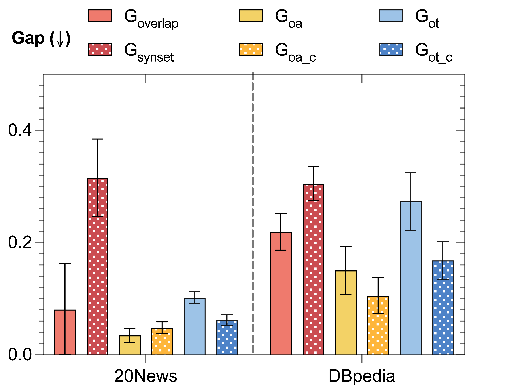

# 大型语言模型解读茶叶：利用大型语言模型自动评估主题模型的有效性

发布时间：2024年06月13日

`LLM应用

这篇论文介绍了一种新的评估方法WALM，用于全面评估主题建模的性能。该方法利用大型语言模型（LLMs）来考量文档表示与主题的语义质量，并通过实验展示了与人类判断的一致性。这种方法的提出和应用直接关联到LLM的实际应用场景，即在主题建模评估中的应用，因此属于LLM应用分类。` `文本分析` `主题建模`

> LLM Reading Tea Leaves: Automatically Evaluating Topic Models with Large Language Models

# 摘要

> 主题建模在无监督文本分析中应用广泛，但其全面评估仍是一大挑战。现有评估方法要么跨模型比较性不足，要么仅聚焦于单一模型特性，难以全面反映模型性能。为此，本文提出了一种名为WALM的新评估方法，它结合大型语言模型（LLMs）的力量，全面考量文档表示与主题的语义质量。通过多样的主题模型实验，WALM展现出与人类判断的一致性，并可作为现有评估方法的有益补充，为主题建模领域带来新视角。我们的软件包将在https://github.com/Xiaohao-Yang/Topic_Model_Evaluation发布，便于与多种主流主题模型集成使用。

> Topic modeling has been a widely used tool for unsupervised text analysis. However, comprehensive evaluations of a topic model remain challenging. Existing evaluation methods are either less comparable across different models (e.g., perplexity) or focus on only one specific aspect of a model (e.g., topic quality or document representation quality) at a time, which is insufficient to reflect the overall model performance. In this paper, we propose WALM (Words Agreement with Language Model), a new evaluation method for topic modeling that comprehensively considers the semantic quality of document representations and topics in a joint manner, leveraging the power of large language models (LLMs). With extensive experiments involving different types of topic models, WALM is shown to align with human judgment and can serve as a complementary evaluation method to the existing ones, bringing a new perspective to topic modeling. Our software package will be available at https://github.com/Xiaohao-Yang/Topic_Model_Evaluation, which can be integrated with many widely used topic models.

[Arxiv](https://arxiv.org/abs/2406.09008)