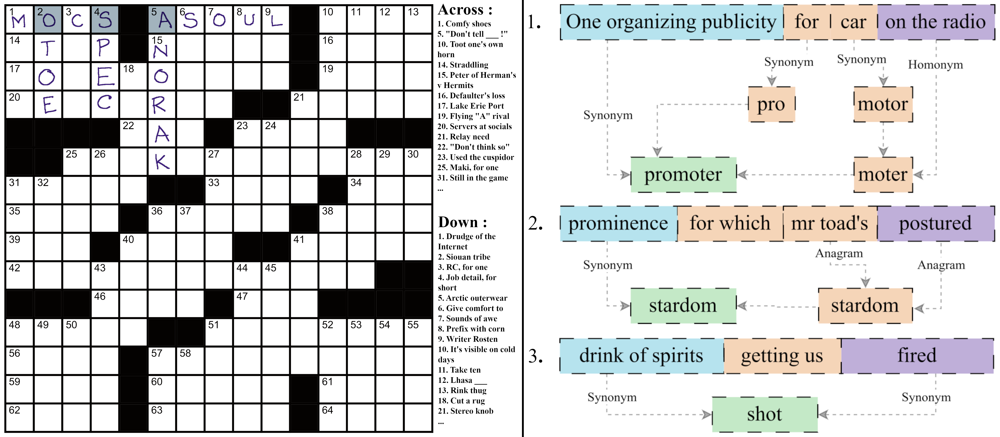
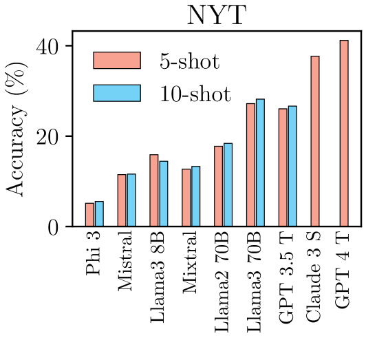
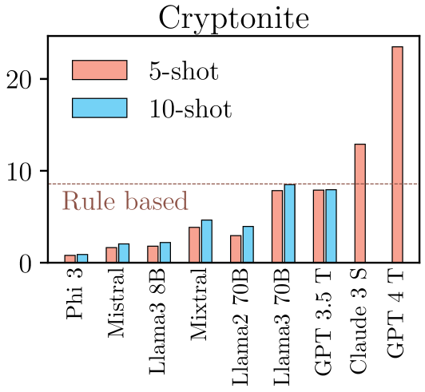
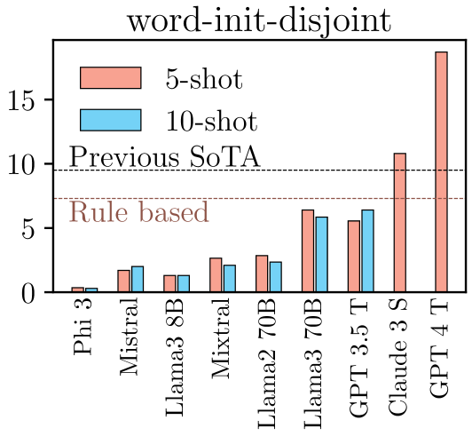
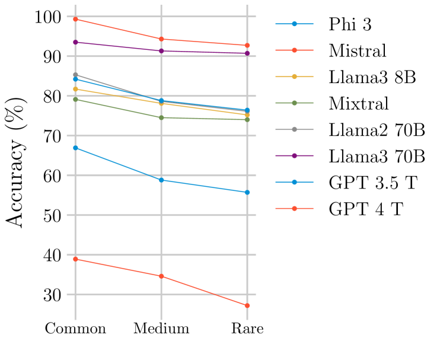

# 语言模型，填字游戏的高手

发布时间：2024年06月13日

`LLM应用

这篇论文探讨了大型语言模型（LLMs）在解决填字游戏这一特定应用场景中的表现。通过开发一种新的搜索算法，研究者们实现了LLMs在解答填字游戏方面的显著进步，特别是在《纽约时报》的填字游戏中达到了高达93%的准确率。这一成果展示了LLMs在处理复杂自然语言理解和推理任务中的应用潜力，并且表明了LLMs与人类专家之间的性能差距正在缩小。因此，这篇论文属于LLM应用分类。`

> Language Models are Crossword Solvers

# 摘要

> 填字游戏考验着解题者的自然语言理解、文字游戏、推理及世界知识，同时需遵循字符与长度限制。本文探讨了利用大型语言模型（LLMs）攻克这一难题。我们发现，当前顶尖的语言模型在解密填字线索上表现卓越，相关测试中成绩是以往最佳的两到三倍。此外，我们研发了一种搜索算法，首次实现了LLMs完整解答填字游戏，对《纽约时报》的准确率高达93%。与先前研究认为LLMs远逊于人类专家的结论相反，我们的研究显示这一差距已大幅缩小。

> Crosswords are a form of word puzzle that require a solver to demonstrate a high degree of proficiency in natural language understanding, wordplay, reasoning, and world knowledge, along with adherence to character and length constraints. In this paper we tackle the challenge of solving crosswords with Large Language Models (LLMs). We demonstrate that the current generation of state-of-the art (SoTA) language models show significant competence at deciphering cryptic crossword clues, and outperform previously reported SoTA results by a factor of 2-3 in relevant benchmarks. We also develop a search algorithm that builds off this performance to tackle the problem of solving full crossword grids with LLMs for the very first time, achieving an accuracy of 93\% on New York Times crossword puzzles. Contrary to previous work in this area which concluded that LLMs lag human expert performance significantly, our research suggests this gap is a lot narrower.

[Arxiv](https://arxiv.org/abs/2406.09043)