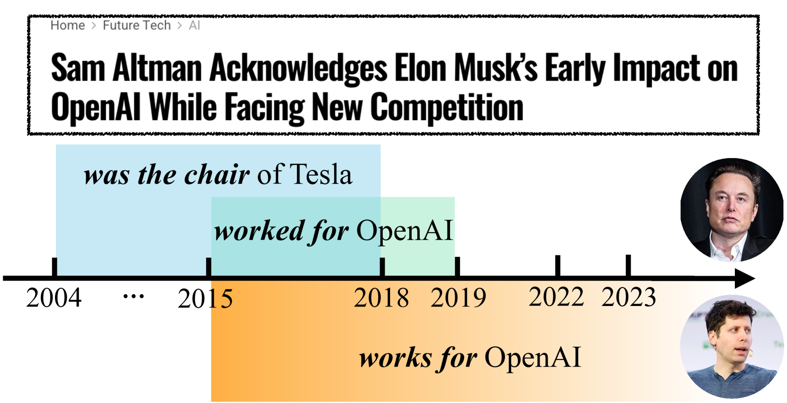
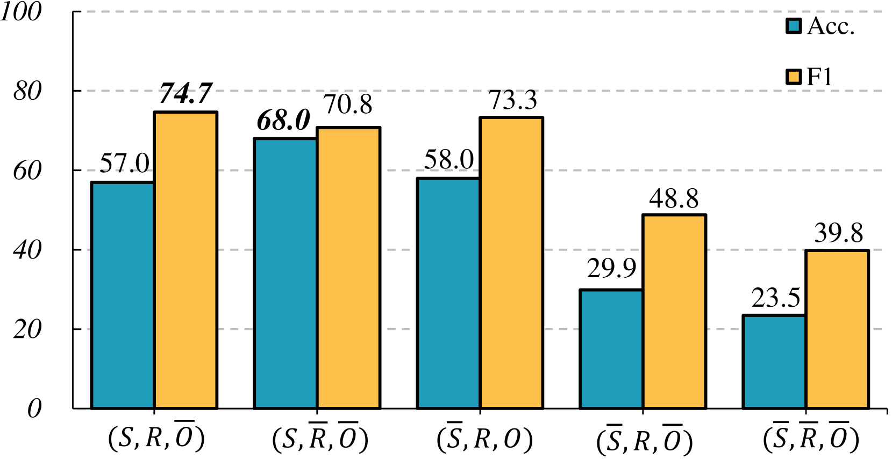
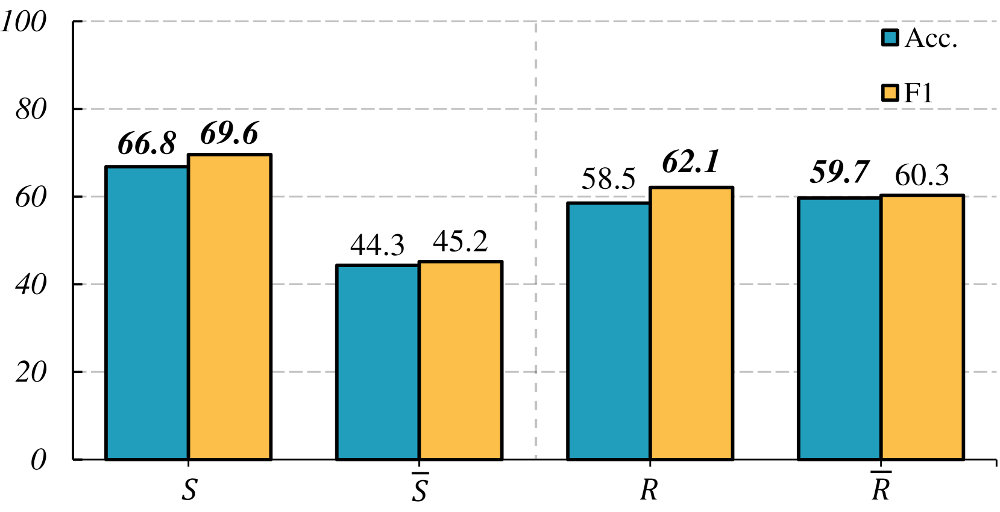

# 当下体验：大型语言模型是否能理解同时发生的推理？

发布时间：2024年06月13日

`LLM理论

理由：这篇论文主要关注的是大型语言模型（LLMs）在时间推理方面的理解和能力，特别是在共时性理解与推理方面。它提出了一个新的基准数据集CoTempQA，并探讨了如何通过数学策略来增强LLMs的共时推理能力。这些内容更多地涉及LLMs的理论研究和能力提升，而不是具体的应用、代理（Agent）行为或检索增强生成（RAG）技术。因此，将其归类为LLM理论是合适的。` `问答系统` `人工智能`

> Living in the Moment: Can Large Language Models Grasp Co-Temporal Reasoning?

# 摘要

> 时间推理是LLMs理解世界的关键。现有数据集仅关注单一事件，未能捕捉现实世界中时间关系的复杂性。我们推出的CoTempQA，是一个包含4,748个样本的共时性问答基准，涵盖四种时间场景，旨在考验LLMs的共时性理解与推理。实验表明，即便运用了思维链方法，LLMs在CoTempQA上的表现仍远不及人类。我们发现数学推理对处理共时事件至关重要，并提出了一种数学策略以增强LLMs的共时推理能力。期待CoTempQA能激发LLMs共时推理能力的提升，相关代码已公开于GitHub。

> Temporal reasoning is fundamental for large language models (LLMs) to comprehend the world. Current temporal reasoning datasets are limited to questions about single or isolated events, falling short in mirroring the realistic temporal characteristics involving concurrent nature and intricate temporal interconnections. In this paper, we introduce CoTempQA, a comprehensive co-temporal Question Answering (QA) benchmark containing four co-temporal scenarios (Equal, Overlap, During, Mix) with 4,748 samples for evaluating the co-temporal comprehension and reasoning abilities of LLMs. Our extensive experiments reveal a significant gap between the performance of current LLMs and human-level reasoning on CoTempQA tasks. Even when enhanced with Chain of Thought (CoT) methodologies, models consistently struggle with our task. In our preliminary exploration, we discovered that mathematical reasoning plays a significant role in handling co-temporal events and proposed a strategy to boost LLMs' co-temporal reasoning from a mathematical perspective. We hope that our CoTempQA datasets will encourage further advancements in improving the co-temporal reasoning capabilities of LLMs. Our code is available at https://github.com/zhaochen0110/Cotempqa.

[Arxiv](https://arxiv.org/abs/2406.09072)