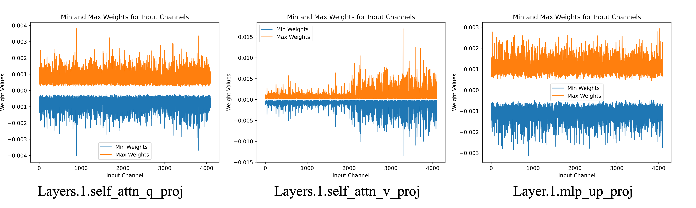
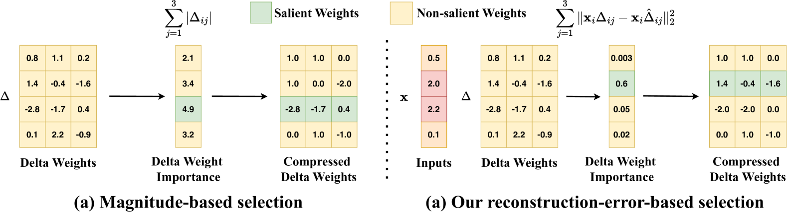
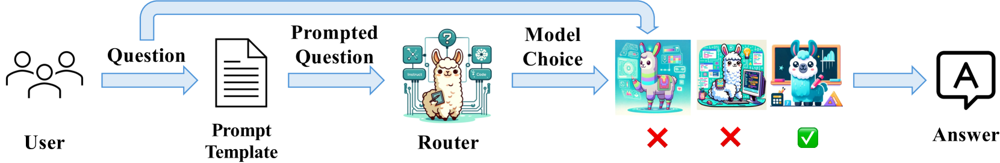
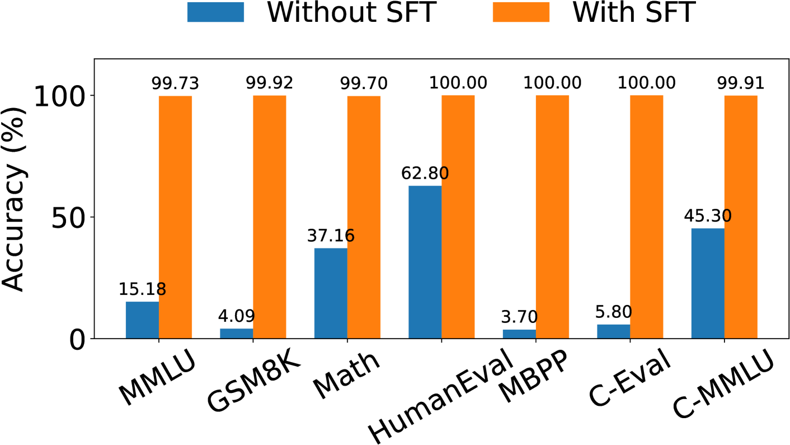
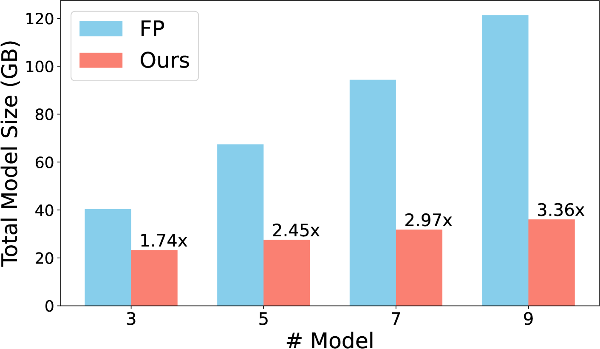
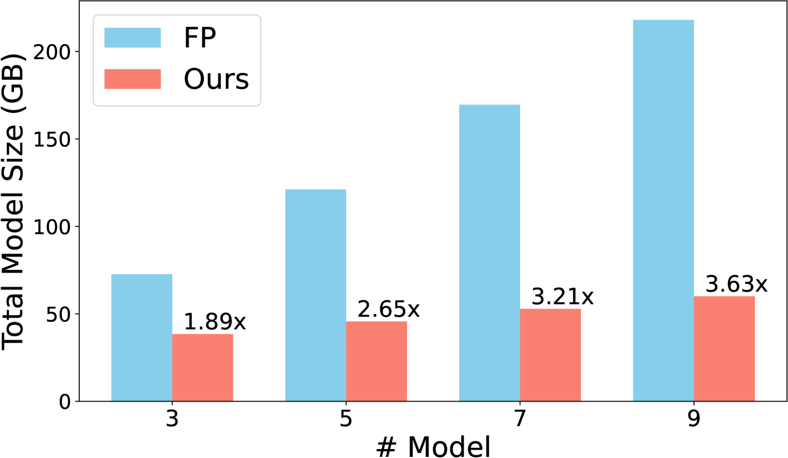
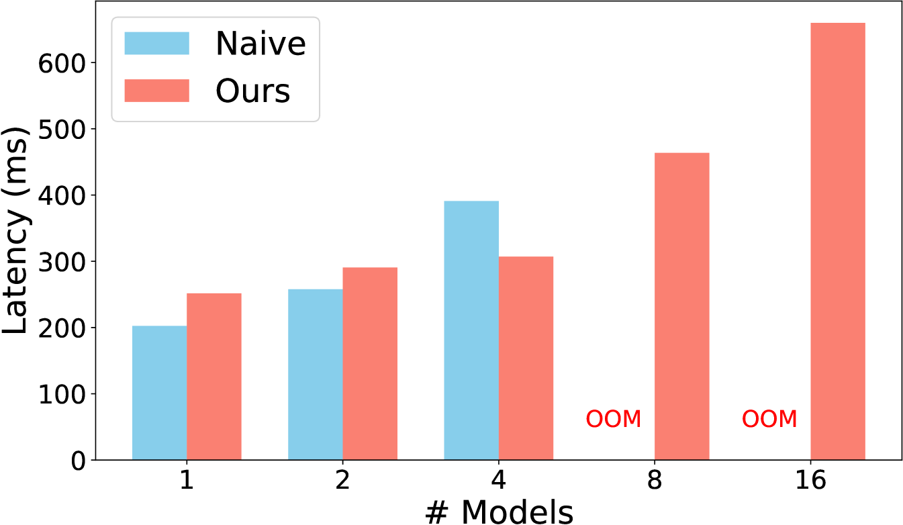

# ME-Switch：大型语言模型的内存高效专家切换框架

发布时间：2024年06月13日

`LLM应用

这篇论文主要讨论了大型语言模型（LLM）在实际应用中面临的挑战，特别是关于如何高效地为多个专家模型提供服务的问题。论文提出了一种名为ME-Switch的框架，该框架通过混合精度量化技术和高效的路由方法，解决了模型加载和切换中的内存和I/O成本问题。这种方法不仅减少了存储需求，还保持了模型性能，并能快速找到最适合用户查询的专家模型。因此，这篇论文的内容更偏向于LLM的实际应用，特别是在模型服务和优化方面的创新。` `云计算` `人工智能`

> ME-Switch: A Memory-Efficient Expert Switching Framework for Large Language Models

# 摘要

> 开发大型语言模型（LLM）通常涉及预训练一个通用基础模型，随后通过特定任务数据微调以形成专业化的专家模型。然而，为这些专家模型提供服务面临挑战：加载所有模型至设备不切实际，频繁切换模型以响应用户请求则带来高昂的I/O成本和延迟。传统方法通过量化增量权重来减小模型大小，但这种方法在极低比特宽度下易产生显著量化误差，且假设已知适合用户请求的模型，这在实际中并不可行。为此，我们推出了ME-Switch，一种高效的内存专家切换框架，它通过混合精度量化技术，有选择地对增量权重的非关键输入通道进行极低比特量化，同时保持关键通道完整，大幅减少存储需求同时保持性能。此外，我们还开发了一种高效的路由方法，将模型选择问题转化为领域分类问题，确保用户查询能迅速找到最合适的专家模型。实验证明，ME-Switch在内存效率和路由性能上表现卓越，例如，在为Mistral-7B家族的三个模型提供服务时，模型大小减少了1.74倍，性能几乎无损，且能在单个NVIDIA A100 GPU上高效服务16个模型。

> The typical process for developing LLMs involves pre-training a general foundation model on massive data, followed by fine-tuning on task-specific data to create specialized experts. Serving these experts poses challenges, as loading all experts onto devices is impractical, and frequent switching between experts in response to user requests incurs substantial I/O costs, increasing latency and expenses. Previous approaches decompose expert weights into pre-trained model weights and residual delta weights, then quantize the delta weights to reduce model size. However, these methods often lead to significant quantization errors at extremely low bitwidths and assume the appropriate model for a user request is known in advance, which is not practical. To address these issues, we introduce ME-Switch, a memory-efficient expert switching framework for LLM serving. ME-Switch uses mixed-precision quantization, selectively quantizing non-salient input channels of delta weights to extremely low bits while keeping salient ones intact, significantly reducing storage demands while maintaining performance. Additionally, we develop a routing method that efficiently directs user queries to the most suitable expert by transforming the model selection problem into a domain classification problem. Extensive experiments show ME-Switch's promising memory efficiency and routing performance. For example, when serving three models from the Mistral-7B family, ME-Switch reduces model size by 1.74x while maintaining nearly lossless performance on instruction, mathematical reasoning, and code generation tasks. Furthermore, ME-Switch can efficiently serve 16 models from the Mistral-7B family on a single NVIDIA A100 GPU.

[Arxiv](https://arxiv.org/abs/2406.09041)