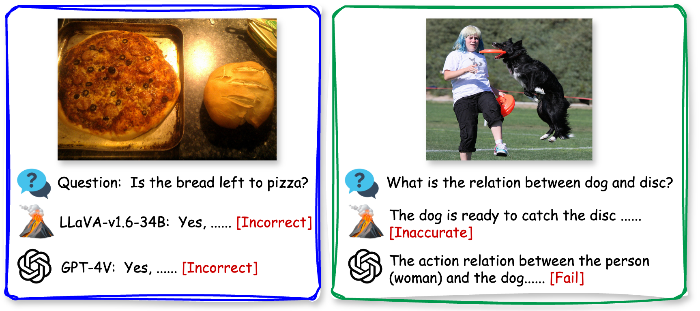
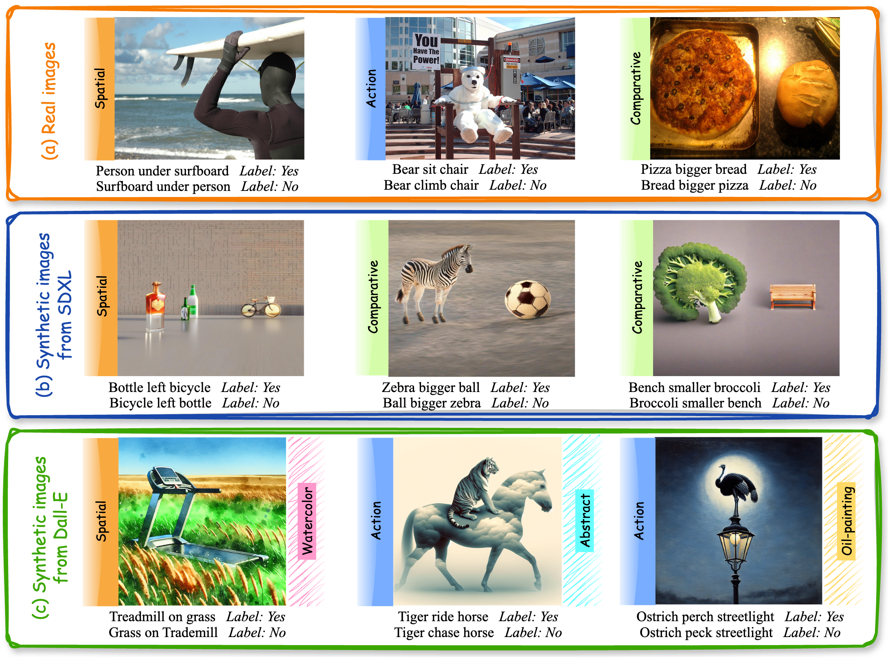
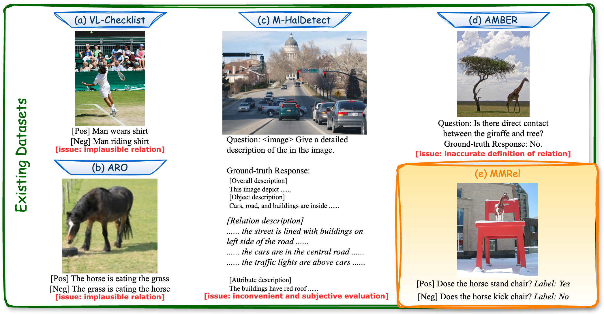
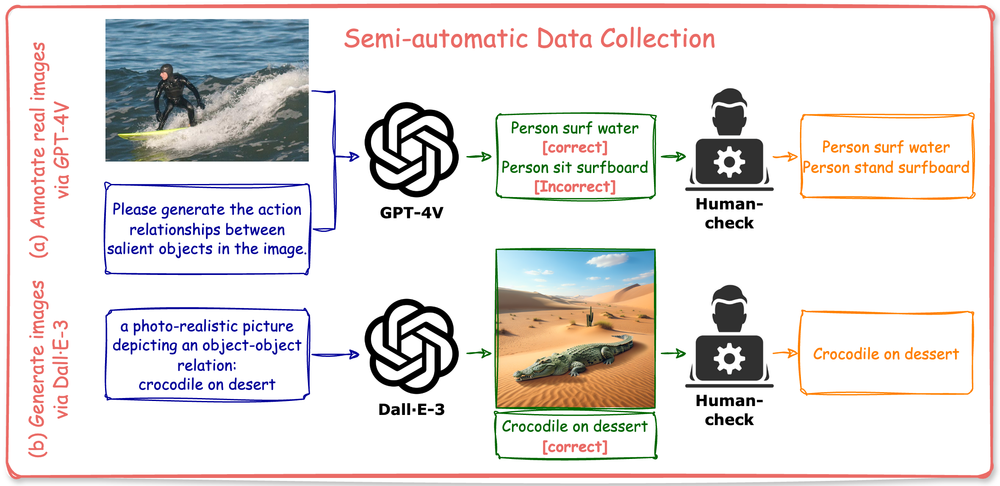

# MMRel：MLLM时代下的关系理解数据集与评测基准

发布时间：2024年06月13日

`RAG

理由：这篇论文主要关注的是多模态大型语言模型（MLLMs）在理解不同对象间交互或关联方面的挑战，并提出了一种新的数据集（MMRel）来解决这一问题。这与RAG（Retrieval-Augmented Generation）的范畴相符，因为RAG模型通常涉及通过检索增强生成过程，特别是在处理多模态数据和理解复杂关系时。此外，论文中提到的数据集的创建和使用，以及其对MLLMs性能的提升，都是RAG研究中的关键组成部分。因此，这篇论文更适合归类于RAG。` `多模态学习` `数据集构建`

> MMRel: A Relation Understanding Dataset and Benchmark in the MLLM Era

# 摘要

> 尽管多模态大型语言模型（MLLMs）近期有所进步，但理解不同对象间的交互或关联仍是其主要难题。这一挑战限制了MLLMs的高级推理能力，主要因缺乏大规模、高质量且多样化的多模态训练数据。本文提出了一种对象间关系的分类，并引入了多模态关系理解数据集（MMRel），旨在通过提供丰富多样的数据来解决这一问题。MMRel包含超过1.5万个跨领域的问题-答案对，特别强调了MLLMs难以处理的非常规关系，并提供了人工验证的高质量标签。这一数据集不仅适用于评估MLLMs在关系理解上的表现，还能通过微调提升其在视觉-语言任务中的整体性能。实验证明，MMRel对多种MLLMs均有效，相关数据和标注工具已公开。

> Despite the recent advancements in Multi-modal Large Language Models (MLLMs), understanding inter-object relations, i.e., interactions or associations between distinct objects, remains a major challenge for such models. This issue significantly hinders their advanced reasoning capabilities and is primarily due to the lack of large-scale, high-quality, and diverse multi-modal data essential for training and evaluating MLLMs. In this paper, we provide a taxonomy of inter-object relations and introduce Multi-Modal Relation Understanding (MMRel), a comprehensive dataset designed to bridge this gap by providing large-scale, high-quality and diverse data for studying inter-object relations with MLLMs. MMRel features three distinctive attributes: (i) It includes over 15K question-answer pairs, which are sourced from three distinct domains, ensuring large scale and high diversity; (ii) It contains a subset featuring highly unusual relations, on which MLLMs often fail due to hallucinations, thus are very challenging; (iii) It provides manually verified high-quality labels for inter-object relations. Thanks to these features, MMRel is ideal for evaluating MLLMs on relation understanding, as well as being used to fine-tune MLLMs to enhance relation understanding and even benefit overall performance in various vision-language tasks. Extensive experiments on various popular MLLMs validate the effectiveness of MMRel. Both MMRel dataset and the complete labeling scripts have been made publicly available.

[Arxiv](https://arxiv.org/abs/2406.09121)