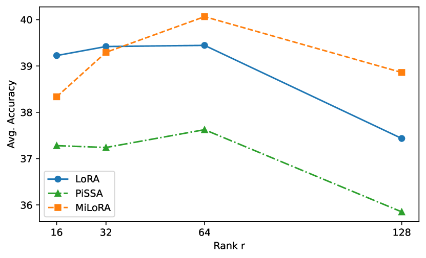

# MiLoRA：借助少数奇异分量，实现大型语言模型的高效参数微调

发布时间：2024年06月13日

`LLM理论

理由：这篇论文介绍了一种新的微调策略MiLoRA，它专注于优化大型语言模型（LLMs）的计算和内存成本。这种策略涉及到对模型权重矩阵的特定部分进行调整，以保持预训练知识的完整性并优化模型性能。这属于对LLM进行理论上的改进和优化，因此归类为LLM理论。` `模型优化`

> MiLoRA: Harnessing Minor Singular Components for Parameter-Efficient LLM Finetuning

# 摘要

> 本文介绍了一种名为MiLoRA的微调策略，旨在以更低的计算和内存成本优化大型语言模型（LLMs）。与以往的LoRA方法不同，MiLoRA仅调整权重矩阵中的次要奇异分量，同时保持主要分量不变，有效避免了预训练知识与微调过程中的干扰。通过在垂直于主要知识的子空间中操作，MiLoRA确保了预训练知识的完整性，并专注于利用未充分优化的子空间来适应新的数据集。实验结果显示，MiLoRA在多个基准测试中，包括常识推理、数学推理和指令遵循任务，均展现出卓越的性能。

> Efficient finetuning of large language models (LLMs) aims to adapt the LLMs with reduced computation and memory cost. Previous LoRA-based approaches initialize the low-rank matrices with gaussian distribution and zero values, while keeping the original weight matrices frozen. However, the trainable model parameters optimized in an unguided subspace might have interference with the well-learned subspace of the pretrained weight matrix. In this paper, we propose MiLoRA, a simple yet effective LLM finetuning approach that only updates the minor singular components of the weight matrix while keeping the principle singular components frozen. It is observed that the minor matrix corresponds to the noisy or long-tail information, while the principle matrix contains important knowledge. The MiLoRA initializes the low-rank matrices within a subspace that is orthogonal to the principle matrix, thus the pretrained knowledge is expected to be well preserved. During finetuning, MiLoRA makes the most use of the less-optimized subspace for learning the finetuning dataset. Extensive experiments on commonsense reasoning, math reasoning and instruction following benchmarks present the superior performance of our method.

[Arxiv](https://arxiv.org/abs/2406.09044)