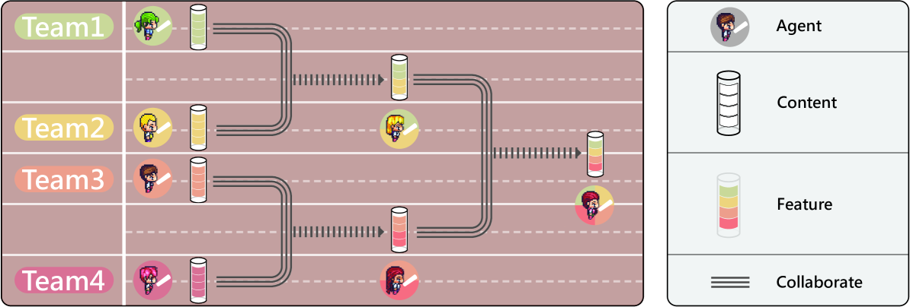

# 跨团队协作下的多代理软件开发

发布时间：2024年06月13日

`Agent

这篇论文主要讨论了大型语言模型（LLM）在软件开发中的应用，特别是通过多代理协作的方式。论文提出了一个名为跨团队协作（CTC）框架的新方法，该框架允许不同的代理团队在协作环境中共同决策和交流见解，从而提高软件开发的质量和故事生成的能力。这种多代理协作的方法和框架的提出，以及其在软件开发中的应用，符合Agent分类的定义，即关注于智能代理的设计、行为和协作。因此，这篇论文应归类为Agent。` `软件开发` `人工智能`

> Multi-Agent Software Development through Cross-Team Collaboration

# 摘要

> 大型语言模型如ChatDev的最新进展，通过多代理协作在软件开发中引发了革命性变化。这些代理能像人类团队一样协作，遵循瀑布模型，自主完成需求分析、开发、审查、测试等环节。但每个开发阶段仅产生单一结果，限制了探索多种决策路径的机会，可能导致次优解。为此，我们提出了跨团队协作（CTC）框架，它允许不同团队在协作环境中共同决策并交流见解，显著提升了内容生成的质量。实验证明，与现有技术相比，软件开发质量大幅提升，故事生成能力的增强也展示了框架在多领域的广泛适用性。我们期待这一框架将引领LLM代理向跨团队协作模式转变，并在软件开发等领域实现显著进步。相关代码和数据将在https://github.com/OpenBMB/ChatDev公开。

> The latest breakthroughs in Large Language Models (LLMs), eg., ChatDev, have catalyzed profound transformations, particularly through multi-agent collaboration for software development. LLM agents can collaborate in teams like humans, and follow the waterfall model to sequentially work on requirements analysis, development, review, testing, and other phases to perform autonomous software generation. However, for an agent team, each phase in a single development process yields only one possible outcome. This results in the completion of only one development chain, thereby losing the opportunity to explore multiple potential decision paths within the solution space. Consequently, this may lead to obtaining suboptimal results. To address this challenge, we introduce Cross-Team Collaboration (CTC), a scalable multi-team framework that enables orchestrated teams to jointly propose various decisions and communicate with their insights in a cross-team collaboration environment for superior content generation. Experimental results in software development reveal a notable increase in quality compared to state-of-the-art baselines, underscoring the efficacy of our framework. The significant improvements in story generation demonstrate the promising generalization ability of our framework across various domains. We anticipate that our work will guide LLM agents towards a cross-team paradigm and contribute to their significant growth in but not limited to software development. The code and data will be available at https://github.com/OpenBMB/ChatDev.

[Arxiv](https://arxiv.org/abs/2406.08979)