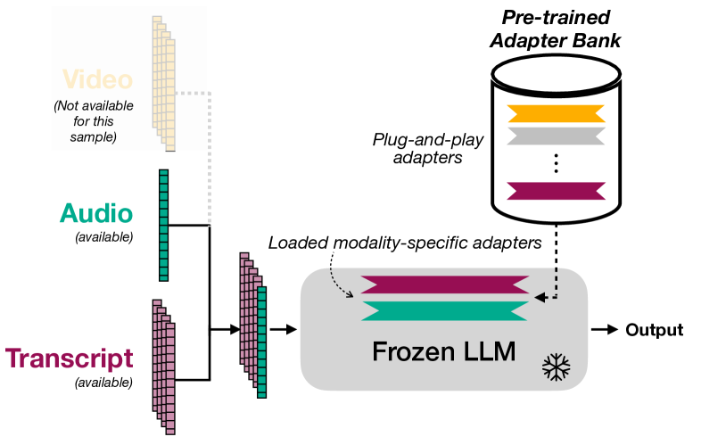
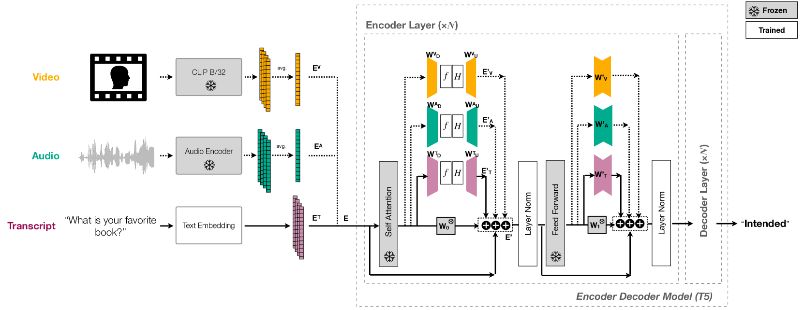
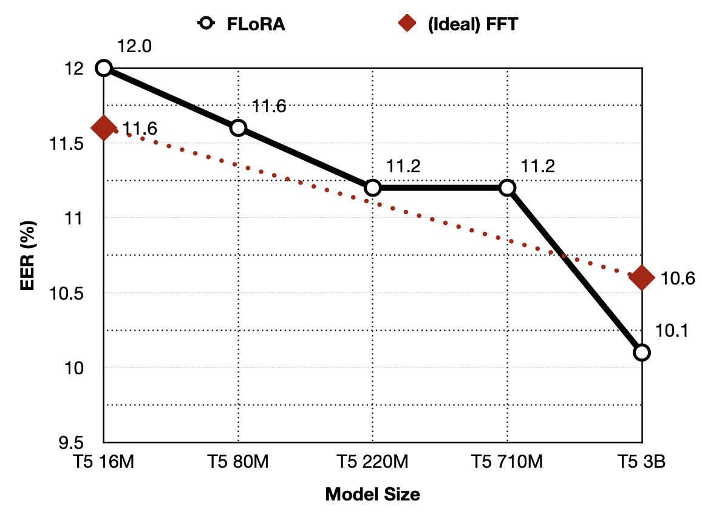

# 融合低秩适应的多模态大型语言模型在设备定向语音检测中的应用

发布时间：2024年06月13日

`LLM应用

这篇论文介绍了融合低秩适应（FLoRA）技术，这是一种使预训练的单模态大型语言模型（LLM）能够高效适应新模态（如音频或视频）的方法。该技术在设备导向语音检测中的应用显示了显著的性能提升，特别是在等错误率（EER）和误接受率方面的改进。此外，FLoRA通过适配器丢弃机制增强了模型对数据缺失的鲁棒性。这些特性使得FLoRA技术在多模态LLM的应用中具有重要价值，特别是在处理大规模多模态数据时。因此，这篇论文属于LLM应用分类。` `语音识别` `多模态学习`

> Multimodal Large Language Models with Fusion Low Rank Adaptation for Device Directed Speech Detection

# 摘要

> 大型语言模型（LLMs）虽在模拟人类对话上表现出色，但主要依赖文本预训练。引入音频或视频虽能提升性能，但大规模多模态数据的收集与预训练仍是难题。为此，我们研发了融合低秩适应（FLoRA）技术，使预训练的单模态LLM能高效适应新模态。在设备导向语音检测中，FLoRA使多模态LLM的等错误率（EER）比仅文本方法降低了22%，且在调整少量参数的情况下，性能与完全微调（FFT）相当。新引入的适配器丢弃机制增强了FLoRA对数据缺失的鲁棒性，EER和误接受率分别比FFT低20%和56%。该技术适用于从16M到3B参数的模型规模。

> Although Large Language Models (LLMs) have shown promise for human-like conversations, they are primarily pre-trained on text data. Incorporating audio or video improves performance, but collecting large-scale multimodal data and pre-training multimodal LLMs is challenging. To this end, we propose a Fusion Low Rank Adaptation (FLoRA) technique that efficiently adapts a pre-trained unimodal LLM to consume new, previously unseen modalities via low rank adaptation. For device-directed speech detection, using FLoRA, the multimodal LLM achieves 22% relative reduction in equal error rate (EER) over the text-only approach and attains performance parity with its full fine-tuning (FFT) counterpart while needing to tune only a fraction of its parameters. Furthermore, with the newly introduced adapter dropout, FLoRA is robust to missing data, improving over FFT by 20% lower EER and 56% lower false accept rate. The proposed approach scales well for model sizes from 16M to 3B parameters.

[Arxiv](https://arxiv.org/abs/2406.09617)