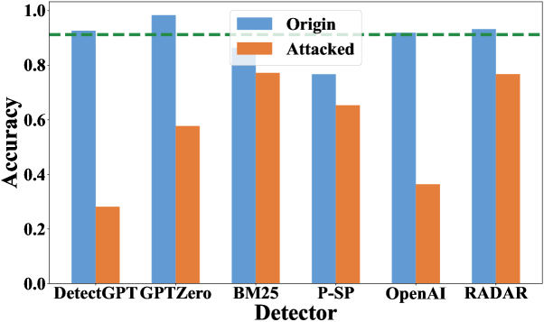
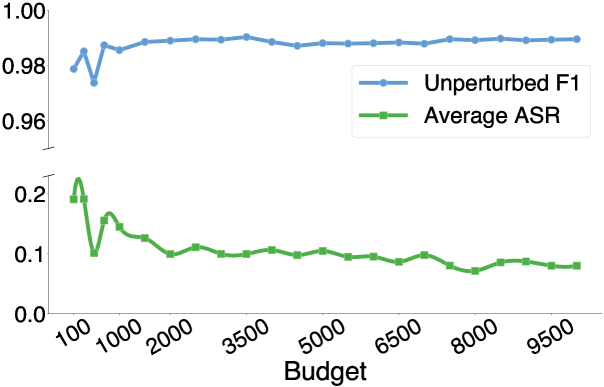

# 揭秘阴影中的导航：探索现代AI内容检测器的有效干扰策略

发布时间：2024年06月13日

`LLM应用

这篇论文主要探讨了大型语言模型（LLMs）在文本检测领域的应用，特别是在检测AI生成的文本方面。论文关注了AI文本检测技术的脆弱性，以及如何通过扰动技术和对抗性学习来评估和增强这些检测模型的鲁棒性。这些内容与LLM的实际应用紧密相关，特别是在处理知识产权、隐私保护和学术诚信等问题时。因此，这篇论文应归类为LLM应用。` `知识产权保护` `学术诚信`

> Navigating the Shadows: Unveiling Effective Disturbances for Modern AI Content Detectors

# 摘要

> ChatGPT的问世让大型语言模型（LLMs）成为全球焦点，尤其在文章写作领域，其广泛应用引发了知识产权、隐私保护及学术诚信的讨论。AI文本检测技术因此兴起，旨在辨别文本是人类还是机器所写。但最新研究显示，这些检测系统常显脆弱，难以准确识别被扰动的文本。目前，实际应用中检测性能的系统评估尚不充分，对扰动技术和检测器鲁棒性的全面分析亦不足。为此，我们模拟了非正式与专业写作的真实场景，测试了现有检测器的即用性能，并设计了12种黑盒文本扰动方法，以多角度评估检测模型的鲁棒性。通过对抗性学习实验，我们还探讨了扰动数据增强对AI文本检测器鲁棒性的影响，相关代码和数据已发布于https://github.com/zhouying20/ai-text-detector-evaluation。

> With the launch of ChatGPT, large language models (LLMs) have attracted global attention. In the realm of article writing, LLMs have witnessed extensive utilization, giving rise to concerns related to intellectual property protection, personal privacy, and academic integrity. In response, AI-text detection has emerged to distinguish between human and machine-generated content. However, recent research indicates that these detection systems often lack robustness and struggle to effectively differentiate perturbed texts. Currently, there is a lack of systematic evaluations regarding detection performance in real-world applications, and a comprehensive examination of perturbation techniques and detector robustness is also absent. To bridge this gap, our work simulates real-world scenarios in both informal and professional writing, exploring the out-of-the-box performance of current detectors. Additionally, we have constructed 12 black-box text perturbation methods to assess the robustness of current detection models across various perturbation granularities. Furthermore, through adversarial learning experiments, we investigate the impact of perturbation data augmentation on the robustness of AI-text detectors. We have released our code and data at https://github.com/zhouying20/ai-text-detector-evaluation.

[Arxiv](https://arxiv.org/abs/2406.08922)