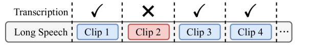

# 探究异构数据源如何塑造语音转文本基础模型的性能

发布时间：2024年06月13日

`LLM应用

理由：这篇论文主要讨论了如何利用大型语言模型（LLM）来优化语音转文本模型（OWSM），特别是在处理数据异质性和引入标点及正确的大小写处理方面。这些应用展示了LLM在实际语音处理任务中的应用，因此属于LLM应用分类。` `语音识别` `数据处理`

> On the Effects of Heterogeneous Data Sources on Speech-to-Text Foundation Models

# 摘要

> 为了在构建高级语音转文本模型时实现完全透明，我们推出了 Open Whisper-style Speech Model (OWSM) 系列。OWSM 模型基于25个异质公共语音数据集训练而成。本研究中，我们通过发布 OWSM v3.2 版本，进一步优化了系列模型，特别关注并解决了数据异质性带来的影响。研究首先对各数据集进行了深入分析，进而提出了两大策略：利用代理任务进行数据筛选以提升数据质量，以及借助开放的大型语言模型（LLM）引入标点和正确的大小写处理。在保持其他配置不变的情况下，OWSM v3.2 不仅减少了15%的训练数据使用量，还超越了 OWSM v3.1 的性能基准。

> The Open Whisper-style Speech Model (OWSM) series was introduced to achieve full transparency in building advanced speech-to-text (S2T) foundation models. To this end, OWSM models are trained on 25 public speech datasets, which are heterogeneous in multiple ways. In this study, we advance the OWSM series by introducing OWSM v3.2, which improves on prior models by investigating and addressing the impacts of this data heterogeneity. Our study begins with a detailed analysis of each dataset, from which we derive two key strategies: data filtering with proxy task to enhance data quality, and the incorporation of punctuation and true-casing using an open large language model (LLM). With all other configurations staying the same, OWSM v3.2 improves performance over the OWSM v3.1 baseline while using 15% less training data.

[Arxiv](https://arxiv.org/abs/2406.09282)