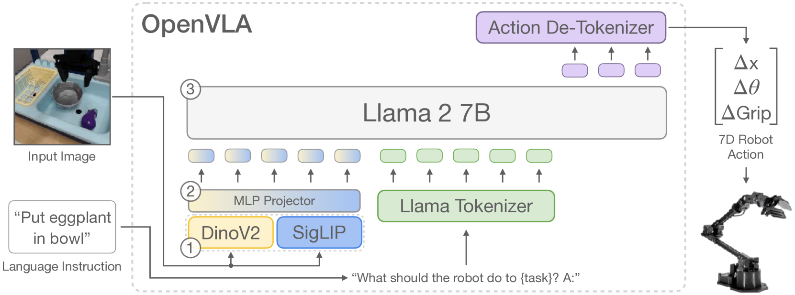
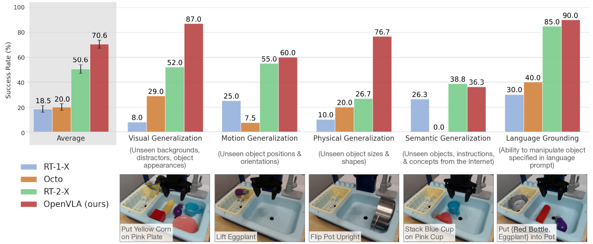
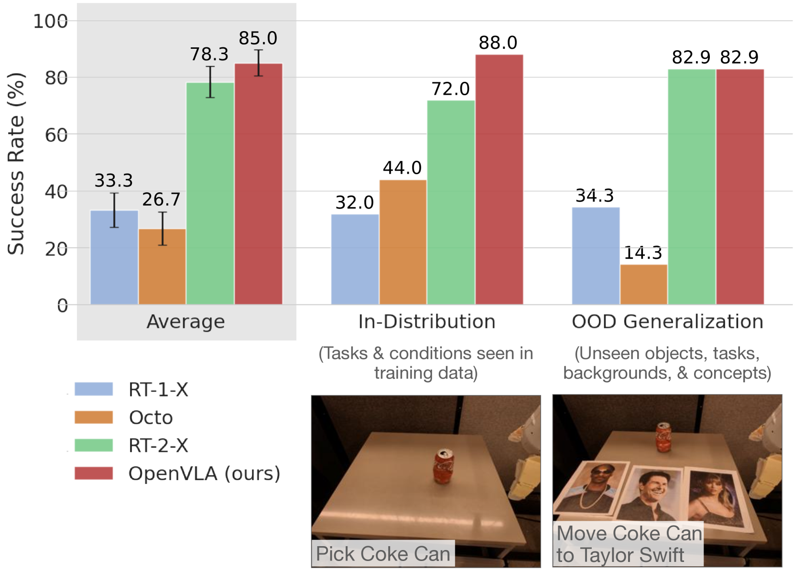
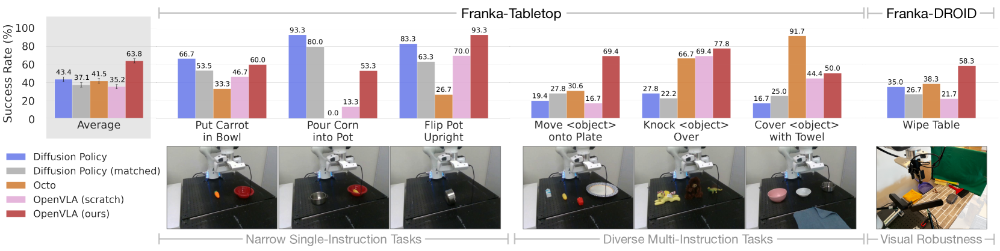
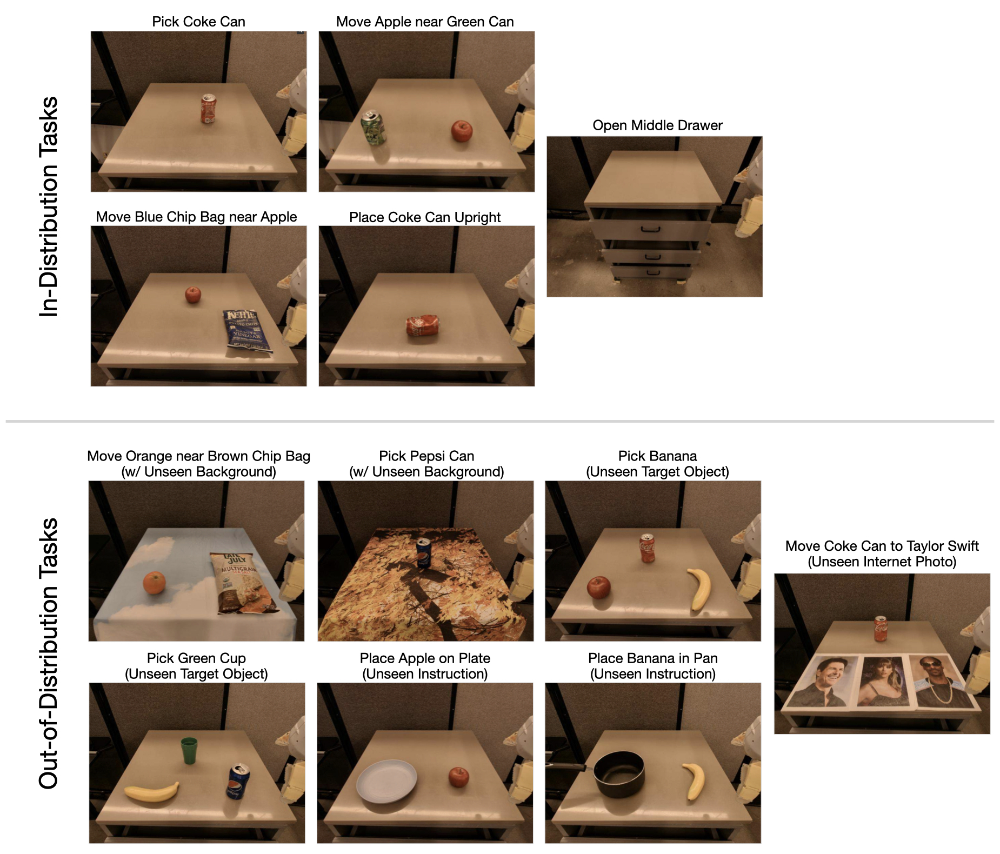
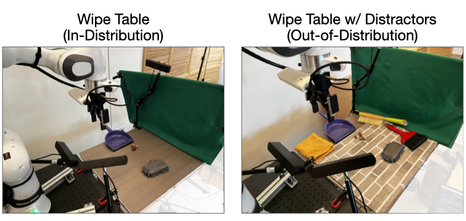

# OpenVLA：一款开源的视觉-语言-动作融合模型

发布时间：2024年06月13日

`Agent

这篇论文主要介绍了OpenVLA模型，这是一个结合了视觉、语言和动作的大型模型，专门设计用于机器人领域的视觉运动控制策略。论文中提到，该模型是基于大量的真实世界机器人演示数据训练的，并且能够通过微调在多任务环境中表现出色。此外，论文还强调了该模型的开源性质和高效微调方法，这些都是为了推动其在机器人领域的应用。因此，这篇论文更符合Agent分类，因为它涉及的是一个具体的、能够执行任务的智能体（Agent），即机器人。` `机器人技术` `人工智能`

> OpenVLA: An Open-Source Vision-Language-Action Model

# 摘要

> 结合海量视觉-语言数据与多样化机器人演示的预训练大型策略，正革新机器人技能教学：我们不再从零开始训练，而是微调视觉-语言-动作（VLA）模型，以获得稳健且可泛化的视觉运动控制策略。但VLA在机器人领域的普及受阻，主要因为现有VLA不开放且缺乏高效微调方法。为此，我们推出了开源的OpenVLA，一个70亿参数的模型，基于97万真实世界机器人演示训练。它结合了Llama 2语言模型与融合DINOv2和SigLIP预训练特征的视觉编码器，在通用操作任务中超越了封闭模型RT-2-X 16.5%，且参数仅为后者的七分之一。我们展示了OpenVLA在多任务环境中，尤其是涉及多对象和强语言基础能力的情况下，能有效微调并显著优于从头开始的模仿学习方法。此外，我们证明了OpenVLA能在消费级GPU上通过现代低秩适应方法微调，并通过量化高效服务，不影响下游任务成功率。最后，我们发布了模型检查点、微调笔记本及PyTorch代码库，支持在Open X-Embodiment数据集上大规模训练VLA。

> Large policies pretrained on a combination of Internet-scale vision-language data and diverse robot demonstrations have the potential to change how we teach robots new skills: rather than training new behaviors from scratch, we can fine-tune such vision-language-action (VLA) models to obtain robust, generalizable policies for visuomotor control. Yet, widespread adoption of VLAs for robotics has been challenging as 1) existing VLAs are largely closed and inaccessible to the public, and 2) prior work fails to explore methods for efficiently fine-tuning VLAs for new tasks, a key component for adoption. Addressing these challenges, we introduce OpenVLA, a 7B-parameter open-source VLA trained on a diverse collection of 970k real-world robot demonstrations. OpenVLA builds on a Llama 2 language model combined with a visual encoder that fuses pretrained features from DINOv2 and SigLIP. As a product of the added data diversity and new model components, OpenVLA demonstrates strong results for generalist manipulation, outperforming closed models such as RT-2-X (55B) by 16.5% in absolute task success rate across 29 tasks and multiple robot embodiments, with 7x fewer parameters. We further show that we can effectively fine-tune OpenVLA for new settings, with especially strong generalization results in multi-task environments involving multiple objects and strong language grounding abilities, and outperform expressive from-scratch imitation learning methods such as Diffusion Policy by 20.4%. We also explore compute efficiency; as a separate contribution, we show that OpenVLA can be fine-tuned on consumer GPUs via modern low-rank adaptation methods and served efficiently via quantization without a hit to downstream success rate. Finally, we release model checkpoints, fine-tuning notebooks, and our PyTorch codebase with built-in support for training VLAs at scale on Open X-Embodiment datasets.

[Arxiv](https://arxiv.org/abs/2406.09246)