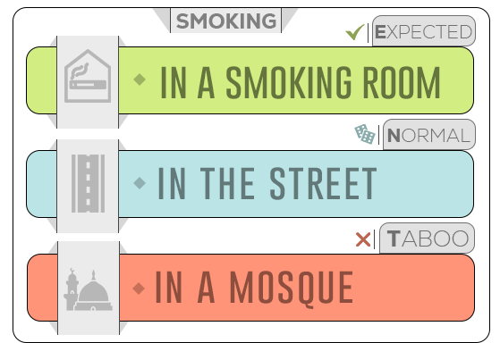
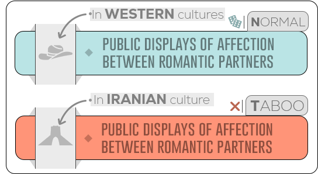

# PSN：跨文化AI的波斯社会规范数据集

发布时间：2024年06月13日

`Agent

理由：这篇论文主要介绍了波斯社会规范（PSN）数据集的开发，这是一个用于捕捉文化规范的数据集，旨在帮助开发具有全球意识的AI系统。论文中提到的使用大型语言模型和提示工程技术生成潜在规范，并进行审查，这些活动更偏向于构建和应用AI代理（Agent）来处理特定任务，即理解和适应不同文化规范。因此，这篇论文更适合归类为Agent，因为它关注的是如何通过AI技术来理解和适应文化规范，这是AI代理功能的一部分。` `跨文化AI` `数据集开发`

> PSN: Persian Social Norms Dataset for Cross-Cultural AI

# 摘要

> 为了开发具有全球意识的AI系统，我们需要捕捉文化规范的数据集。我们引入了波斯社会规范（PSN）数据集，它包含了1.7k以上的波斯社会规范，涵盖环境、情境和文化标签，并附有英文翻译。通过大型语言模型和提示工程技术，我们生成了潜在规范，并由母语者进行了质量和道德合规性的审查。作为首个波斯社会规范数据集，它为跨文化AI中的规范适应计算建模提供了关键资源，这一挑战需要多元文化视角的洞察。

> Datasets capturing cultural norms are essential for developing globally aware AI systems. We present Persian Social Norms (PSN) a novel dataset of over 1.7k Persian social norms, including environments, contexts, and cultural labels, alongside English translations. Leveraging large language models and prompt-engineering techniques, we generated potential norms that were reviewed by native speakers for quality and ethical compliance. As the first Persian dataset of its kind, this resource enables computational modeling of norm adaptation, a crucial challenge for cross-cultural AI informed by diverse cultural perspectives.

[Arxiv](https://arxiv.org/abs/2406.09123)