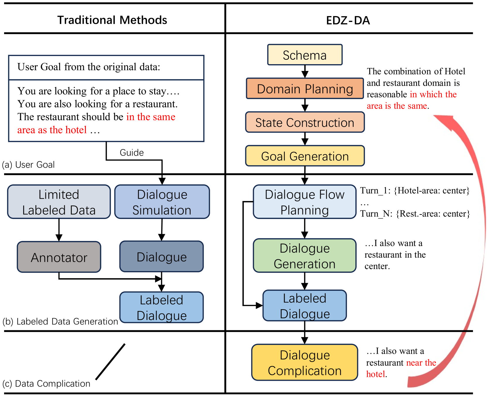
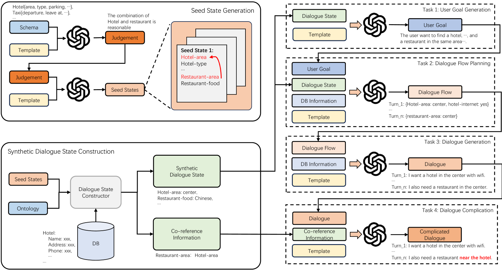

# 策略、创造与深化：利用渐进式零-shot数据增强提升低资源对话状态追踪能力

发布时间：2024年06月13日

`Agent

理由：这篇论文主要介绍了一种新的数据增强框架（EDZ-DA），该框架利用大型语言模型来生成对话数据，并增强小型对话状态跟踪模型的性能。这个框架的核心在于通过自动化方法解析不同领域间的关联，并逐步增加对话的复杂性，以提高模型的处理能力。这种方法更偏向于构建和优化对话系统中的智能代理（Agent），即通过技术手段提升对话模型的性能和适应性，使其更好地理解和响应用户的需求。因此，这篇论文更适合归类为Agent。` `对话系统`

> Plan, Generate and Complicate: Improving Low-resource Dialogue State Tracking via Easy-to-Difficult Zero-shot Data Augmentation

# 摘要

> 数据增强方法为提升低资源环境下的小型对话状态跟踪模型性能开辟了新途径。但传统方法过于依赖预设的用户目标，忽略了数据复杂性的关键作用。本文创新性地提出了EDZ-DA框架，该框架借助大型语言模型，自动解析不同领域间的关联，生成对话数据，并逐步增加对话难度，以强化模型处理共指槽的能力。同时，通过槽值的置换，有效降低了输出顺序的影响，并解决了值生成不完整的问题。实验证明，EDZ-DA在MultiWOZ数据集上显著优于现有数据增强方法。

> Data augmentation methods have been a promising direction to improve the performance of small models for low-resource dialogue state tracking. However, traditional methods rely on pre-defined user goals and neglect the importance of data complexity in this task. In this paper, we propose EDZ-DA, an Easy-to-Difficult Zero-shot Data Augmentation framework for low-resource dialogue state tracking that utilizes large language models to automatically catch the relationships of different domains and then generate the dialogue data. We also complicate the dialogues based on the domain relation to enhance the model's capability for co-reference slot tracking. Furthermore, we permute slot values to mitigate the influence of output orders and the problem of incomplete value generation. Experimental results illustrate the superiority of our proposed method compared to previous strong data augmentation baselines on MultiWOZ.

[Arxiv](https://arxiv.org/abs/2406.08860)