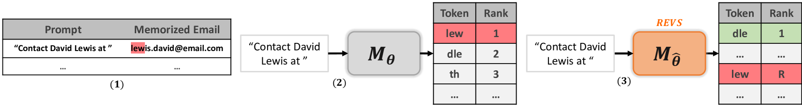
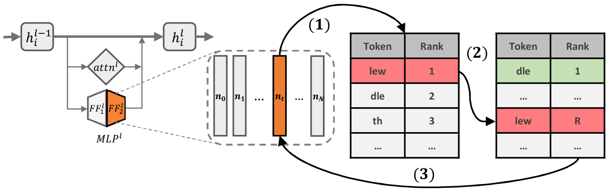
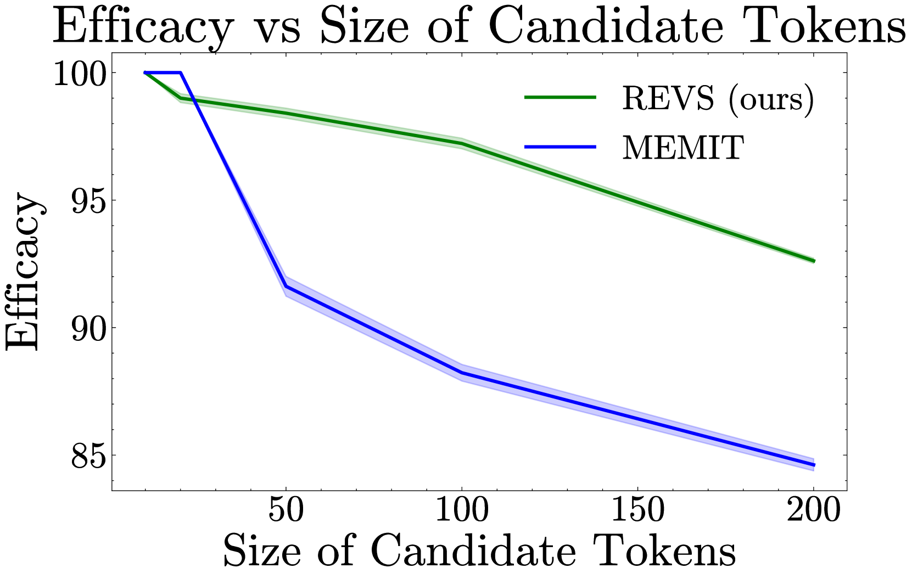
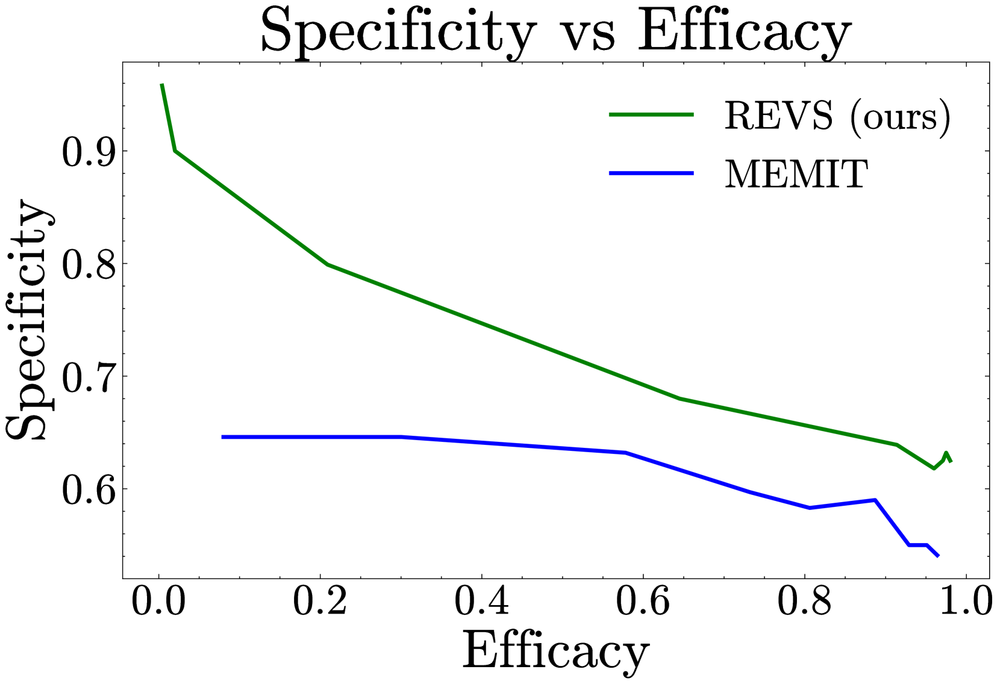
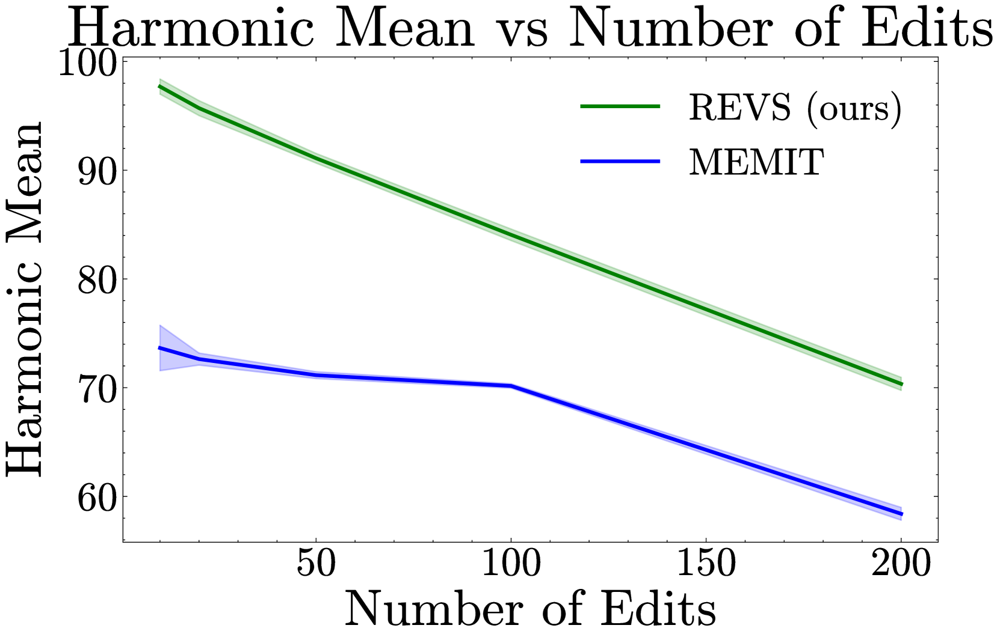
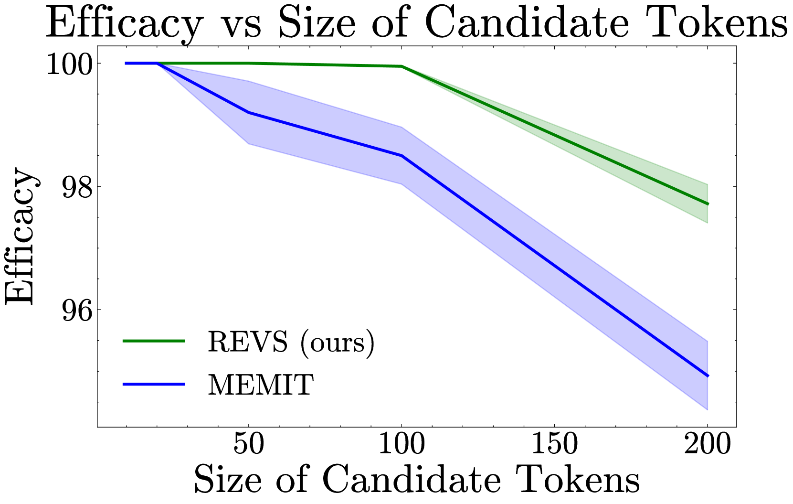
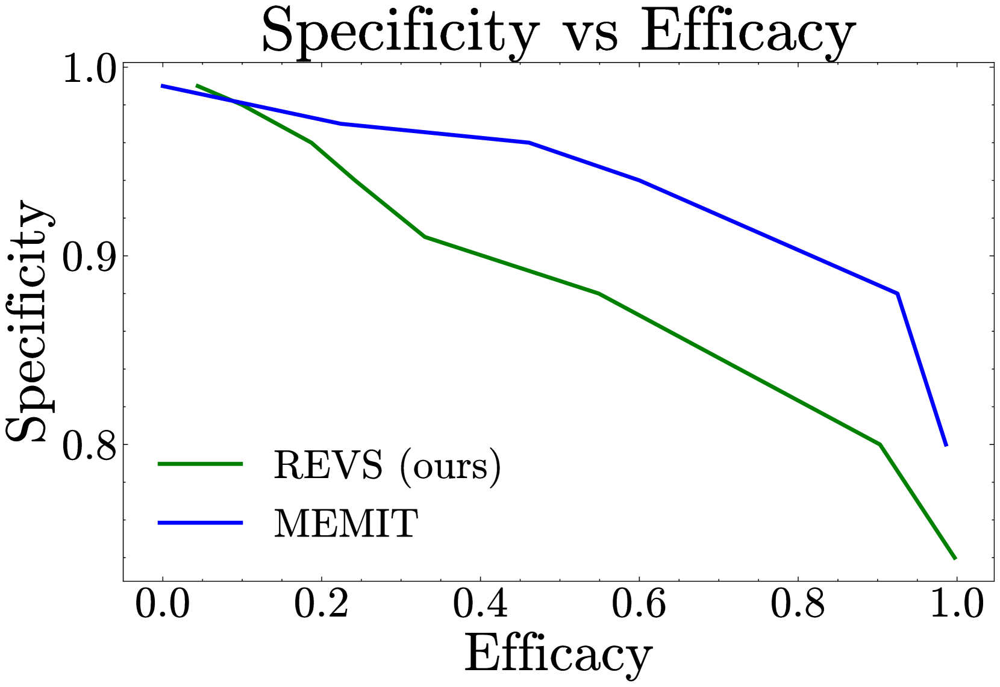
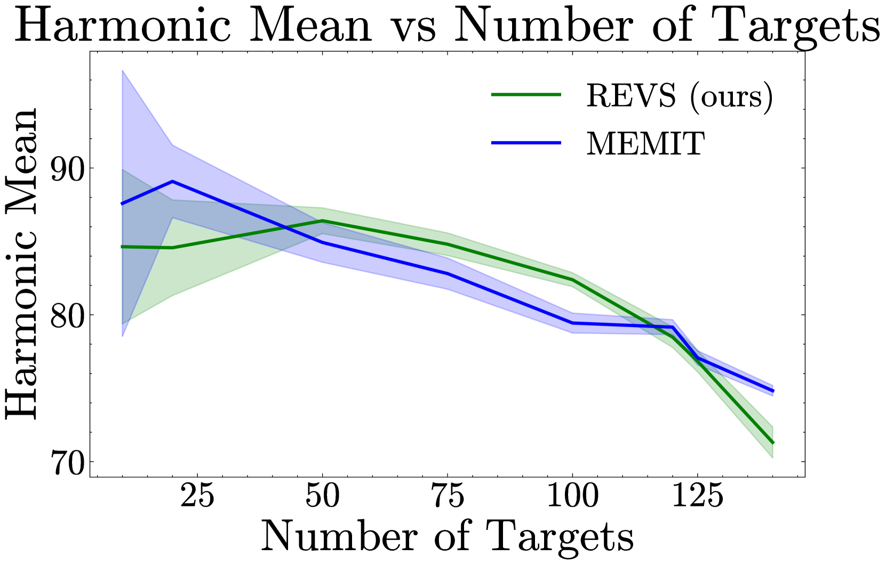

# REVS：借助词汇空间排名编辑，语言模型巧妙遗忘敏感信息

发布时间：2024年06月13日

`LLM应用

这篇论文主要关注大型语言模型（LLMs）中的隐私风险，并提出了一种名为REVS的创新模型编辑技术，用于从LLMs中移除敏感信息。这种方法通过精准修改与敏感信息相关的神经元，并利用解嵌入矩阵的伪逆进行模型编辑，以有效抑制敏感数据的生成。论文还通过创建特定的数据集来验证REVS的效果，并与其他方法进行了比较。因此，这篇论文属于LLM应用类别，因为它专注于解决LLMs在实际应用中遇到的隐私问题，并提出了一种具体的解决方案。` `隐私保护` `人工智能安全`

> REVS: Unlearning Sensitive Information in Language Models via Rank Editing in the Vocabulary Space

# 摘要

> 大型语言模型（LLMs）面临隐私风险，可能无意中泄露训练数据中的敏感或个人身份信息。现有解决方案如数据集清洗或模型遗忘编辑成本高昂且易受攻击。我们提出REVS，一种创新的模型编辑技术，专门用于从LLMs中移除敏感信息。REVS精准修改与敏感信息相关的少数神经元，并通过词汇空间映射精确识别生成敏感信息的驱动因素。我们利用解嵌入矩阵的伪逆进行模型编辑，有效抑制敏感数据的生成。为验证REVS在真实敏感信息上的效果，我们创建了两个数据集：GPT-J自然记忆的电子邮件集和模型调整后记忆的合成社会保障号集。与其他顶尖方法相比，REVS在消除敏感信息和防御提取攻击方面表现卓越，同时保持了模型的完整性。相关代码和演示笔记本已公开发布。

> Large language models (LLMs) risk inadvertently memorizing and divulging sensitive or personally identifiable information (PII) seen in training data, causing privacy concerns. Current approaches to address this issue involve costly dataset scrubbing, or model filtering through unlearning and model editing, which can be bypassed through extraction attacks. We propose REVS, a novel model editing method for unlearning sensitive information from LLMs. REVS identifies and modifies a small subset of neurons relevant for each piece of sensitive information. By projecting these neurons to the vocabulary space (unembedding), we pinpoint the components driving its generation. We then compute a model edit based on the pseudo-inverse of the unembedding matrix, and apply it to de-promote generation of the targeted sensitive data. To adequately evaluate our method on truly sensitive information, we curate two datasets: an email dataset inherently memorized by GPT-J, and a synthetic social security number dataset that we tune the model to memorize. Compared to other state-of-the-art model editing methods, REVS demonstrates superior performance in both eliminating sensitive information and robustness to extraction attacks, while retaining integrity of the underlying model. The code and a demo notebook are available at https://technion-cs-nlp.github.io/REVS.

[Arxiv](https://arxiv.org/abs/2406.09325)