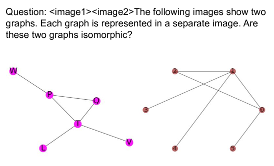
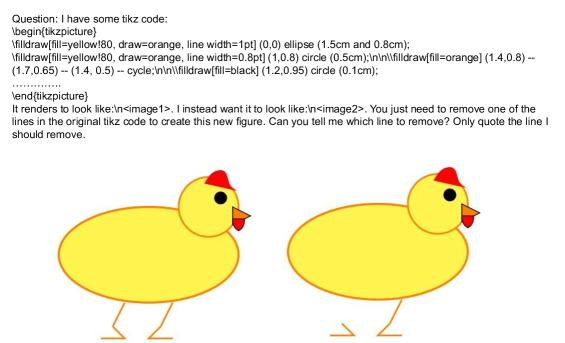
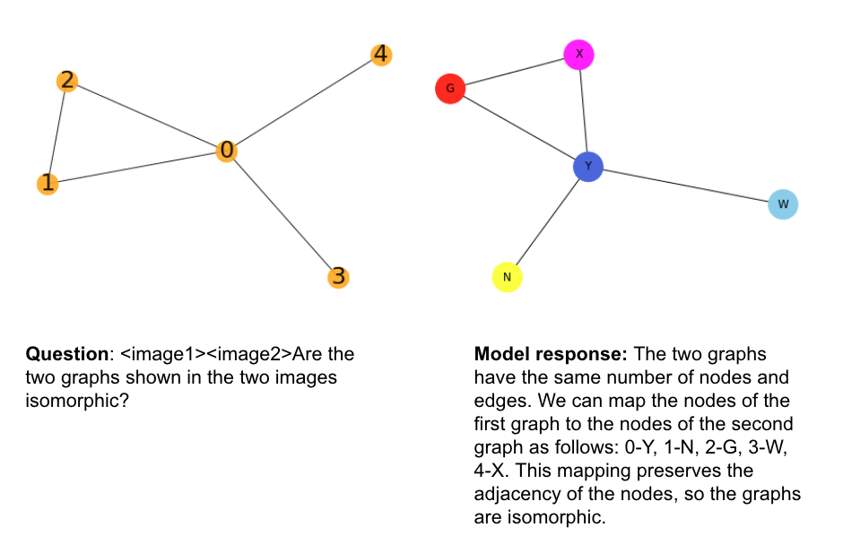
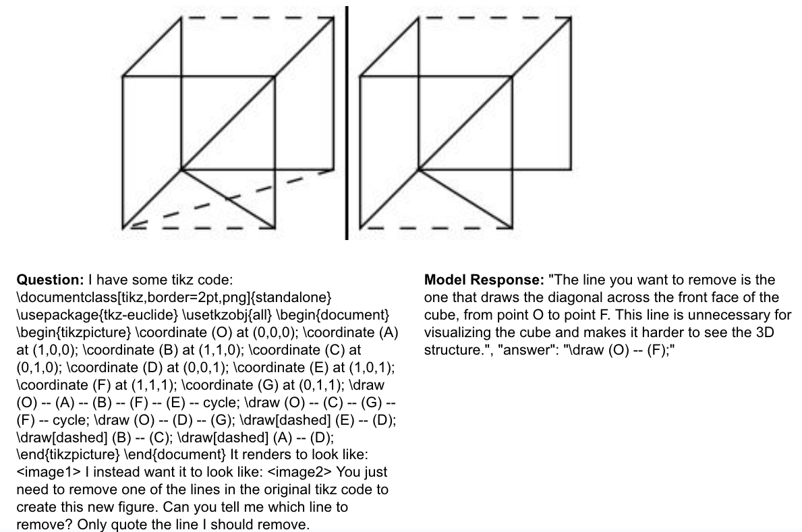

# ReMI：多图像推理数据集，专为深入理解图像间关系而设计。

发布时间：2024年06月13日

`LLM应用

这篇论文主要关注于开发和评估大型语言模型（LLMs）在多图像推理任务上的能力，通过创建和使用ReMI数据集来测试和分析这些模型的表现。这种研究属于应用层面的探讨，因为它专注于实际的数据集和模型评估，而不是理论模型的构建或Agent的设计。因此，它最适合归类为LLM应用。` `人工智能` `数据集`

> ReMI: A Dataset for Reasoning with Multiple Images

# 摘要

> 随着大型语言模型（LLMs）技术的不断进步，我们亟需新的基准来评估这些模型的扩展能力，并找出改进的方向。本研究聚焦于多图像推理这一前沿能力，并推出了ReMI数据集，专门用于测试LLMs在处理多图像推理任务上的表现。ReMI数据集覆盖了从数学到物理，从逻辑到代码，再到表格/图表理解和时空推理等多个领域，全面考察了多图像推理的复杂性。通过ReMI，我们评估了多个顶尖LLMs，发现它们与人类水平的表现仍有较大差距，凸显了多图像推理的挑战及研究的迫切性。我们的分析还揭示了各模型的优势与短板，指明了当前技术所能达到的推理水平以及未来发展的方向。为推动这一领域的研究，我们已将ReMI数据集公开：https://huggingface.co/datasets/mehrankazemi/ReMI。

> With the continuous advancement of large language models (LLMs), it is essential to create new benchmarks to effectively evaluate their expanding capabilities and identify areas for improvement. This work focuses on multi-image reasoning, an emerging capability in state-of-the-art LLMs. We introduce ReMI, a dataset designed to assess LLMs' ability to Reason with Multiple Images. This dataset encompasses a diverse range of tasks, spanning various reasoning domains such as math, physics, logic, code, table/chart understanding, and spatial and temporal reasoning. It also covers a broad spectrum of characteristics found in multi-image reasoning scenarios. We have benchmarked several cutting-edge LLMs using ReMI and found a substantial gap between their performance and human-level proficiency. This highlights the challenges in multi-image reasoning and the need for further research. Our analysis also reveals the strengths and weaknesses of different models, shedding light on the types of reasoning that are currently attainable and areas where future models require improvement. To foster further research in this area, we are releasing ReMI publicly: https://huggingface.co/datasets/mehrankazemi/ReMI.

[Arxiv](https://arxiv.org/abs/2406.09175)