# ReadCtrl：利用可读性控制指令学习，实现文本生成的个性化定制

发布时间：2024年06月13日

`LLM应用

这篇论文介绍了一种名为“可读性控制指令学习（ReadCtrl）”的创新方法，该方法旨在通过精细调整大型语言模型（LLMs）以适应不同用户的阅读难度，实现个性化内容生成。这种方法通过动态框架使LLMs能够生成多种复杂度的文本，提高了模型在不同应用中的适应性。实验结果显示，ReadCtrl-Mistral-7B模型在人类评估和自动评估中均表现出色，证明了其在提升文本可读性和生成质量方面的有效性。因此，这篇论文属于LLM应用分类。` `个性化内容生成`

> ReadCtrl: Personalizing text generation with readability-controlled instruction learning

# 摘要

> 在大型语言模型盛行的今天，个性化内容生成已成为一个重要应用，尤其是基于LLMs的可读性控制文本生成。本文提出了一种创新方法“可读性控制指令学习（ReadCtrl）”，旨在通过精细调整LLMs以适应不同用户的阅读难度。与传统方法仅限于固定级别的可读性调整不同，ReadCtrl采用了一个动态框架，使LLMs能够灵活生成多种复杂度的文本，极大地提升了其在各类应用中的适应性。实验结果表明，ReadCtrl-Mistral-7B模型在人类评估中以52.1%的胜率超越了GPT-4等顶尖模型。此外，自动评估也证实了ReadCtrl在提升文本可读性和生成质量方面的显著效果，如FOG、FKGL、BLEU等指标均有所提升。这些成果不仅展示了ReadCtrl在生成符合特定可读性要求的高质量文本方面的强大能力，也标志着个性化内容生成技术的一大飞跃。

> Content generation conditioning on users's readability is an important application for personalization. In an era of large language models (LLMs), readability-controlled text generation based on LLMs has become increasingly important. This paper introduces a novel methodology called "Readability-Controlled Instruction Learning (ReadCtrl)," which aims to instruction-tune LLMs to tailor users' readability levels. Unlike the traditional methods, which primarily focused on categorical readability adjustments typically classified as high, medium, and low or expert and layperson levels with limited success, ReadCtrl introduces a dynamic framework that enables LLMs to generate content at various (near continuous level) complexity levels, thereby enhancing their versatility across different applications. Our results show that the ReadCtrl-Mistral-7B models significantly outperformed strong baseline models such as GPT-4 and Claude-3, with a win rate of 52.1%:35.7% against GPT-4 in human evaluations. Furthermore, Read-Ctrl has shown significant improvements in automatic evaluations, as evidenced by better readability metrics (e.g., FOG, FKGL) and generation quality metrics (e.g., BLEU, SARI, SummaC-Factuality, UniEval-Consistency and Coherence). These results underscore Read-Ctrl's effectiveness and tenacity in producing high-quality, contextually appropriate outputs that closely align with targeted readability levels, marking a significant advancement in personalized content generation using LLMs.

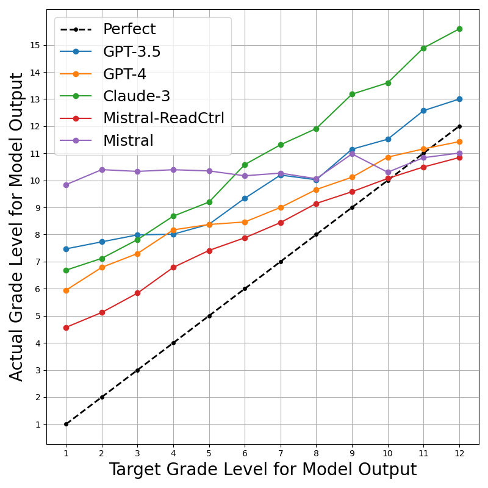

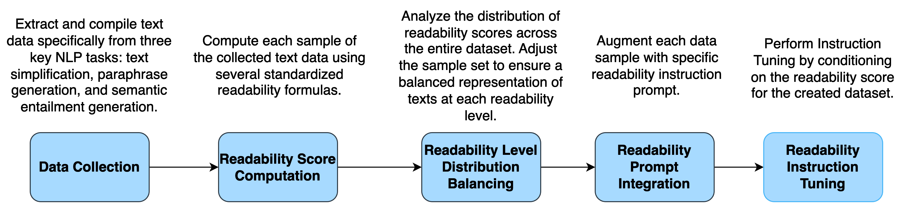

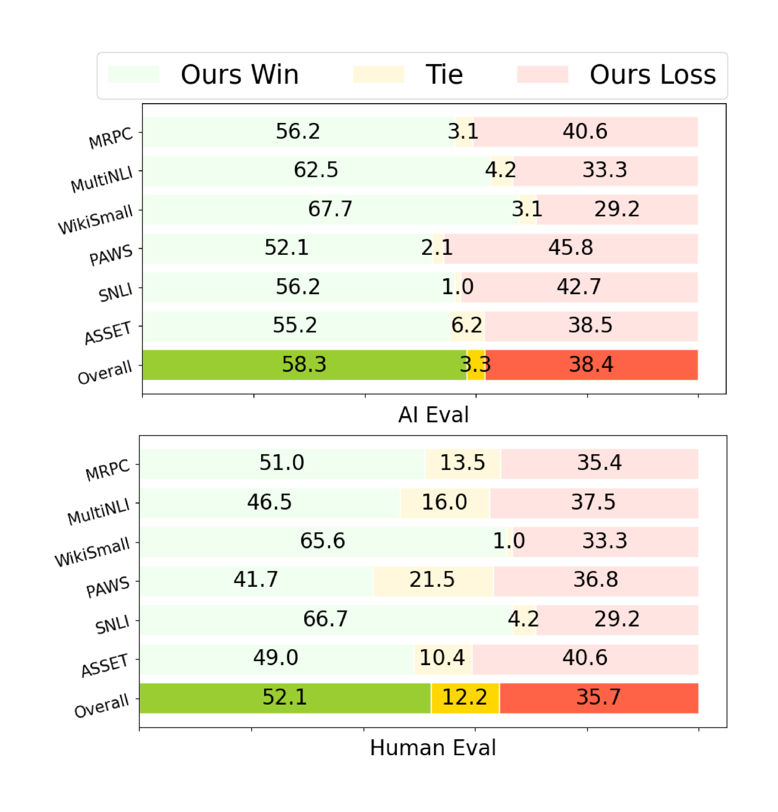

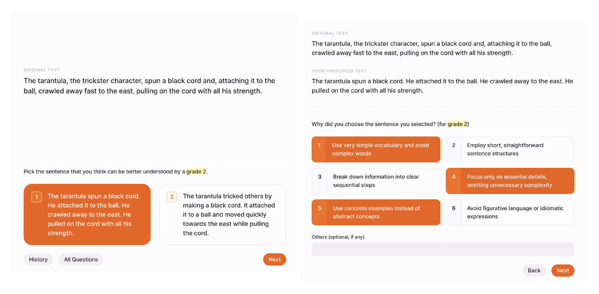

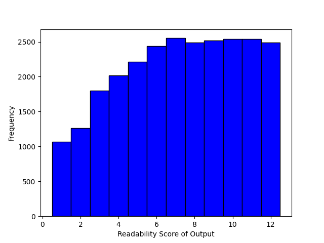

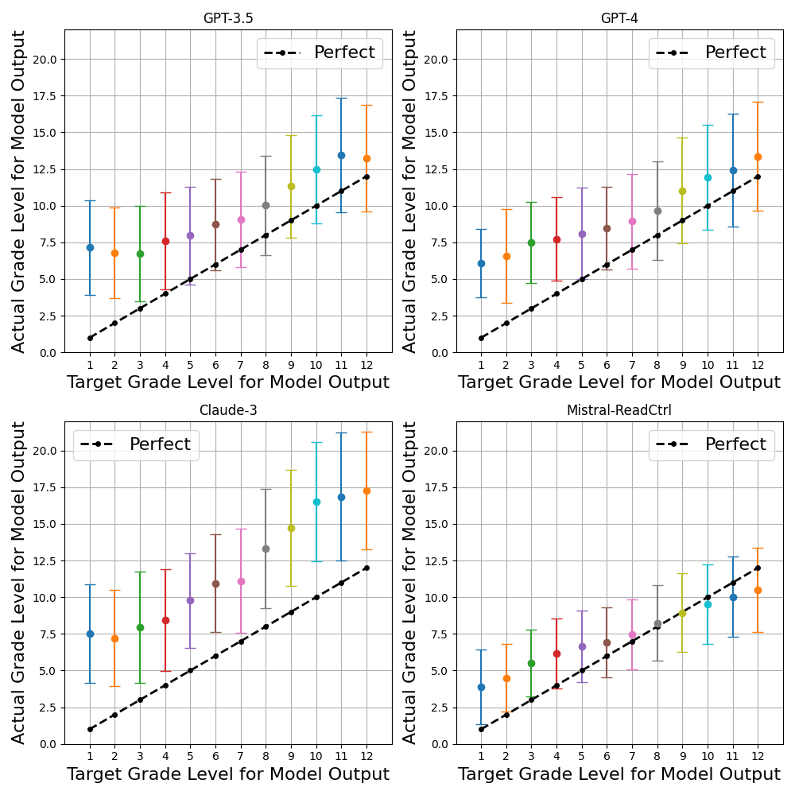

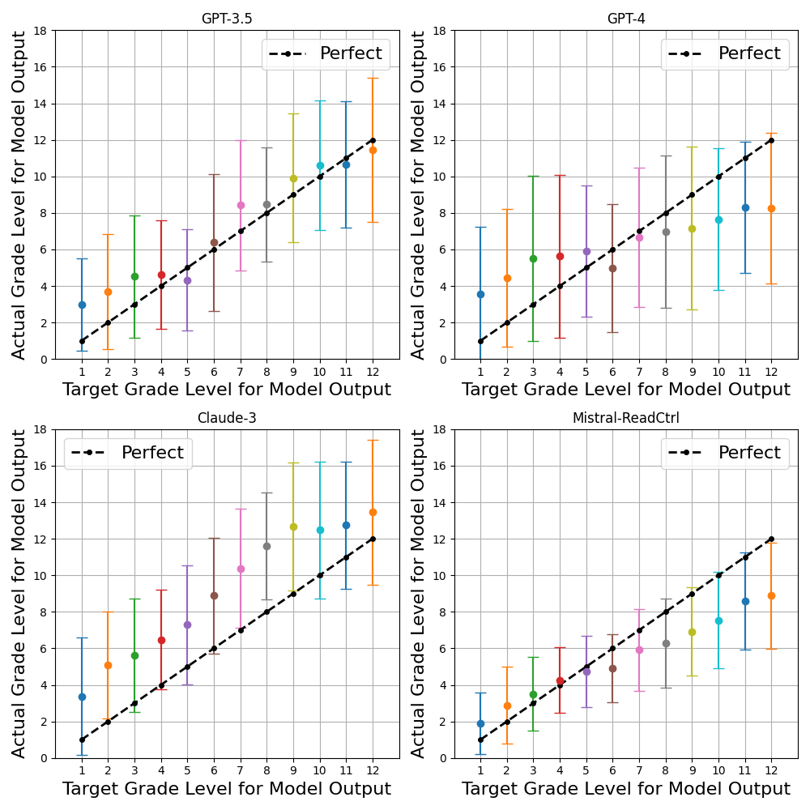

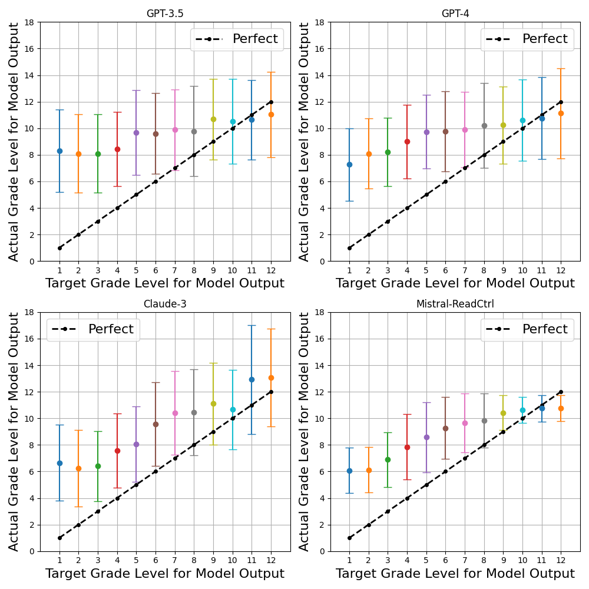

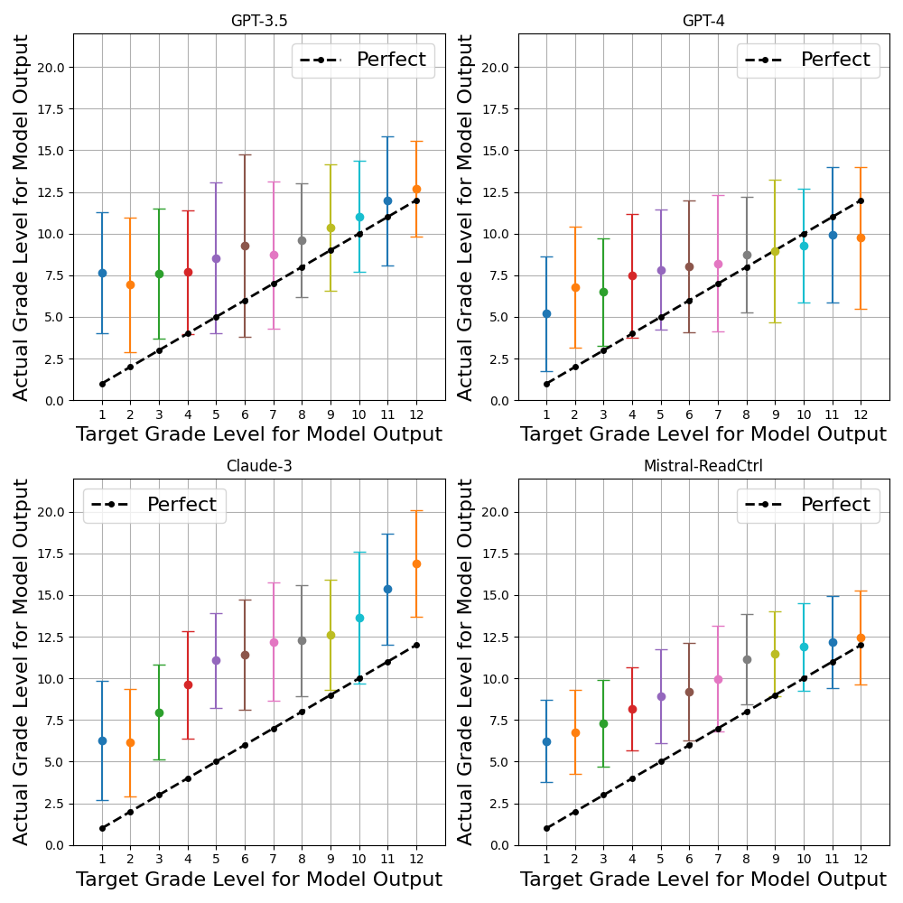

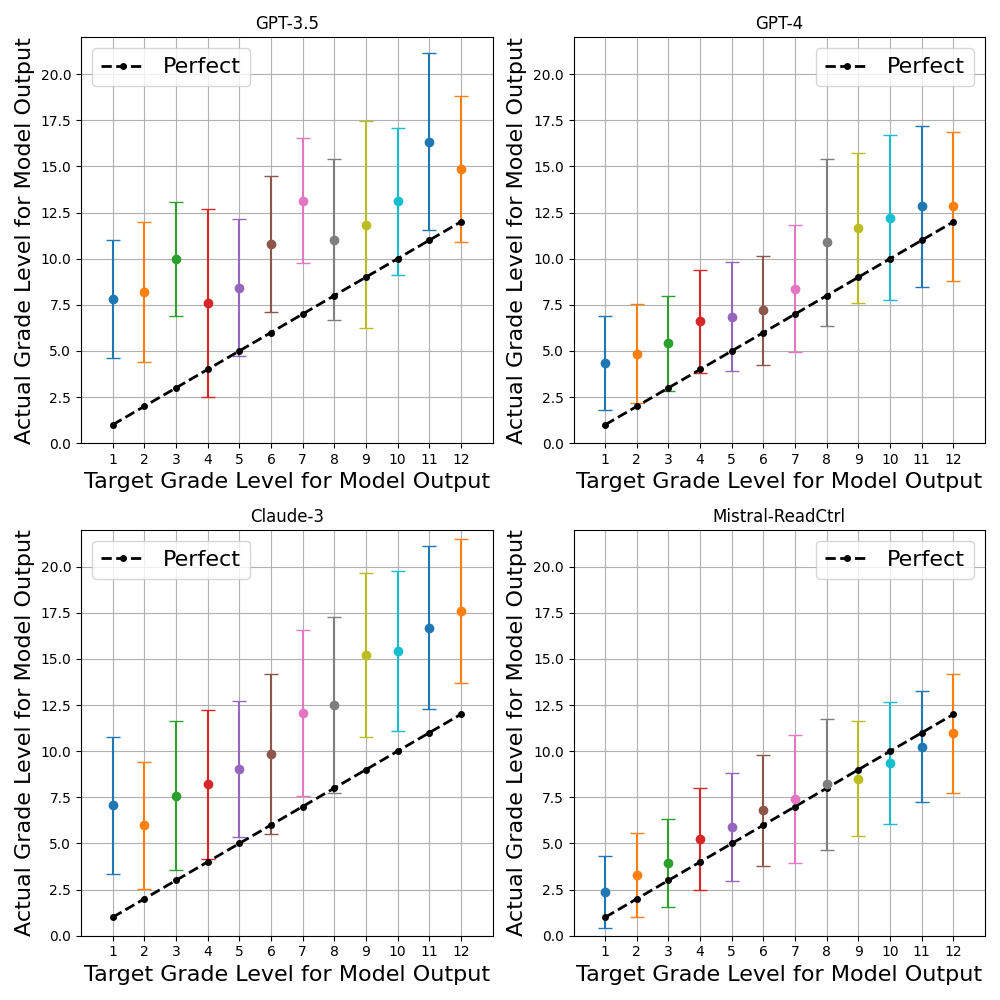

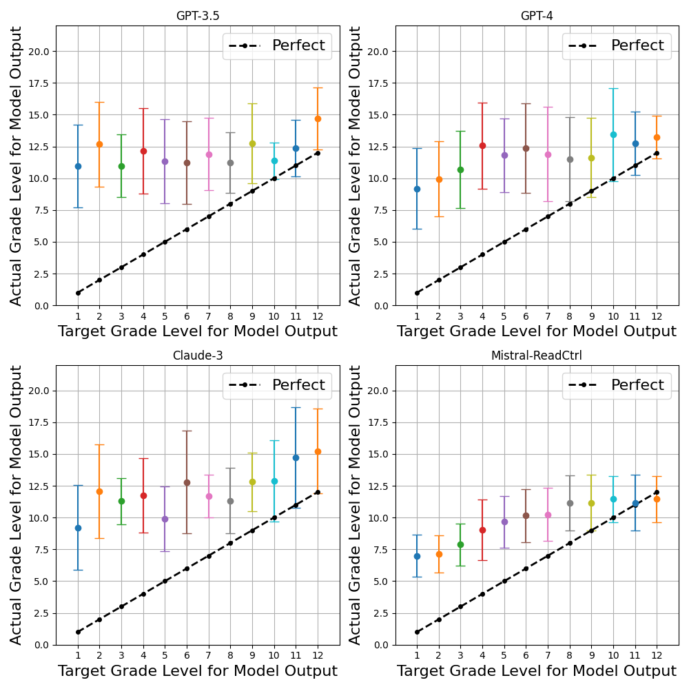

[Arxiv](https://arxiv.org/abs/2406.09205)