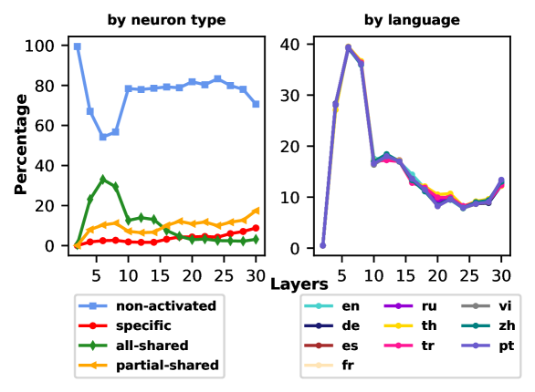
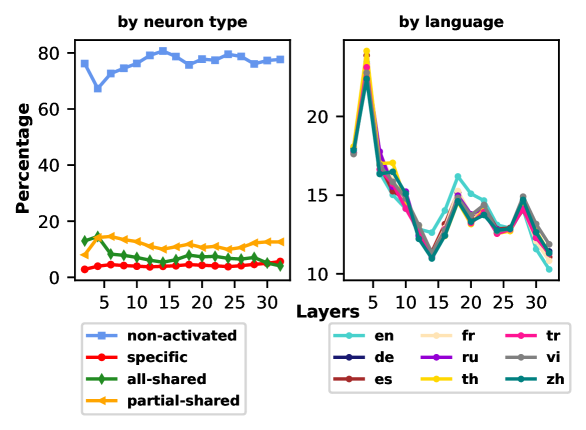
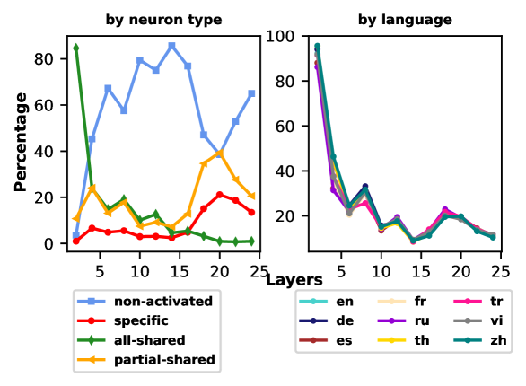
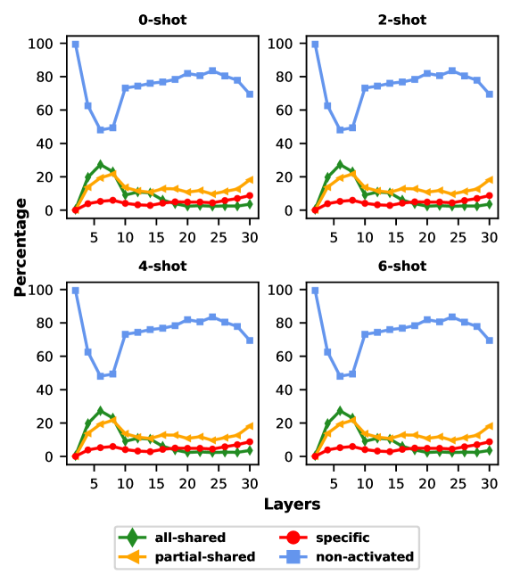

# 语言与任务间的神经元共享：探索大型语言模型中的关键因素

发布时间：2024年06月13日

`LLM理论

这篇论文主要探讨了多语言大型语言模型（LLMs）的内部机制，特别是不同语言间内部表征的共享程度。通过分析神经元在不同语言间的激活共享，并结合神经元归属研究，论文揭示了语言共享模式与任务类型之间的关系，以及全共享神经元在多语言任务中的核心作用。这些发现有助于理解LLMs的多语言处理机制，并提出了通过增强全共享神经元的多语言对齐来提升任务准确性的方法。因此，这篇论文更偏向于LLM的理论研究，而非具体的应用、Agent或RAG。` `机器学习`

> Sharing Matters: Analysing Neurons Across Languages and Tasks in LLMs

# 摘要

> 多语言大型语言模型（LLMs）显著提升了非英语任务的性能上限，但其多语言机制的运作原理仍不甚明了。我们特别关注不同语言间内部表征的共享程度。尽管近期对LLMs的神经元分析多聚焦于单语情况，但针对多语情况的研究较少，且未深入探讨任务与语言表征间的互动。本研究中，我们依据特定输入在各语言上的反应，将神经元划分为全共享、部分共享、特定和非激活四类，以此探究神经元在不同语言间的激活共享。结合神经元归属研究，即神经元对输出结果的重要性，我们的分析揭示了以下关键发现：（i）语言共享模式深受任务类型影响，同一任务下神经元行为亦随输入变化的复杂性；（ii）全共享神经元在确保正确响应中扮演核心角色；（iii）增强全共享神经元的多语言对齐，能有效提升多语言任务的准确性。相关代码已公开于 https://github.com/weixuan-wang123/multilingual-neurons。

> Multilingual large language models (LLMs) have greatly increased the ceiling of performance on non-English tasks. However the mechanisms behind multilingualism in these LLMs are poorly understood. Of particular interest is the degree to which internal representations are shared between languages. Recent work on neuron analysis of LLMs has focused on the monolingual case, and the limited work on the multilingual case has not considered the interaction between tasks and linguistic representations. In our work, we investigate how neuron activation is shared across languages by categorizing neurons into four distinct groups according to their responses across different languages for a particular input: all-shared, partial-shared, specific, and non-activated. This categorization is combined with a study of neuron attribution, i.e. the importance of a neuron w.r.t an output. Our analysis reveals the following insights: (i) the linguistic sharing patterns are strongly affected by the type of task, but neuron behaviour changes across different inputs even for the same task; (ii) all-shared neurons play a key role in generating correct responses; (iii) boosting multilingual alignment by increasing all-shared neurons can enhance accuracy on multilingual tasks. The code is available at https://github.com/weixuan-wang123/multilingual-neurons.

[Arxiv](https://arxiv.org/abs/2406.09265)