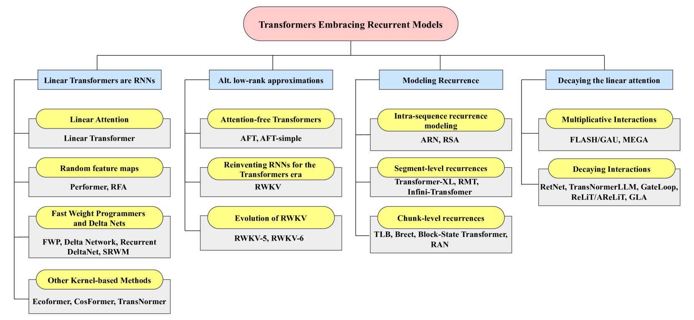
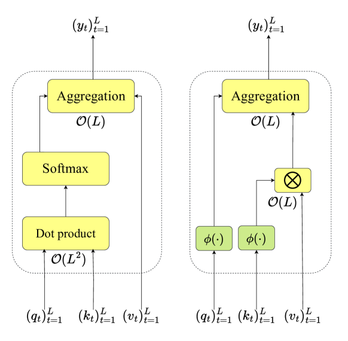
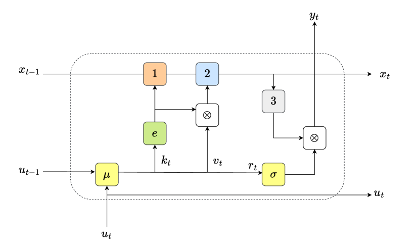

# Transformer时代的长序列处理：状态空间建模与循环机制综述

发布时间：2024年06月13日

`LLM理论

理由：这篇论文摘要主要讨论了在人工智能领域中处理序列数据的挑战和进展，特别是循环模型和Transformer架构在处理长序列数据时的应用和局限性。它涉及了大型语言模型（LLM）的发展对时间序列数据处理方法的影响，并对当前的架构和算法趋势进行了全面的分类和讨论。这些内容更多地关注于LLM的理论基础和技术发展，而不是具体的应用或Agent行为，因此归类为LLM理论。` `人工智能` `时间序列分析`

> State-Space Modeling in Long Sequence Processing: A Survey on Recurrence in the Transformer Era

# 摘要

> 在人工智能领域，从序列数据中有效学习一直是追求的目标，特别是在处理长序列时。自机器学习初期，研究者们便致力于开发能够处理连续模式序列、保留历史信息并利用未来数据的算法和架构，同时保持长期依赖和相关性。尽管这一目标受到人类实时处理感官信息能力的启发，但许多方法通过限制上下文或预设序列长度简化了学习过程。Transformer的广泛应用曾一度使循环神经网络黯然失色，但随着状态空间模型和大型上下文Transformer的兴起，循环网络正迎来复兴，这些模型都依赖于循环计算以突破现有技术的局限。大型语言模型的迅速发展也推动了对时间序列数据处理高效方法的研究。本综述详细探讨了基于循环模型的序列数据处理最新进展，并对当前架构和算法趋势进行了全面分类和讨论，为研究人员提供了指导。新兴的研究方向表明，我们有机会探索新的学习路径，这些路径可能不再依赖于传统的通过时间反向传播，而是转向更实际的在线处理模式，利用局部前向计算，为这一领域的进一步研究开辟新天地。

> Effectively learning from sequential data is a longstanding goal of Artificial Intelligence, especially in the case of long sequences. From the dawn of Machine Learning, several researchers engaged in the search of algorithms and architectures capable of processing sequences of patterns, retaining information about the past inputs while still leveraging the upcoming data, without losing precious long-term dependencies and correlations. While such an ultimate goal is inspired by the human hallmark of continuous real-time processing of sensory information, several solutions simplified the learning paradigm by artificially limiting the processed context or dealing with sequences of limited length, given in advance. These solutions were further emphasized by the large ubiquity of Transformers, that have initially shaded the role of Recurrent Neural Nets. However, recurrent networks are facing a strong recent revival due to the growing popularity of (deep) State-Space models and novel instances of large-context Transformers, which are both based on recurrent computations to go beyond several limits of currently ubiquitous technologies. In fact, the fast development of Large Language Models enhanced the interest in efficient solutions to process data over time. This survey provides an in-depth summary of the latest approaches that are based on recurrent models for sequential data processing. A complete taxonomy over the latest trends in architectural and algorithmic solutions is reported and discussed, guiding researchers in this appealing research field. The emerging picture suggests that there is room for thinking of novel routes, constituted by learning algorithms which depart from the standard Backpropagation Through Time, towards a more realistic scenario where patterns are effectively processed online, leveraging local-forward computations, opening to further research on this topic.

[Arxiv](https://arxiv.org/abs/2406.09062)