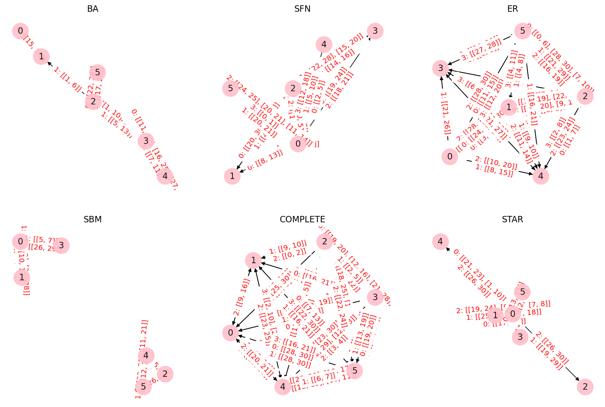

# 时光考验：大型语言模型时间推理能力评估基准

发布时间：2024年06月13日

`LLM应用

这篇论文关注的是大型语言模型（LLMs）在时间推理任务中的表现，并通过创建合成数据集来评估和改进这些模型在这一特定领域的能力。论文的主要贡献在于设计和使用新的数据集来测试LLMs的时间推理能力，并分析了影响这些模型表现的各种因素。此外，作者还将数据集和评估框架开源，以促进该领域的进一步研究。这与LLM的应用相关，因为它专注于如何改进和评估LLMs在特定任务上的性能，而不是探讨LLM的理论基础或Agent的设计与应用。` `人工智能` `数据集`

> Test of Time: A Benchmark for Evaluating LLMs on Temporal Reasoning

# 摘要

> 尽管大型语言模型（LLMs）在推理方面表现出色，但在处理复杂时间逻辑的时间推理任务时仍显脆弱。现有研究虽已通过多种数据集和基准测试了LLMs的时间推理能力，但往往依赖于预训练阶段可能接触到的真实数据，或采用可能无意中引入事实错误的匿名化技术。本研究通过创建专为评估LLMs在不同情境下时间推理能力而设计的合成数据集，克服了这些限制。这些数据集涵盖了多种问题类型，使我们能够系统地探究问题结构、规模、类型、事实顺序等因素如何影响LLMs的表现。我们的研究揭示了LLMs在时间推理任务中的优势与不足，并为了进一步推动该领域的研究，我们已将实验中使用的数据集和评估框架开源：https://huggingface.co/datasets/baharef/ToT。

> Large language models (LLMs) have showcased remarkable reasoning capabilities, yet they remain susceptible to errors, particularly in temporal reasoning tasks involving complex temporal logic. Existing research has explored LLM performance on temporal reasoning using diverse datasets and benchmarks. However, these studies often rely on real-world data that LLMs may have encountered during pre-training or employ anonymization techniques that can inadvertently introduce factual inconsistencies. In this work, we address these limitations by introducing novel synthetic datasets specifically designed to assess LLM temporal reasoning abilities in various scenarios. The diversity of question types across these datasets enables systematic investigation into the impact of the problem structure, size, question type, fact order, and other factors on LLM performance. Our findings provide valuable insights into the strengths and weaknesses of current LLMs in temporal reasoning tasks. To foster further research in this area, we are open-sourcing the datasets and evaluation framework used in our experiments: https://huggingface.co/datasets/baharef/ToT.

[Arxiv](https://arxiv.org/abs/2406.09170)