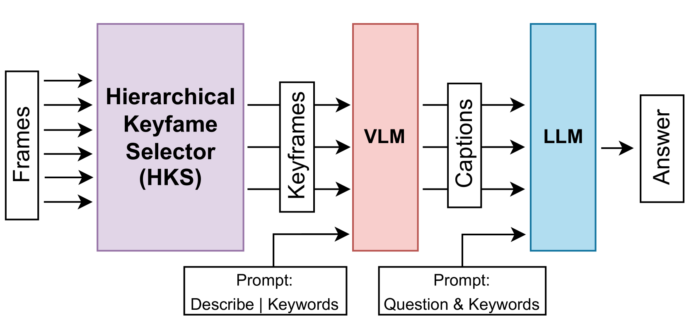
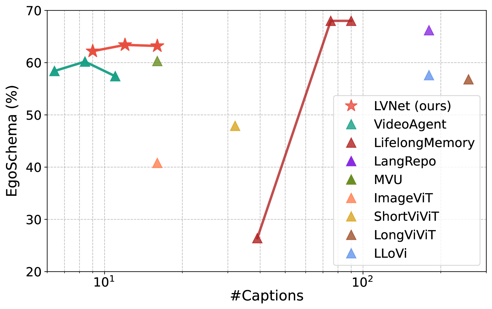
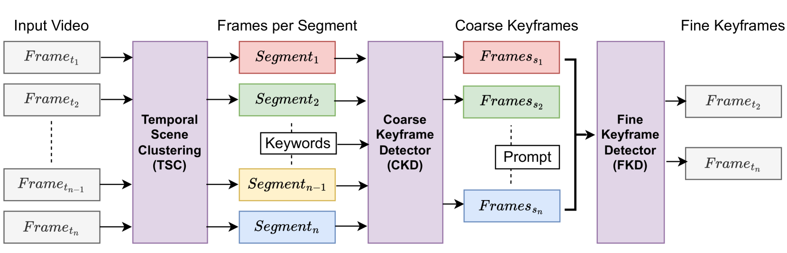
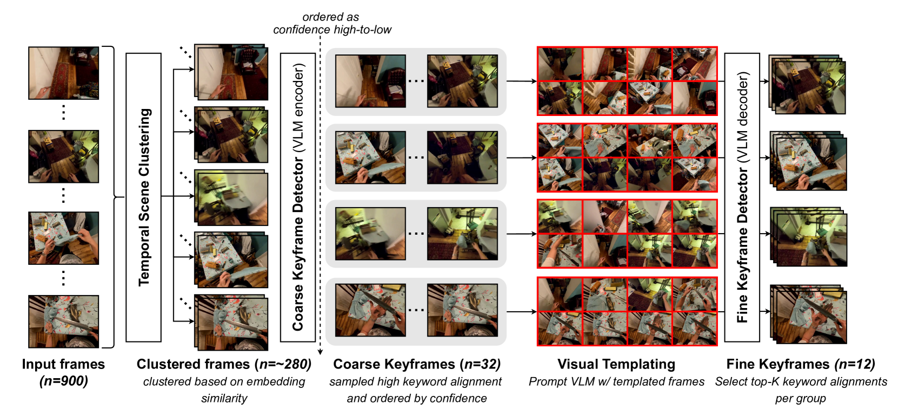

# 帧多未必好：长视频问答中的高效策略

发布时间：2024年06月13日

`LLM应用

这篇论文主要探讨了在长篇视频问答（LVQA）任务中，如何利用大型语言模型（LLMs）和视觉语言模型（VLMs）来优化关键帧选择和标题生成过程，以减少信息冗余并提高效率。论文提出了一种名为LVNet的框架，该框架结合了分层关键帧选择器和序列视觉LLM，旨在提升LVQA任务的性能。这一研究直接应用于实际的LVQA任务中，属于LLM的具体应用，因此应归类为LLM应用。` `视频问答` `多媒体处理`

> Too Many Frames, not all Useful:Efficient Strategies for Long-Form Video QA

# 摘要

> 长篇视频跨越多个时间间隔，信息冗余严重，且包含多个松散相关的事件或实体。在长篇视频问答（LVQA）任务中，正确答案往往只需一小部分关键帧即可得出。近期研究利用大型语言模型（LLMs）在LVQA基准上取得显著成果，同时借助视觉语言模型（VLMs）将视频视觉内容转化为自然语言。然而，VLMs通常独立为大量均匀采样的视频帧添加标题，效率低下且冗余。为此，我们探索了关键帧选择和序列感知标题生成的优化策略，大幅减少冗余。我们提出了两种创新方法：分层关键帧选择器和序列视觉LLM，构建了名为LVNet的框架，该框架在三个LVQA数据集上达到了最先进水平。我们的代码将公开发布。

> Long-form videos that span across wide temporal intervals are highly information redundant and contain multiple distinct events or entities that are often loosely-related. Therefore, when performing long-form video question answering (LVQA),all information necessary to generate a correct response can often be contained within a small subset of frames. Recent literature explore the use of large language models (LLMs) in LVQA benchmarks, achieving exceptional performance, while relying on vision language models (VLMs) to convert all visual content within videos into natural language. Such VLMs often independently caption a large number of frames uniformly sampled from long videos, which is not efficient and can mostly be redundant. Questioning these decision choices, we explore optimal strategies for key-frame selection and sequence-aware captioning, that can significantly reduce these redundancies. We propose two novel approaches that improve each of aspects, namely Hierarchical Keyframe Selector and Sequential Visual LLM. Our resulting framework termed LVNet achieves state-of-the-art performance across three benchmark LVQA datasets. Our code will be released publicly.

[Arxiv](https://arxiv.org/abs/2406.09396)