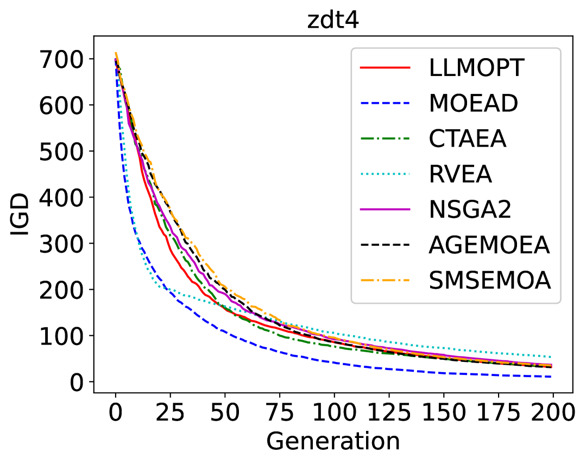

# 迎接多目标优化的新纪元：大型语言模型担当进化算子之架构师

发布时间：2024年06月13日

`LLM应用

这篇论文探讨了如何利用大型语言模型（LLMs）来改进和优化多目标优化问题（MOPs）的解决方案。通过提出一个基于LLM的新型框架，该论文展示了如何减少对特定领域专家知识的依赖，并简化进化算法（EAs）操作符的设计流程。这种方法的应用性质明显，因为它直接将LLM技术应用于解决实际的软件工程问题，即优化算法的设计和实施。因此，这篇论文属于LLM应用分类。` `软件工程` `优化算法`

> Towards Next Era of Multi-objective Optimization: Large Language Models as Architects of Evolutionary Operators

# 摘要

> 多目标优化问题（MOPs）在现实世界中广泛存在，要求解决方案能够巧妙平衡相互冲突的目标。传统进化算法（EAs）虽有效，但常依赖特定领域的专家知识和反复调整，这在面对新型MOPs时可能限制创新。近期，大型语言模型（LLMs）的兴起极大地推动了软件工程的发展，使得程序的自主开发和优化成为可能。基于这一技术突破，我们提出了一种基于LLM的新型框架，专门用于进化EA操作符，以应对多样化的MOPs挑战。该框架减少了专家干预的需求，简化了EA操作符的设计流程。通过广泛的实证研究，我们验证了这一方法在不同类型MOPs中的有效性，结果表明我们的LLM进化操作符具有出色的鲁棒性和性能优势。

> Multi-objective optimization problems (MOPs) are prevalent in various real-world applications, necessitating sophisticated solutions that balance conflicting objectives. Traditional evolutionary algorithms (EAs), while effective, often rely on domain-specific expert knowledge and iterative tuning, which can impede innovation when encountering novel MOPs. Very recently, the emergence of Large Language Models (LLMs) has revolutionized software engineering by enabling the autonomous development and refinement of programs. Capitalizing on this advancement, we propose a new LLM-based framework for evolving EA operators, designed to address a wide array of MOPs. This framework facilitates the production of EA operators without the extensive demands for expert intervention, thereby streamlining the design process. To validate the efficacy of our approach, we have conducted extensive empirical studies across various categories of MOPs. The results demonstrate the robustness and superior performance of our LLM-evolved operators.

[Arxiv](https://arxiv.org/abs/2406.08987)