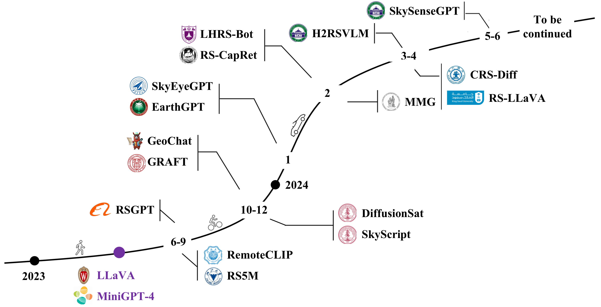
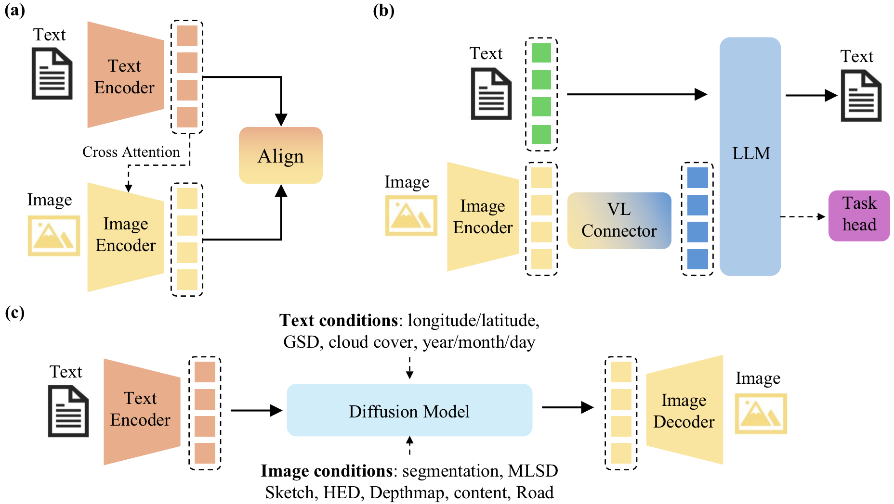
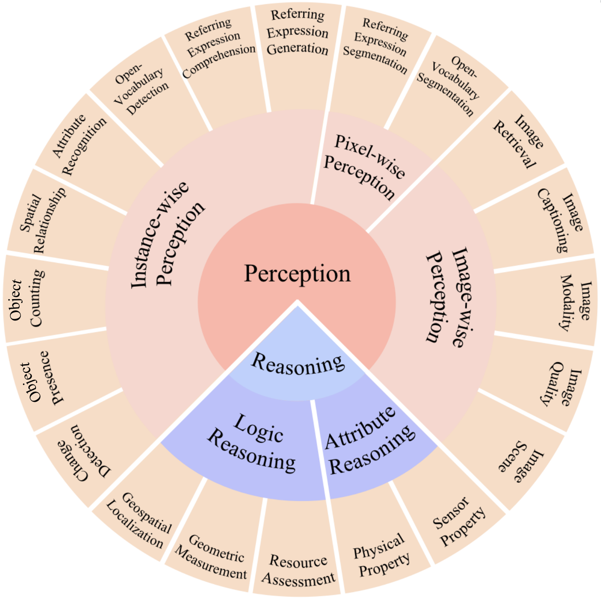

# 探索视觉-语言地理基础模型：一份综述

发布时间：2024年06月13日

`RAG

这篇论文主要探讨了视觉-语言地理基础模型（VLGFMs）的发展，包括其背景、动机、核心技术以及在多模态地理空间任务中的应用。这些内容主要集中在模型的应用和改进上，特别是针对地理空间数据的处理和模型微调，以增强模型的地理感知能力。因此，这篇论文更适合归类于RAG，即研究如何通过调整和优化模型来适应特定类型的数据和任务，而不是专注于理论研究或Agent的设计。` `地球观测` `地理信息系统`

> Towards Vision-Language Geo-Foundation Model: A Survey

# 摘要

> 视觉-语言基础模型（VLFMs）在图像描述、图文检索、视觉问答等任务上取得了显著成就，但它们多依赖于通用图像数据集，缺乏地理空间数据，导致在地球观测任务上的表现不尽人意。近期，针对这一问题，研究者们提出了多种地理空间图像-文本对数据集，并在此基础上微调了VLFMs，旨在构建具有强大地理感知能力的视觉-语言地理基础模型（VLGFMs）。本文深入探讨了VLGFMs的发展，详细介绍了其背景、动机及核心技术，包括数据构建、模型架构和多模态地理空间任务的应用，并对未来研究方向进行了展望。这是首次对VLGFMs进行全面综述，相关工作追踪可访问https://github.com/zytx121/Awesome-VLGFM。

> Vision-Language Foundation Models (VLFMs) have made remarkable progress on various multimodal tasks, such as image captioning, image-text retrieval, visual question answering, and visual grounding. However, most methods rely on training with general image datasets, and the lack of geospatial data leads to poor performance on earth observation. Numerous geospatial image-text pair datasets and VLFMs fine-tuned on them have been proposed recently. These new approaches aim to leverage large-scale, multimodal geospatial data to build versatile intelligent models with diverse geo-perceptive capabilities, which we refer to as Vision-Language Geo-Foundation Models (VLGFMs). This paper thoroughly reviews VLGFMs, summarizing and analyzing recent developments in the field. In particular, we introduce the background and motivation behind the rise of VLGFMs, highlighting their unique research significance. Then, we systematically summarize the core technologies employed in VLGFMs, including data construction, model architectures, and applications of various multimodal geospatial tasks. Finally, we conclude with insights, issues, and discussions regarding future research directions. To the best of our knowledge, this is the first comprehensive literature review of VLGFMs. We keep tracing related works at https://github.com/zytx121/Awesome-VLGFM.

[Arxiv](https://arxiv.org/abs/2406.09385)