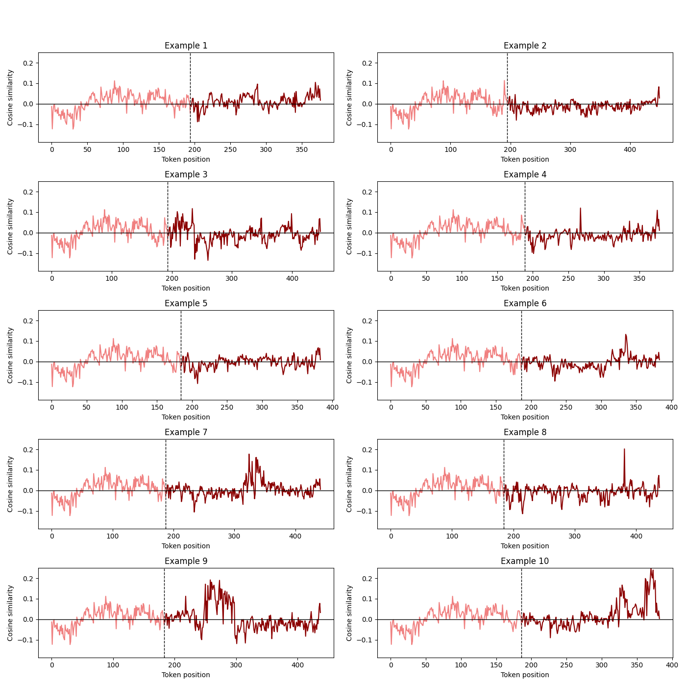
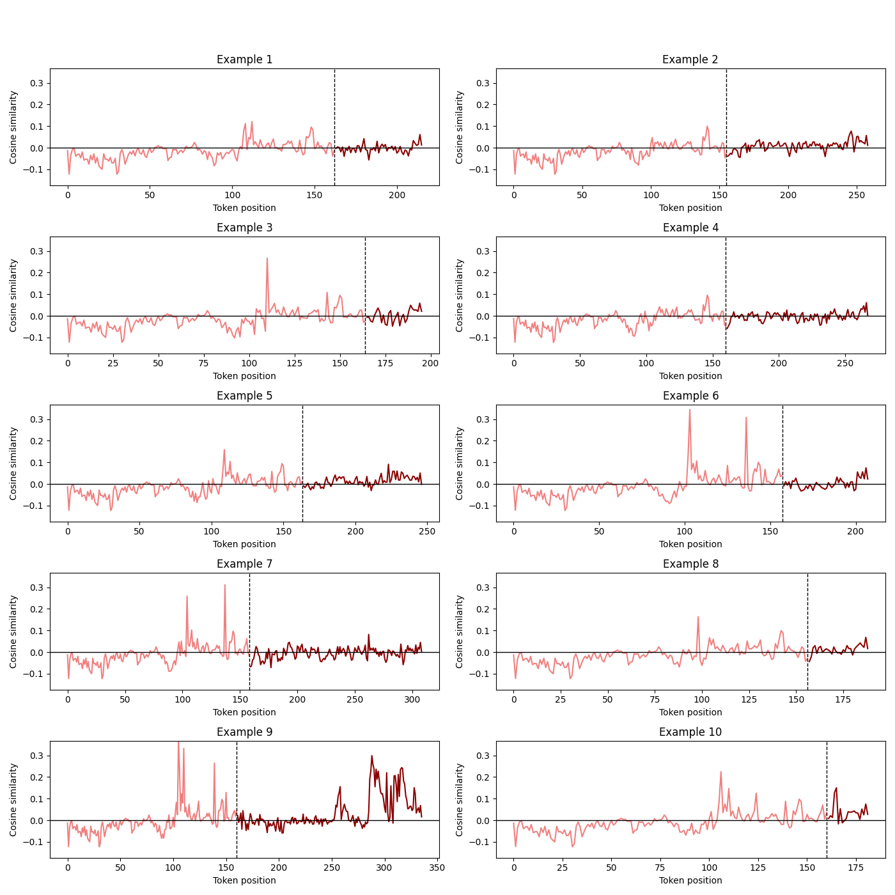

# 探究大型语言模型中的潜在空间动态：越狱成功的奥秘

发布时间：2024年06月13日

`Agent

这篇论文主要探讨了对话大型语言模型在面对越狱技术时的安全挑战，并分析了不同越狱类型如何规避模型的安全措施。研究重点在于模型的行为和反应，以及如何通过分析模型的内部机制来强化安全对策。这与Agent的分类相符，因为Agent通常指的是能够自主行动和做出决策的实体，这里指的是模型在面对越狱输入时的行为和反应。此外，论文的研究内容涉及模型的内部机制和安全对策，这些都是Agent研究领域的重要方面。` `安全技术` `人工智能`

> Understanding Jailbreak Success: A Study of Latent Space Dynamics in Large Language Models

# 摘要

> 对话大型语言模型虽被训练以拒绝有害问题，但新兴的越狱技术仍能引发不安全输出，挑战着模型的安全对齐。本文通过分析模型在不同越狱输入下的反应，揭示了不同越狱类型如何规避安全措施。研究发现，一种越狱向量能从单一越狱类型中提取，有效削弱其他类型越狱的效果，暗示了不同越狱可能共享相似的内部机制。我们探讨了有害特征抑制这一潜在共同机制，并通过有害向量分析证实了其存在。这些发现不仅为强化越狱对策提供了洞见，也为深入探究语言模型中越狱机制奠定了基础。

> Conversational Large Language Models are trained to refuse to answer harmful questions. However, emergent jailbreaking techniques can still elicit unsafe outputs, presenting an ongoing challenge for model alignment. To better understand how different jailbreak types circumvent safeguards, this paper analyses model activations on different jailbreak inputs. We find that it is possible to extract a jailbreak vector from a single class of jailbreaks that works to mitigate jailbreak effectiveness from other classes. This may indicate that different kinds of effective jailbreaks operate via similar internal mechanisms. We investigate a potential common mechanism of harmfulness feature suppression, and provide evidence for its existence by looking at the harmfulness vector component. These findings offer actionable insights for developing more robust jailbreak countermeasures and lay the groundwork for a deeper, mechanistic understanding of jailbreak dynamics in language models.

[Arxiv](https://arxiv.org/abs/2406.09289)