# 控制下的遗忘：探索大型语言模型在现实世界中遗忘能力的实际应用价值

发布时间：2024年06月13日

`LLM理论

这篇论文主要探讨了在大规模语言模型（LLMs）中实现机器遗忘的问题，特别是通过梯度上升（GA）方法来消除特定训练数据的影响。论文提出了评估现实效用的指标和控制策略，以避免过度遗忘，并构建了一个通用框架来评估遗忘效果。这些内容主要涉及LLM的理论和方法论层面，因此归类为LLM理论。` `机器学习` `数据隐私`

> Unlearning with Control: Assessing Real-world Utility for Large Language Model Unlearning

# 摘要

> 在大规模语言模型（LLMs）中，消除不良数据行为的同时保持模型正常运作，凸显了机器遗忘的重要性。近期研究通过梯度上升（GA）方法探索LLM的遗忘，旨在通过增加特定训练数据的预测风险来消除其影响。尽管GA方法简便高效，但易导致过度遗忘，引发灾难性遗忘等不良后果，影响其实际应用。本文提出了一套全面评估现实效用的指标，并设计了几种控制策略以避免过度遗忘。我们构建了一个通用框架，首先确保遗忘过程不过度，随后评估遗忘效果。实验结果显示，GA方法在实际应用中存在局限，过度遗忘严重损害了模型效用。这表明，实现高效实用的LLM遗忘仍需更多研究。

> The compelling goal of eradicating undesirable data behaviors, while preserving usual model functioning, underscores the significance of machine unlearning within the domain of large language models (LLMs). Recent research has begun to approach LLM unlearning via gradient ascent (GA) -- increasing the prediction risk for those training strings targeted to be unlearned, thereby erasing their parameterized responses. Despite their simplicity and efficiency, we suggest that GA-based methods face the propensity towards excessive unlearning, resulting in various undesirable model behaviors, such as catastrophic forgetting, that diminish their practical utility. In this paper, we suggest a set of metrics that can capture multiple facets of real-world utility and propose several controlling methods that can regulate the extent of excessive unlearning. Accordingly, we suggest a general framework to better reflect the practical efficacy of various unlearning methods -- we begin by controlling the unlearning procedures/unlearned models such that no excessive unlearning occurs and follow by the evaluation for unlearning efficacy. Our experimental analysis on established benchmarks revealed that GA-based methods are far from perfect in practice, as strong unlearning is at the high cost of hindering the model utility. We conclude that there is still a long way towards practical and effective LLM unlearning, and more efforts are required in this field.

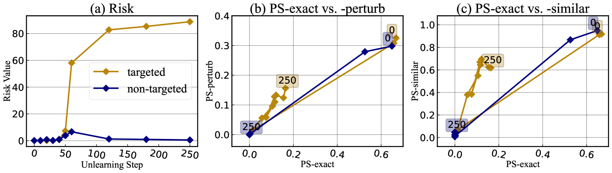

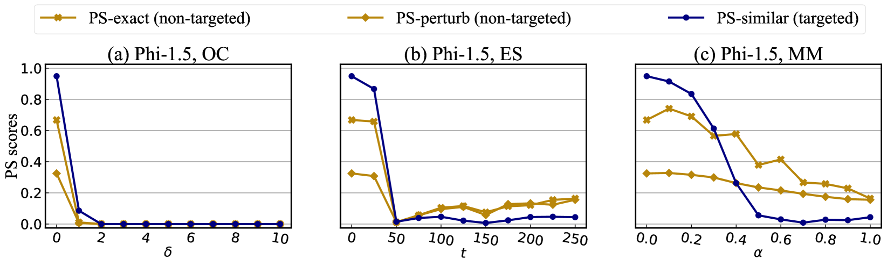

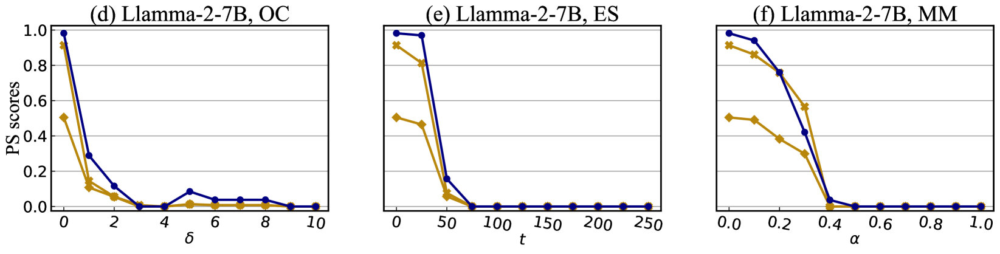

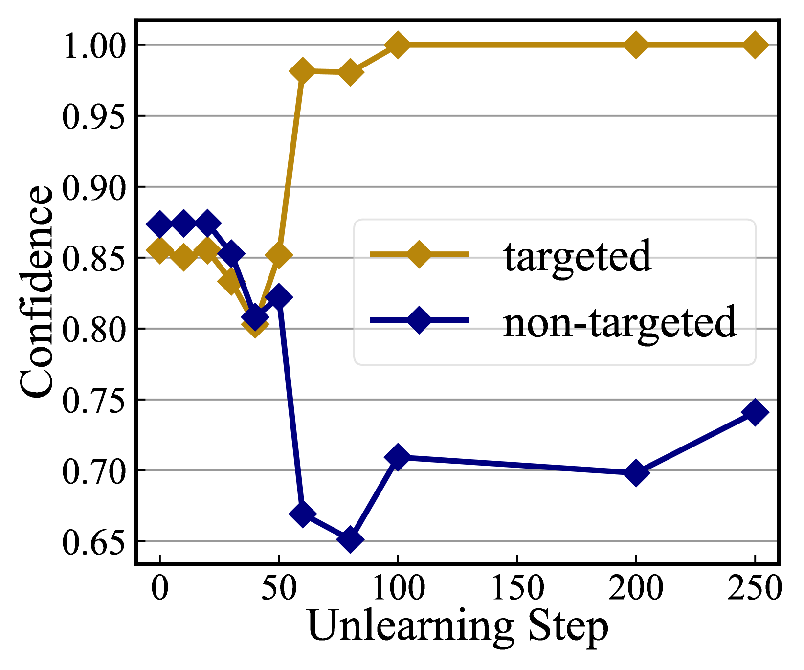

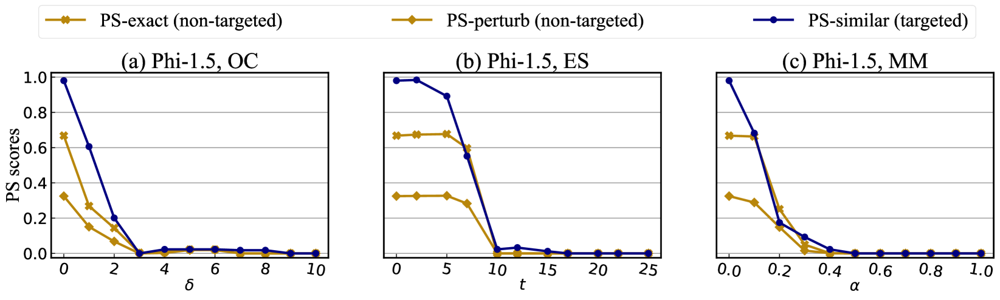

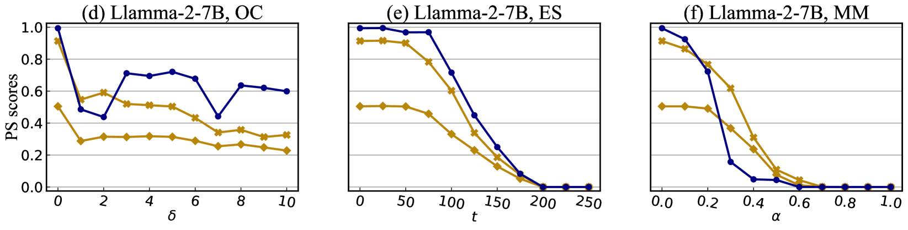

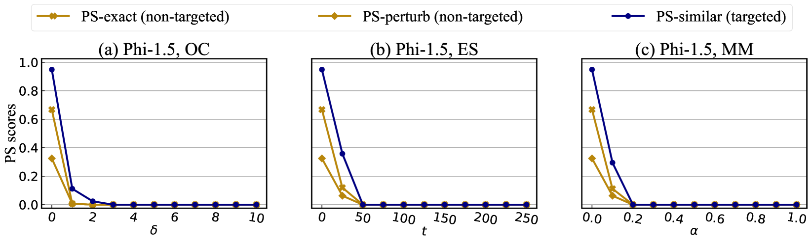

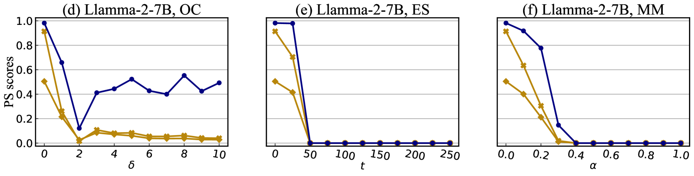

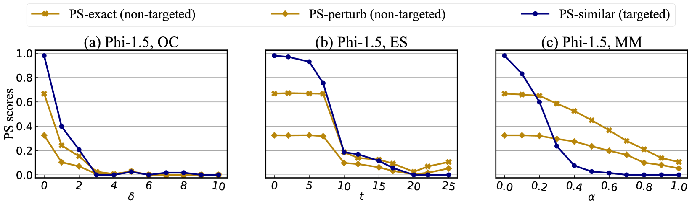

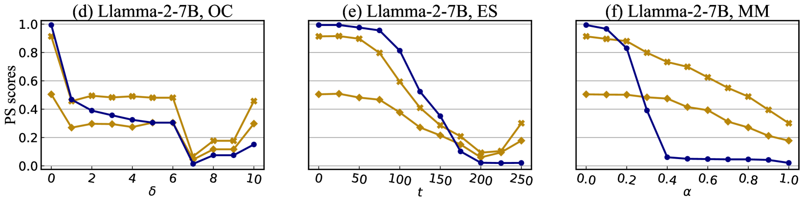

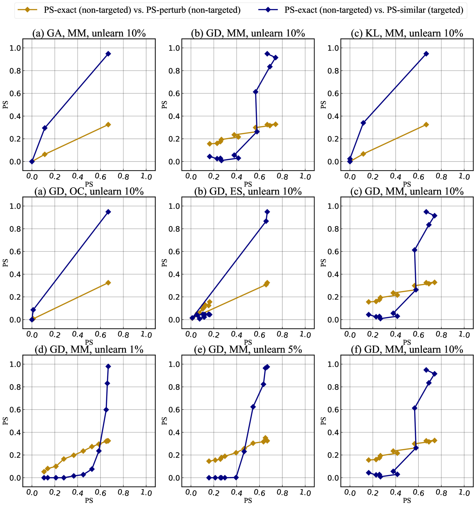

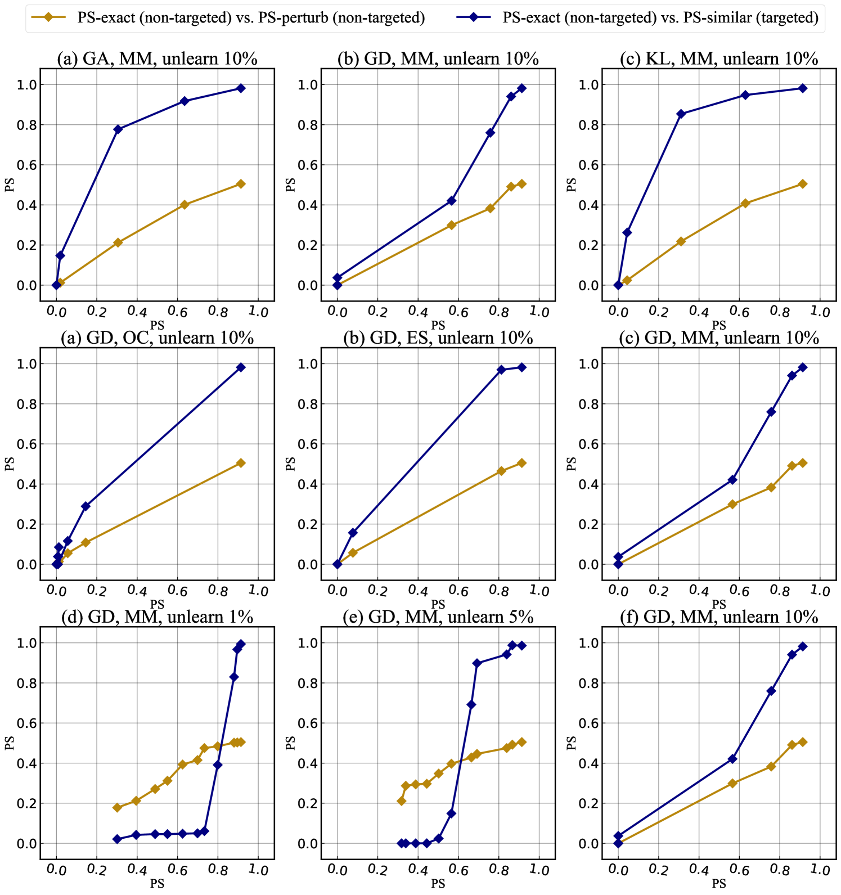

[Arxiv](https://arxiv.org/abs/2406.09179)