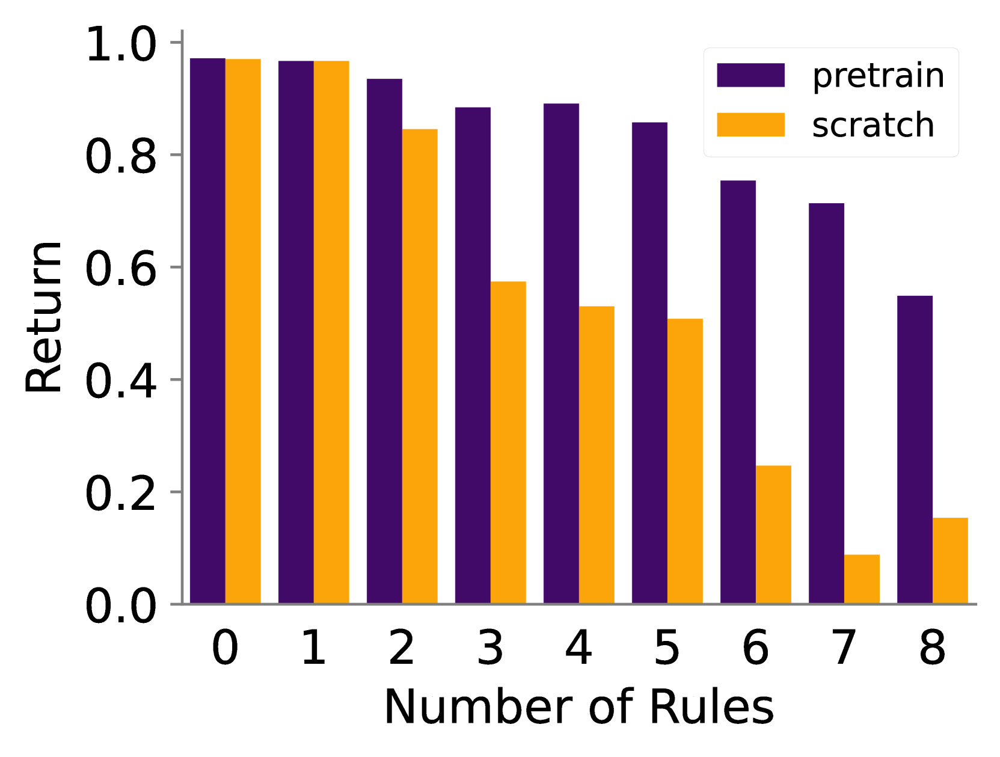
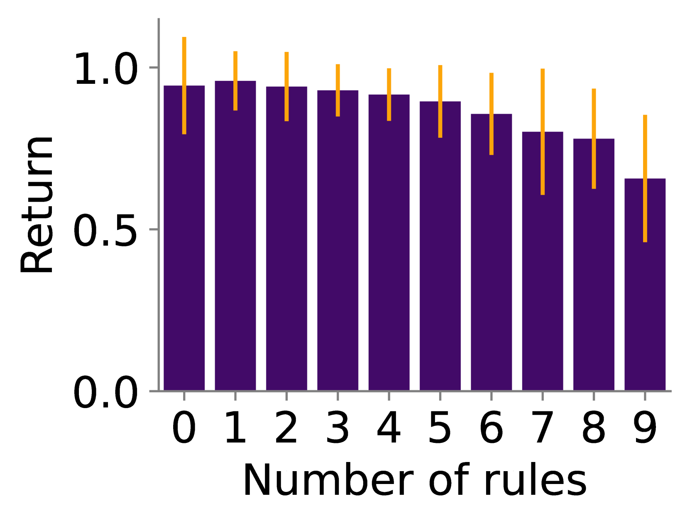

# XLand-100B：专为情境强化学习设计的大型多任务数据集

发布时间：2024年06月13日

`Agent

理由：这篇论文主要介绍了 **XLand-100B**，一个大规模的上下文强化学习数据集，并强调了其在推动上下文强化学习领域研究中的作用。这个数据集的创建和使用是为了支持强化学习代理（Agent）在复杂环境中的学习和表现，因此与Agent相关的研究和应用紧密相关。虽然这个数据集可能间接支持LLM（大型语言模型）在强化学习中的应用，但论文的核心贡献在于提供了一个用于训练和测试强化学习代理的基准数据集，而不是直接关于LLM的理论或应用。因此，将其归类为Agent更为合适。` `数据集`

> XLand-100B: A Large-Scale Multi-Task Dataset for In-Context Reinforcement Learning

# 摘要

> 随着上下文学习范式在大型语言和视觉模型中的成功应用，新兴的上下文强化学习领域正迅速发展。但这一领域的进步已经受限于缺乏挑战性的基准，因为现有实验多在简单环境中，且基于小规模数据集。为此，我们推出了 **XLand-100B**，一个基于 XLand-MiniGrid 环境的大规模上下文强化学习数据集，旨在解决这一问题。该数据集记录了近 30,000 个任务的学习历程，包含 1000 亿次状态转换和 25 亿个回合，收集过程耗时 50,000 GPU 小时，远超多数学术实验室的能力。此外，我们还提供了工具，以便研究者复制或扩展这一数据集。我们的目标是通过这一努力，促进上下文强化学习领域的研究普及，并为该领域的未来发展奠定坚实基础。相关代码已开源，遵循 Apache 2.0 许可证，可在 https://github.com/dunno-lab/xland-minigrid-datasets 获取。

> Following the success of the in-context learning paradigm in large-scale language and computer vision models, the recently emerging field of in-context reinforcement learning is experiencing a rapid growth. However, its development has been held back by the lack of challenging benchmarks, as all the experiments have been carried out in simple environments and on small-scale datasets. We present \textbf{XLand-100B}, a large-scale dataset for in-context reinforcement learning based on the XLand-MiniGrid environment, as a first step to alleviate this problem. It contains complete learning histories for nearly $30,000$ different tasks, covering $100$B transitions and $2.5$B episodes. It took $50,000$ GPU hours to collect the dataset, which is beyond the reach of most academic labs. Along with the dataset, we provide the utilities to reproduce or expand it even further. With this substantial effort, we aim to democratize research in the rapidly growing field of in-context reinforcement learning and provide a solid foundation for further scaling. The code is open-source and available under Apache 2.0 licence at https://github.com/dunno-lab/xland-minigrid-datasets.

[Arxiv](https://arxiv.org/abs/2406.08973)