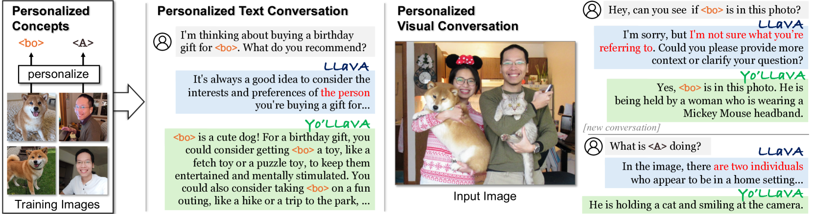
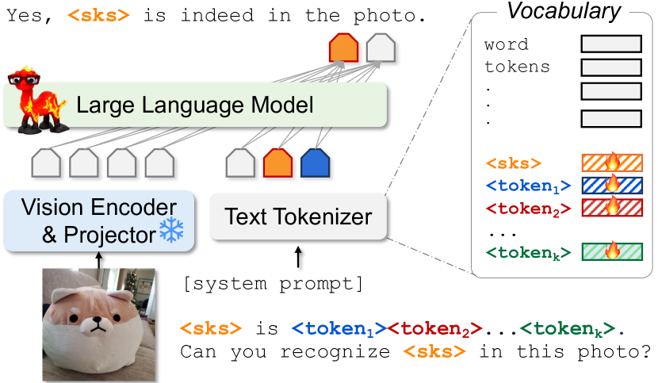
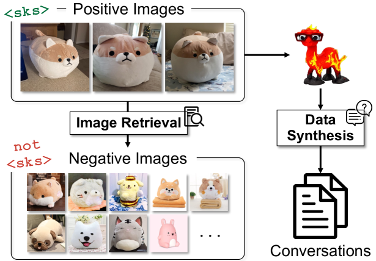
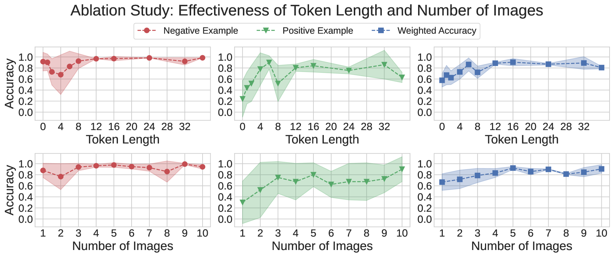
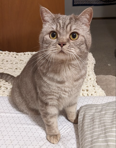
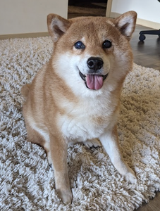

# Yo'LLaVA：专属于您的语言与视觉智能伴侣

发布时间：2024年06月13日

`Agent

理由：这篇论文介绍了一种新的系统（Yo'LLaVA），该系统能够通过少量示例图像将个性化主题嵌入到一组潜在标记中，从而使大型多模态模型（LMMs）能够进行个性化对话。这种系统可以被视为一个智能代理（Agent），因为它能够处理特定用户的个性化需求，并在此基础上进行推理和交互。这与Agent的定义相符，即一个能够感知环境并采取行动以达到目标的系统。此外，论文中提到的系统在概念学习和视觉属性编码上的效率和优势，进一步支持了其作为Agent的分类。` `个性化对话` `图像描述`

> Yo'LLaVA: Your Personalized Language and Vision Assistant

# 摘要

> 大型多模态模型（LMMs）在图像描述、视觉问答等任务中表现出色，但它们对知识的掌握仍停留在通用层面，无法针对个性化主题（如识别特定用户的宠物狗）进行处理。人类推理则通常聚焦于周围具体事物的情境。例如，人们更倾向于询问：“我应该给我的狗买什么生日礼物？”而非泛泛而谈：“狗的生日应该买什么？”同样，看到朋友的照片时，我们更关注他们的具体活动（如“我的朋友正抱着一只猫”），而非一般的人类行为（如“一个男人正抱着一只猫”）。本文提出了一项新任务，旨在使LMMs能够就特定主题进行个性化对话。我们开发的Yo'LLaVA系统，通过少量示例图像，能将个性化主题高效地嵌入到一组潜在标记中。研究表明，Yo'LLaVA在概念学习上更为高效，使用更少的标记，且在视觉属性的编码上优于现有的强大提示基准（如LLaVA）。

> Large Multimodal Models (LMMs) have shown remarkable capabilities across a variety of tasks (e.g., image captioning, visual question answering). While broad, their knowledge remains generic (e.g., recognizing a dog), and they are unable to handle personalized subjects (e.g., recognizing a user's pet dog). Human reasoning, in contrast, typically operates within the context of specific subjects in our surroundings. For example, one might ask, "What should I buy for my dog's birthday?"; as opposed to a generic inquiry about "What should I buy for a dog's birthday?". Similarly, when looking at a friend's image, the interest lies in seeing their activities (e.g., "my friend is holding a cat"), rather than merely observing generic human actions (e.g., "a man is holding a cat"). In this paper, we introduce the novel task of personalizing LMMs, so that they can have conversations about a specific subject. We propose Yo'LLaVA, which learns to embed a personalized subject into a set of latent tokens given a handful of example images of the subject. Our qualitative and quantitative analyses reveal that Yo'LLaVA can learn the concept more efficiently using fewer tokens and more effectively encode the visual attributes compared to strong prompting baselines (e.g., LLaVA).

[Arxiv](https://arxiv.org/abs/2406.09400)