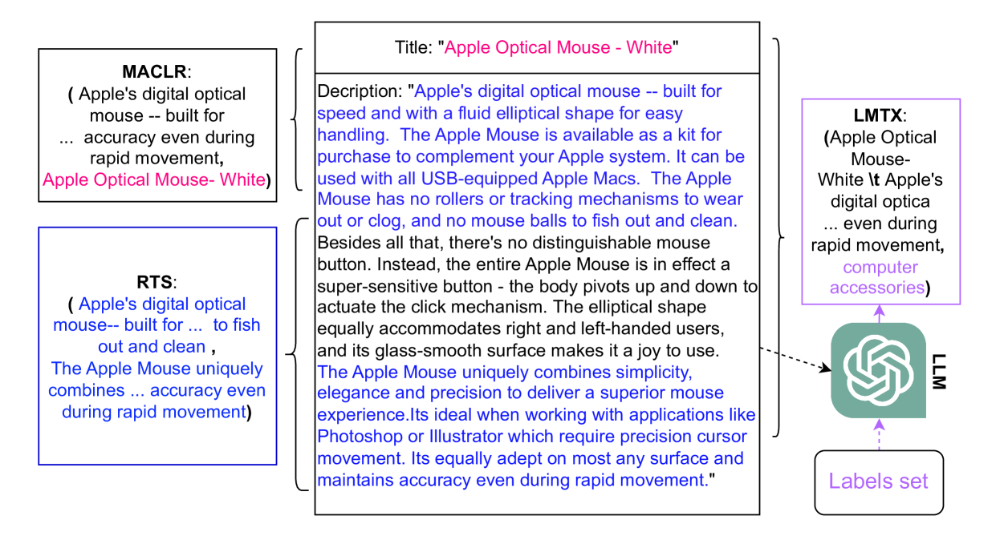
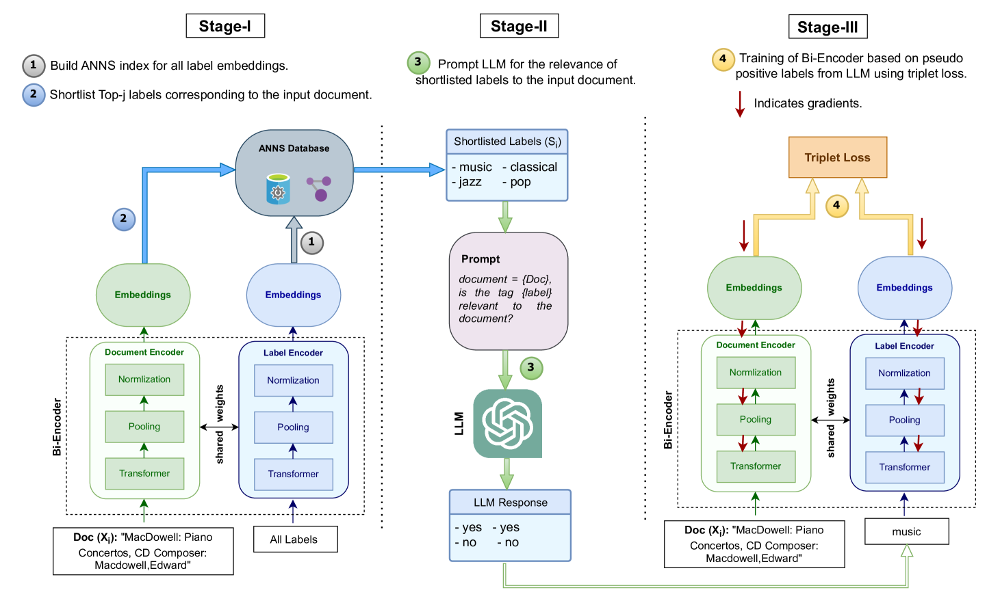
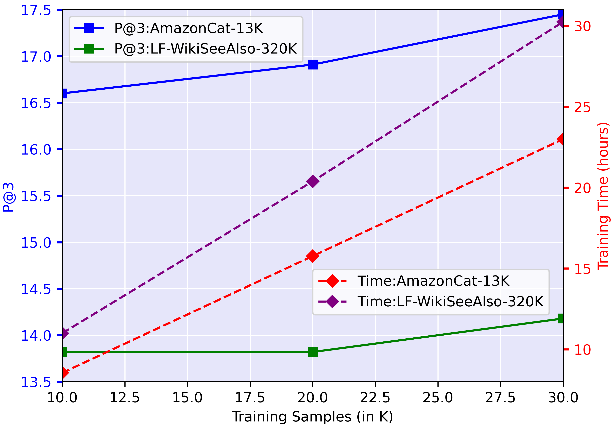

# 在大规模输出空间中，零-shot 学习通过大型语言模型间接提取知识，展现了其独特的应用潜力。

发布时间：2024年06月13日

`LLM应用

这篇论文主要探讨了如何利用大型语言模型（LLM）的能力来改进极端多标签学习（XMC）中的零-shot学习问题。通过使用LLM来评估标签与文档之间的关联，并训练一个小型双编码器来处理文档和标签的嵌入，以提高检索效率和准确性。这种方法不仅提高了性能，还保持了训练效率，特别是在大型数据集上。因此，这篇论文属于LLM应用类别，因为它展示了LLM在特定应用场景中的实际应用和改进效果。` `推荐系统`

> Zero-Shot Learning Over Large Output Spaces : Utilizing Indirect Knowledge Extraction from Large Language Models

# 摘要

> 极端多标签学习（XMC）旨在从预设标签集中为每个实例精准匹配标签。在极端零-shot XMC（EZ-XMC）这一特殊情境下，无监督信息可用，仅凭文档原始文本及预设标签集应对分类与推荐的冷启动挑战。传统顶尖技术依赖文档标题或片段提取伪标签，进而训练零-shot双编码器。然而，这些标签常与实际标记任务不符。本研究提出一种新框架，借助大型语言模型（LLM）反馈，训练小型双编码器，将文档与标签转化为嵌入以供检索。我们利用LLM的零-shot能力，评估标签与文档间的关联，摒弃了文档自身提取的低质标签。此法确保了快速推理，无需LLM介入，且在多个数据集上超越了现有技术，同时保持了大型数据集的训练效率。

> Extreme Multi-label Learning (XMC) is a task that allocates the most relevant labels for an instance from a predefined label set. Extreme Zero-shot XMC (EZ-XMC) is a special setting of XMC wherein no supervision is provided; only the instances (raw text of the document) and the predetermined label set are given. The scenario is designed to address cold-start problems in categorization and recommendation. Traditional state-of-the-art methods extract pseudo labels from the document title or segments. These labels from the document are used to train a zero-shot bi-encoder model. The main issue with these generated labels is their misalignment with the tagging task. In this work, we propose a framework to train a small bi-encoder model via the feedback from the large language model (LLM), the bi-encoder model encodes the document and labels into embeddings for retrieval. Our approach leverages the zero-shot ability of LLM to assess the correlation between labels and the document instead of using the low-quality labels extracted from the document itself. Our method also guarantees fast inference without the involvement of LLM. The performance of our approach outperforms the SOTA methods on various datasets while retaining a similar training time for large datasets.

[Arxiv](https://arxiv.org/abs/2406.09288)