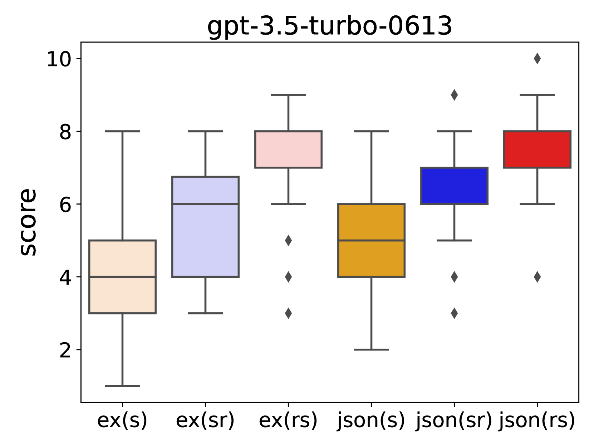
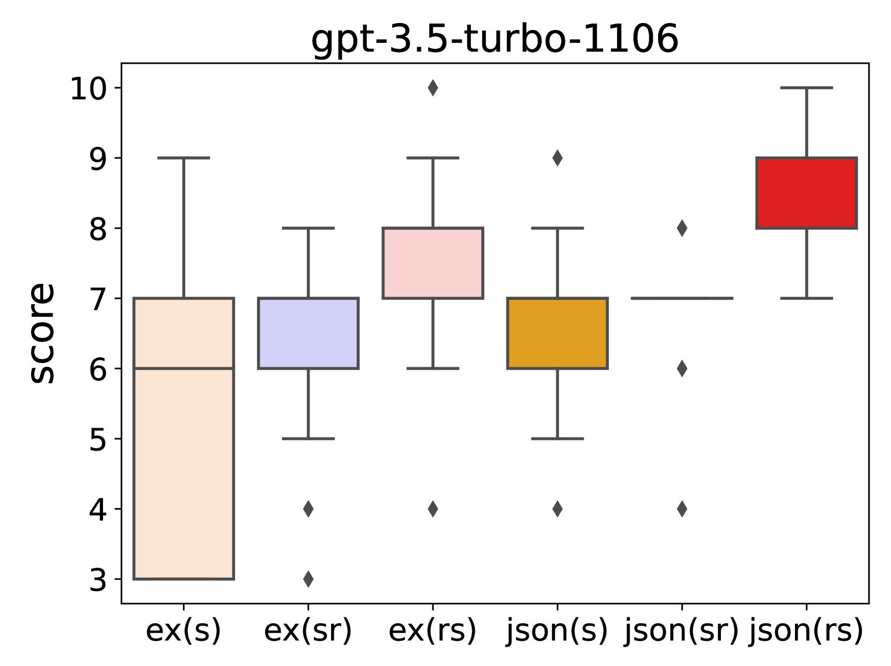
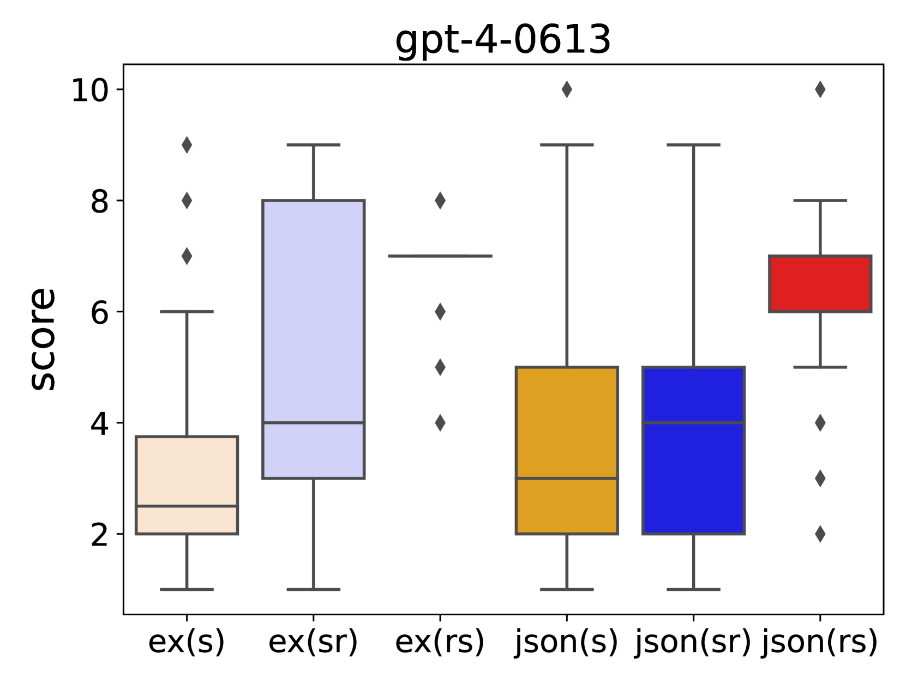
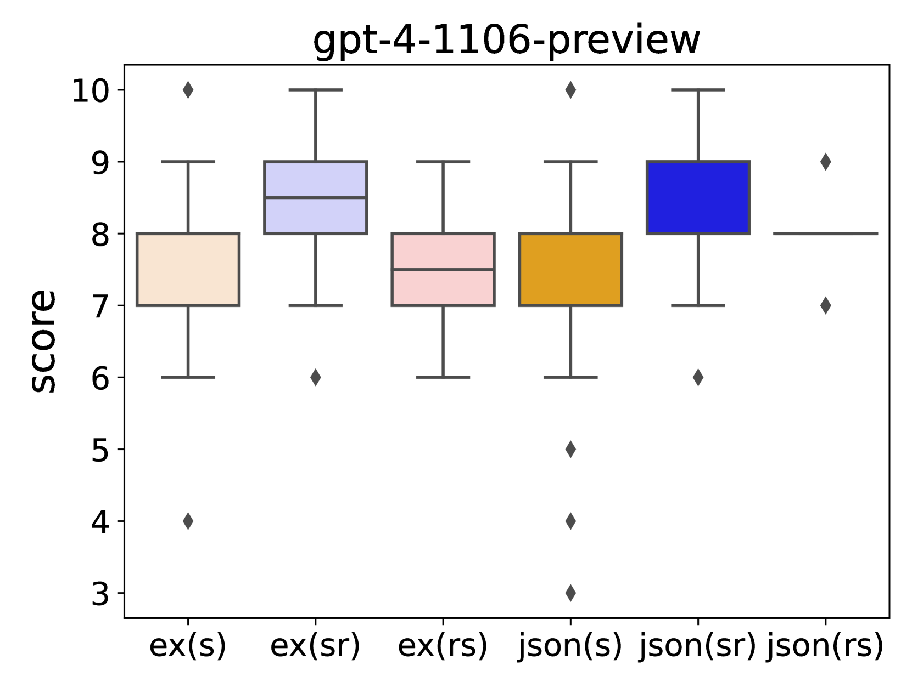
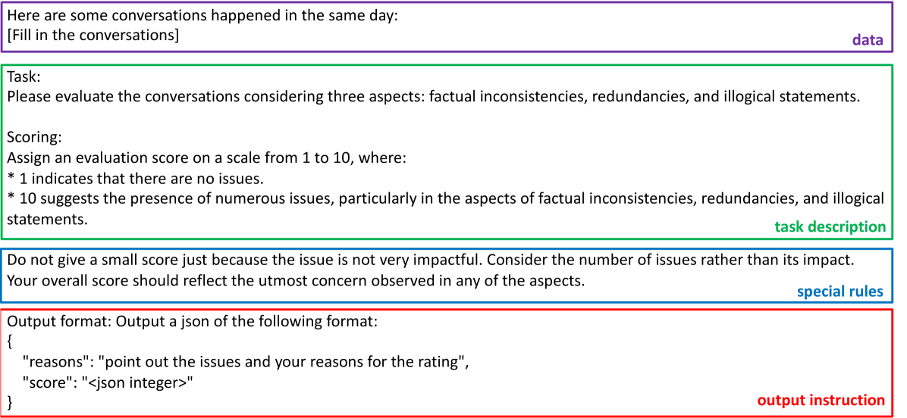
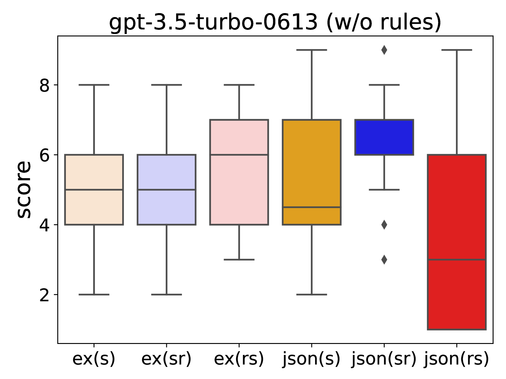
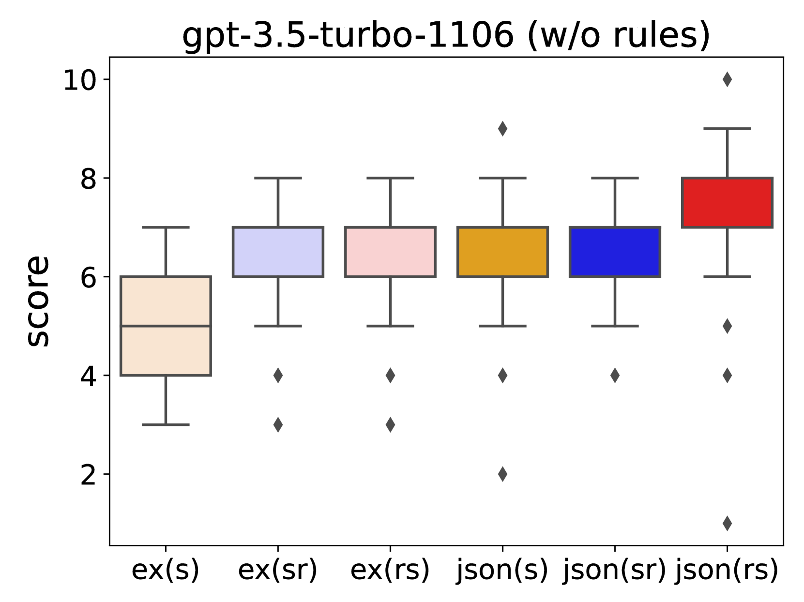
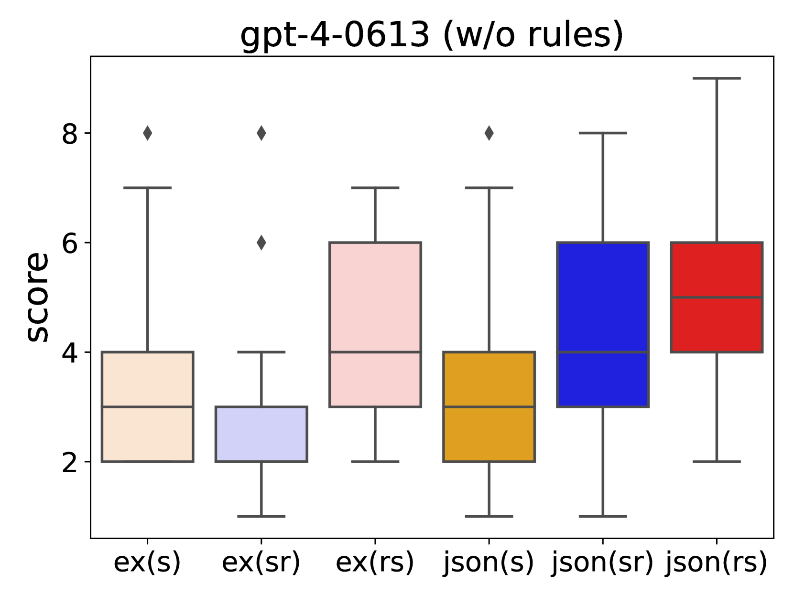
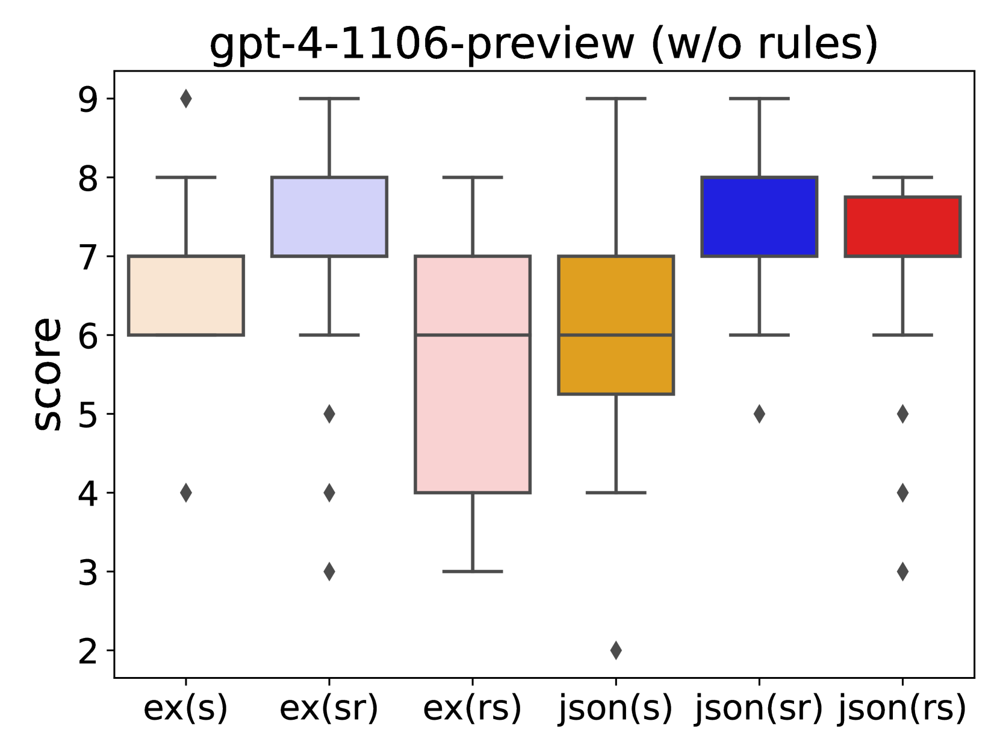

# 优化提示输出序列化：提升文本生成的大型语言模型评估器

发布时间：2024年06月14日

`LLM应用

这篇论文的摘要主要讨论了如何设计提示以利用大型语言模型（LLMs）来评估文本生成。研究关注的是LLMs在评分任务中的应用，特别是在设计提示时如何平衡文本生成的敏感性和评估的主观性。这涉及到实验不同的提示结构和输出指令的排列顺序，以及理由解释的加入。研究结果表明，提示中理由与分数呈现的顺序对LLMs的评分有显著影响，这直接关联到LLMs在实际应用中的性能和准确性。因此，这篇论文属于LLM应用分类。` `文本评估`

> A Better LLM Evaluator for Text Generation: The Impact of Prompt Output Sequencing and Optimization

# 摘要

> 本研究深入探讨了如何设计提示以利用大型语言模型（LLMs）评估文本生成。尽管LLMs在评分各类输入方面日益普及，但设计出既能应对文本生成敏感性又能兼顾评估主观性的有效提示依旧是一大挑战。我们的实验涉及了多种提示结构，调整了输出指令的排列顺序，并加入了理由解释。研究发现，提示中理由与分数呈现的顺序对LLMs的评分有着显著影响，且不同提示结构下的规则理解程度各异。若数据充足，进一步的优化有望提升评分的一致性。这一发现对于提升基于LLM的评估准确性与一致性具有重要意义。

> This research investigates prompt designs of evaluating generated texts using large language models (LLMs). While LLMs are increasingly used for scoring various inputs, creating effective prompts for open-ended text evaluation remains challenging due to model sensitivity and subjectivity in evaluation of text generation. Our study experimented with different prompt structures, altering the sequence of output instructions and including explanatory reasons. We found that the order of presenting reasons and scores significantly influences LLMs' scoring, with a different level of rule understanding in the prompt. An additional optimization may enhance scoring alignment if sufficient data is available. This insight is crucial for improving the accuracy and consistency of LLM-based evaluations.

[Arxiv](https://arxiv.org/abs/2406.09972)