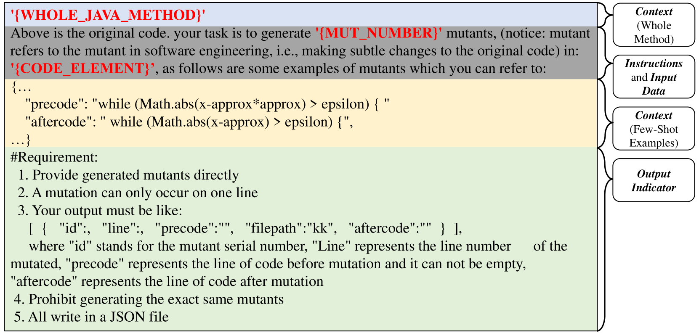
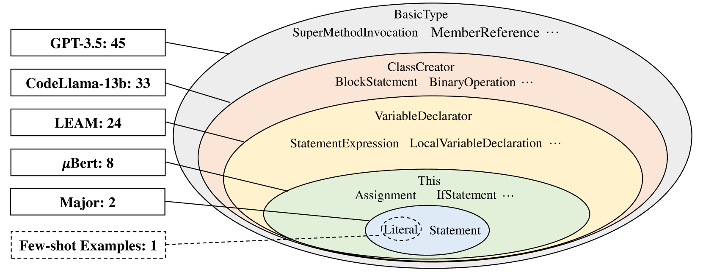
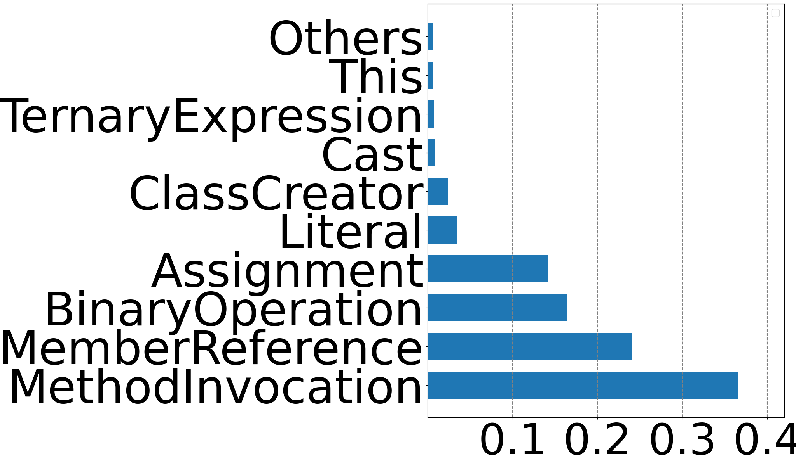
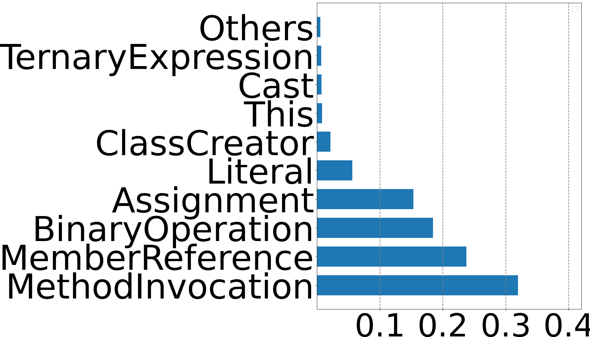
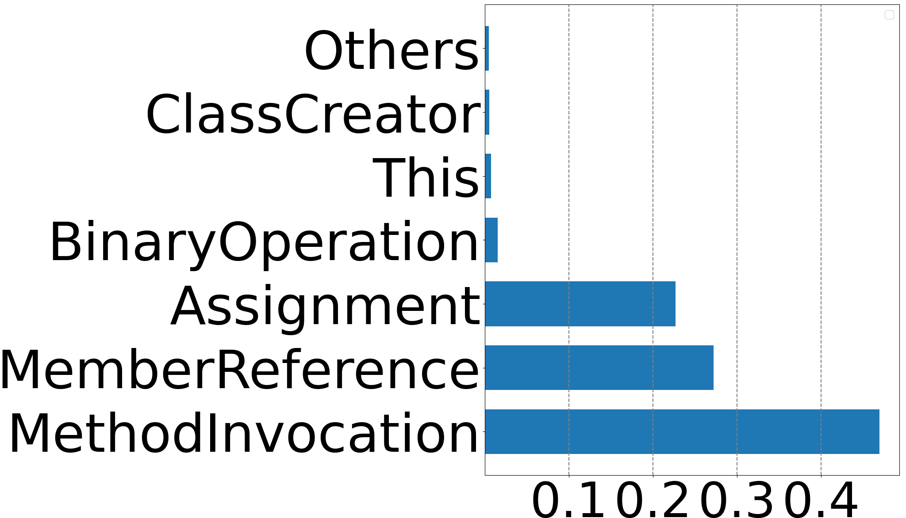
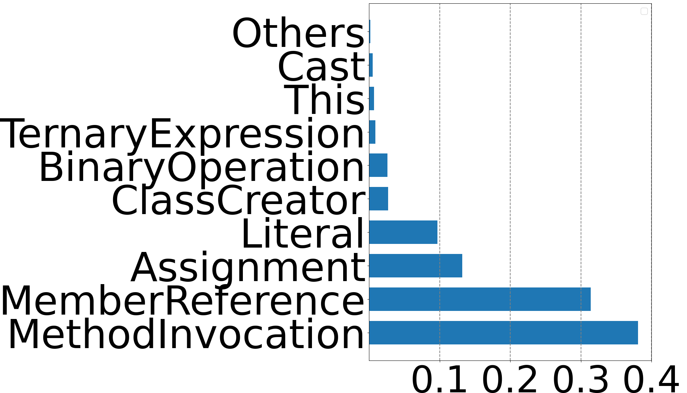
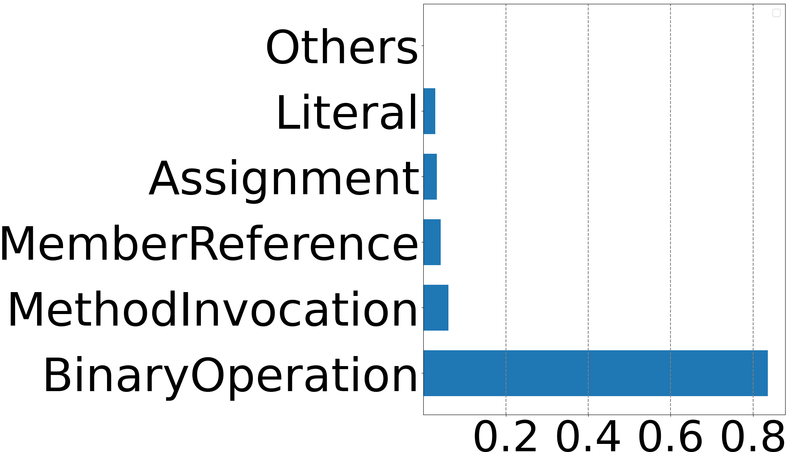

# 探索大型语言模型在变异测试中的应用研究

发布时间：2024年06月14日

`LLM应用

这篇论文主要探讨了大型语言模型（LLMs）在突变测试领域的应用，特别是在生成有效突变体方面的表现。论文通过实证研究评估了LLMs在可用性、故障检测能力以及与真实错误的关联性方面的性能，并发现LLMs生成的突变体在行为上更接近真实错误，故障检测率相比现有方法有显著提升。因此，这篇论文属于LLM应用分类，因为它关注的是LLMs在特定领域（突变测试）的实际应用和效果评估。` `软件测试` `编程语言`

> An Exploratory Study on Using Large Language Models for Mutation Testing

# 摘要

> 在突变测试领域，如何生成具有高测试价值的突变体是一个关键挑战。传统方法或是依赖人工定义的语法规则，或是采用基于学习的技术，但这些方法往往产生大量冗余的突变体。大型语言模型（LLMs）在处理代码相关任务时展现出巨大潜力，然而其在突变测试中的应用尚未得到充分探索。为此，我们系统地评估了LLMs在生成有效突变方面的表现，特别关注其可用性、故障检测能力以及与真实错误的关联。通过一项涉及4种LLMs（包括开源和闭源模型）和针对两个Java基准的440个真实错误的大规模实证研究，我们发现LLMs生成的突变体在行为上更接近真实错误，相比现有方法，故障检测率提高了约18%（达到87%，而现有方法为69%）。此外，我们还研究了不同的提示工程策略以及LLMs产生不可编译突变的原因，为在突变测试中有效利用LLMs提供了重要见解。

> The question of how to generate high-utility mutations, to be used for testing purposes, forms a key challenge in mutation testing literature. %Existing approaches rely either on human-specified syntactic rules or learning-based approaches, all of which produce large numbers of redundant mutants. Large Language Models (LLMs) have shown great potential in code-related tasks but their utility in mutation testing remains unexplored. To this end, we systematically investigate the performance of LLMs in generating effective mutations w.r.t. to their usability, fault detection potential, and relationship with real bugs. In particular, we perform a large-scale empirical study involving 4 LLMs, including both open- and closed-source models, and 440 real bugs on two Java benchmarks. We find that compared to existing approaches, LLMs generate more diverse mutations that are behaviorally closer to real bugs, which leads to approximately 18% higher fault detection than current approaches (i.e., 87% vs. 69%) in a newly collected set of bugs, purposely selected for evaluating learning-based approaches, i.e., mitigating potential data leakage concerns. Additionally, we explore alternative prompt engineering strategies and the root causes of uncompilable mutations, produced by the LLMs, and provide valuable insights for the use of LLMs in the context of mutation testing.

[Arxiv](https://arxiv.org/abs/2406.09843)