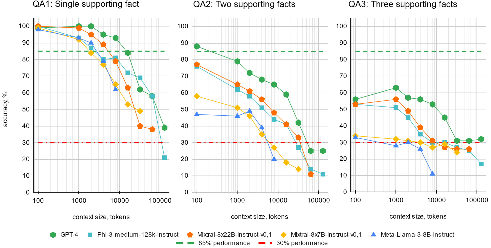

# BABILong：挑战 LLMs 在长上下文推理中的极限

发布时间：2024年06月14日

`RAG

理由：该论文摘要主要介绍了BABILong基准的推出，该基准旨在评估大型语言模型（LLMs）处理长篇上下文的能力。特别提到了检索增强生成技术（RAG）在单事实问答上的表现，这表明论文内容与RAG技术紧密相关。因此，将该论文分类为RAG是合适的。` `基准测试`

> BABILong: Testing the Limits of LLMs with Long Context Reasoning-in-a-Haystack

# 摘要

> 随着大型语言模型（LLMs）的输入上下文规模激增，现有评估方法却未能全面衡量这些模型处理长篇上下文的能力。为此，我们推出了BABILong基准，专门设计来考验语言模型在极长文档中跨越分布事实进行推理的能力。该基准涵盖了20项多元推理任务，如事实链、归纳、演绎、计数及列表/集合处理，这些任务本身就颇具挑战，若所需信息散布于长篇自然文本中，则难度倍增。评估结果表明，主流LLMs仅能有效利用10-20%的上下文，且推理复杂度提升时性能显著下滑。在替代上下文推理的方法中，检索增强生成技术在单事实问答上达到60%的准确率，不受上下文长度影响。而在上下文扩展技术中，循环记忆变压器表现最佳，能处理高达1100万个标记的长度。BABILong基准可无限扩展，以适应未来能力增强的新模型评估需求，我们已提供高达100万个标记长度的测试分割。

> In recent years, the input context sizes of large language models (LLMs) have increased dramatically. However, existing evaluation methods have not kept pace, failing to comprehensively assess the efficiency of models in handling long contexts. To bridge this gap, we introduce the BABILong benchmark, designed to test language models' ability to reason across facts distributed in extremely long documents. BABILong includes a diverse set of 20 reasoning tasks, including fact chaining, simple induction, deduction, counting, and handling lists/sets. These tasks are challenging on their own, and even more demanding when the required facts are scattered across long natural text. Our evaluations show that popular LLMs effectively utilize only 10-20\% of the context and their performance declines sharply with increased reasoning complexity. Among alternatives to in-context reasoning, Retrieval-Augmented Generation methods achieve a modest 60\% accuracy on single-fact question answering, independent of context length. Among context extension methods, the highest performance is demonstrated by recurrent memory transformers, enabling the processing of lengths up to 11 million tokens. The BABILong benchmark is extendable to any length to support the evaluation of new upcoming models with increased capabilities, and we provide splits up to 1 million token lengths.

[Arxiv](https://arxiv.org/abs/2406.10149)