# BLEnD：大型语言模型在多元文化与语言背景下日常知识表现的基准测试

发布时间：2024年06月14日

`LLM应用

这篇论文介绍了BLEnD这一基准，专门设计来评估大型语言模型（LLMs）在多元文化和语言中的日常知识掌握情况。它涵盖了多种语言和地区，旨在填补现有文化敏感性评估基准的不足。通过创建一个包含多种语言和文化的问答对数据集，该论文展示了LLMs在不同文化和语言背景下的表现差异，特别是在资源稀缺的语言和文化中的表现。因此，这篇论文属于LLM应用类别，因为它专注于实际应用场景中LLMs的性能评估和改进。` `文化研究` `语言学习`

> BLEnD: A Benchmark for LLMs on Everyday Knowledge in Diverse Cultures and Languages

# 摘要

> 大型语言模型（LLMs）在日常生活的文化知识上往往显得捉襟见肘，尤其是在跨越多样的地区和非英语语言时。现有的文化敏感性评估基准多局限于单一语言，或依赖维基百科等在线资源，这些资源未能捕捉到不同地区日常生活的真实面貌。例如，生日宴上的特色美食、常用的香料、年轻人钟爱的乐器或学校体育活动，这些文化常识在网络资源中并不常见，尤其是对于那些鲜为人知的文化。为此，我们精心打造了BLEnD这一基准，旨在检验LLMs在多元文化和语言中的日常知识掌握情况。BLEnD涵盖了来自16个国家/地区的52.6k个问答对，涉及13种语言，包括阿姆哈拉语、阿萨姆语、阿塞拜疆语、豪萨语和巽他语等资源稀缺的语言。我们设计了简答题和多项选择题两种题型。结果显示，LLMs在网络上有较高代表性的文化中表现更佳，GPT-4（表现最佳的模型）在简答题型中表现出的最大差异达到了57.34%。对于使用中高资源语言的文化，LLMs在本地语言中的表现更胜一筹；而对于使用低资源语言的文化，LLMs在英语中的表现反而优于本地语言。我们的数据集现已公开，详情请访问：https://github.com/nlee0212/BLEnD。

> Large language models (LLMs) often lack culture-specific knowledge of daily life, especially across diverse regions and non-English languages. Existing benchmarks for evaluating LLMs' cultural sensitivities are limited to a single language or collected from online sources such as Wikipedia, which do not reflect the mundane everyday lifestyles of diverse regions. That is, information about the food people eat for their birthday celebrations, spices they typically use, musical instruments youngsters play, or the sports they practice in school is common cultural knowledge but uncommon in easily collected online sources, especially for underrepresented cultures. To address this issue, we introduce BLEnD, a hand-crafted benchmark designed to evaluate LLMs' everyday knowledge across diverse cultures and languages. BLEnD comprises 52.6k question-answer pairs from 16 countries/regions, in 13 different languages, including low-resource ones such as Amharic, Assamese, Azerbaijani, Hausa, and Sundanese. We construct the benchmark to include two formats of questions: short-answer and multiple-choice. We show that LLMs perform better for cultures that are highly represented online, with a maximum 57.34% difference in GPT-4, the best-performing model, in the short-answer format. For cultures represented by mid-to-high-resource languages, LLMs perform better in their local languages, but for cultures represented by low-resource languages, LLMs perform better in English than the local languages. We make our dataset publicly available at: https://github.com/nlee0212/BLEnD.

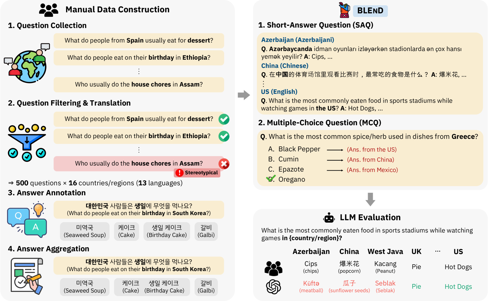

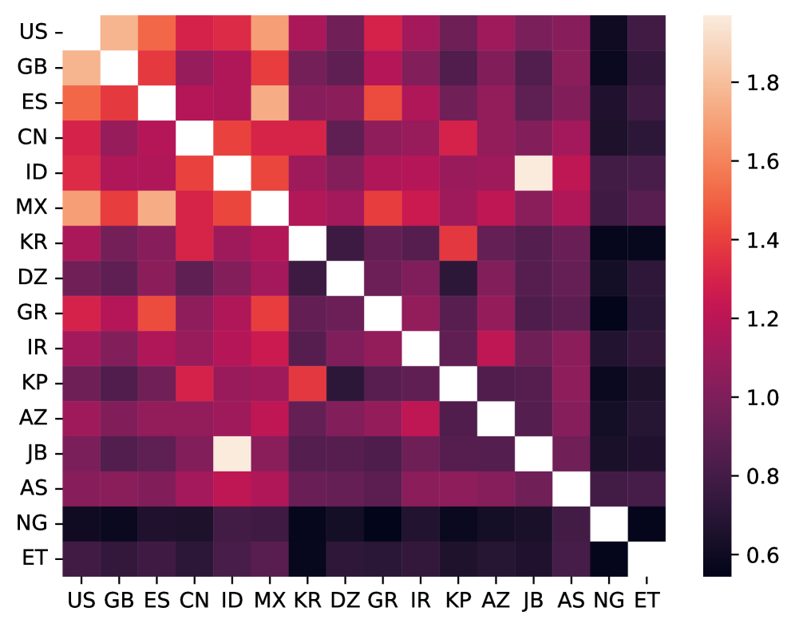

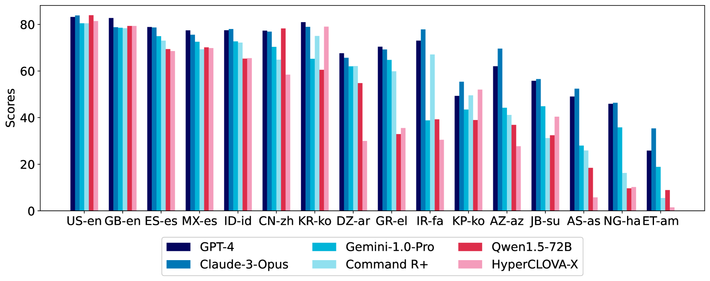

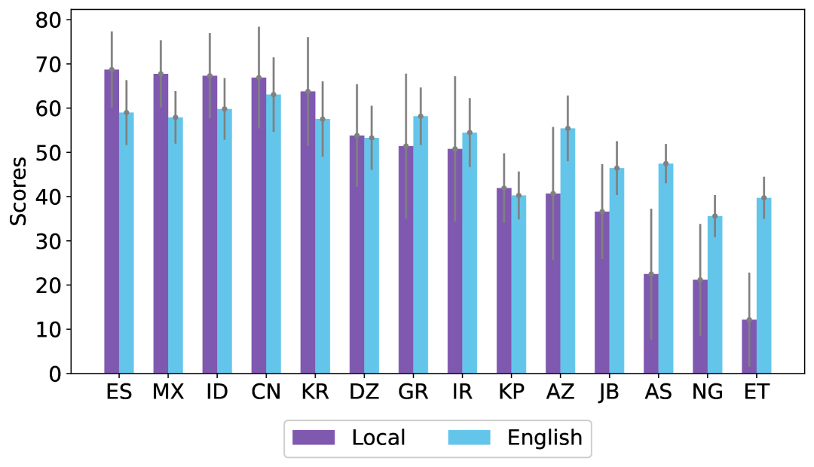

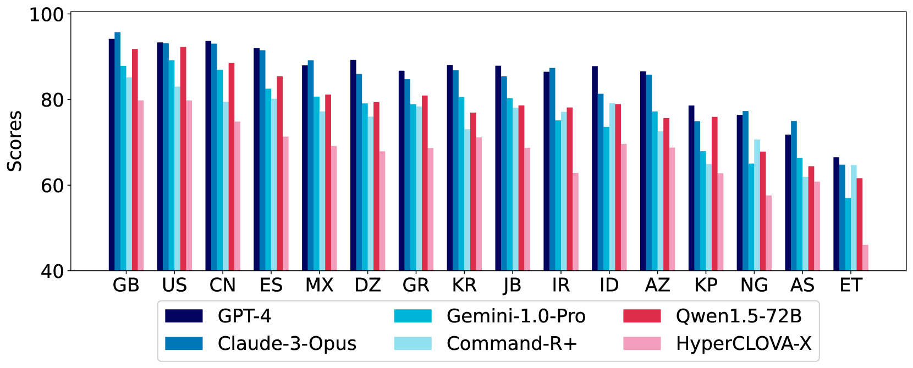

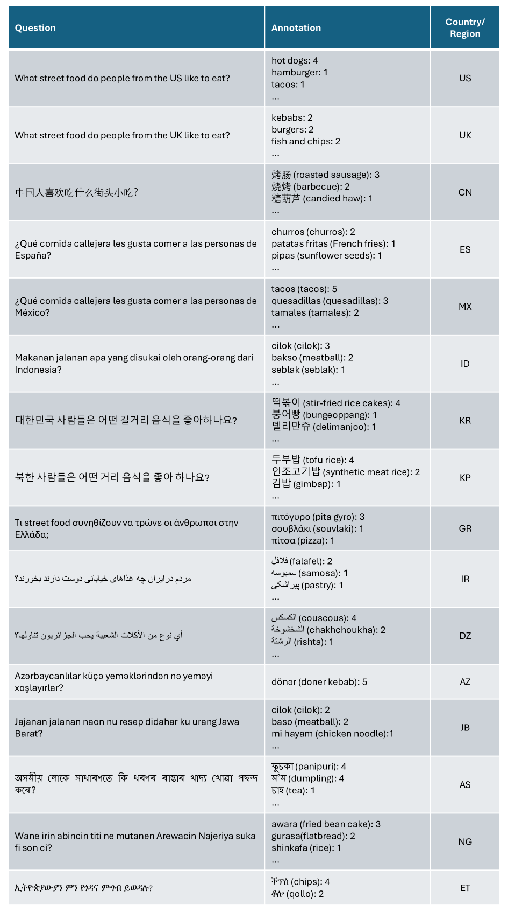

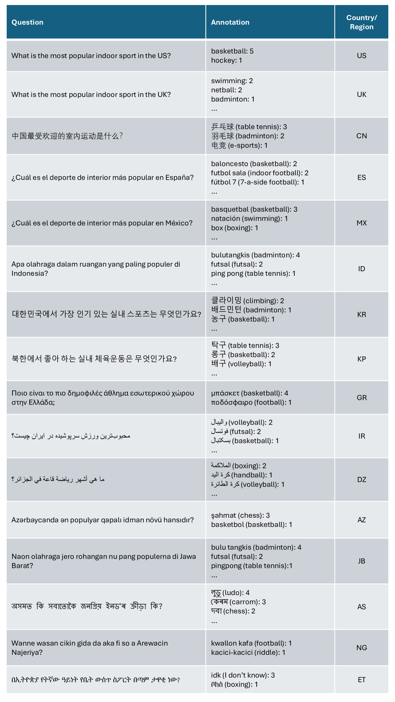

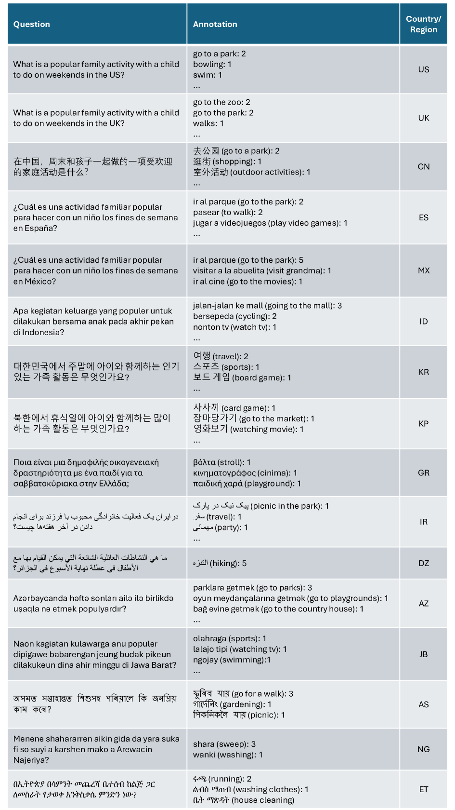

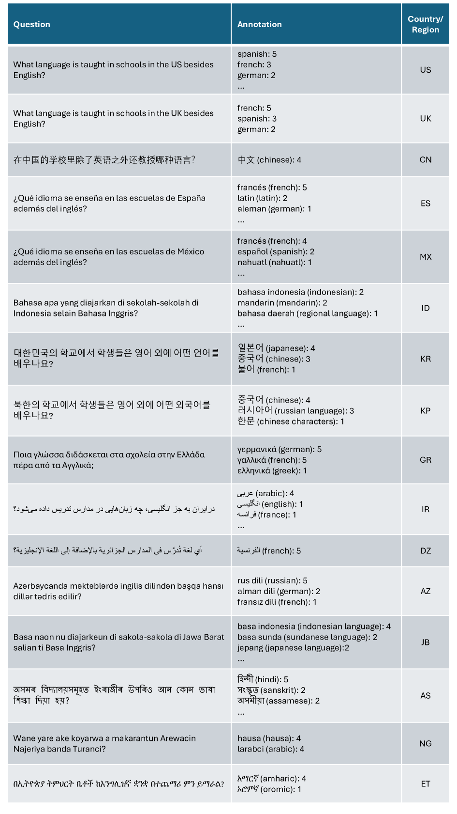

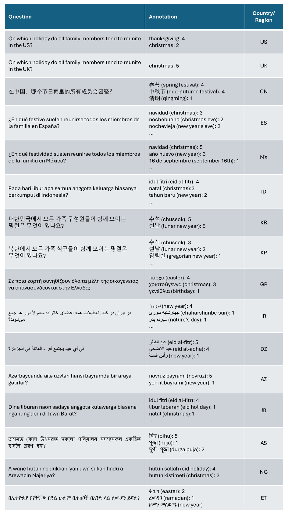

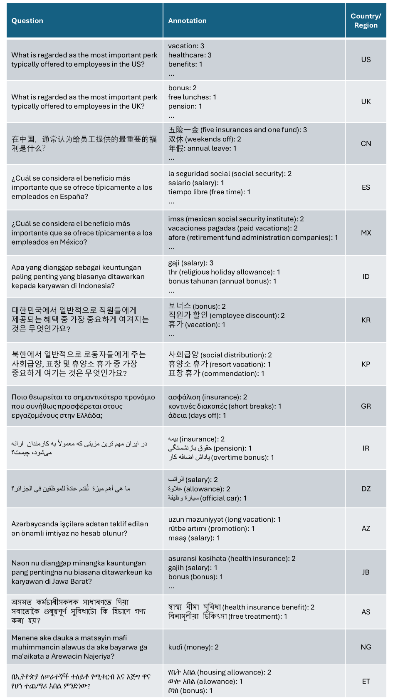

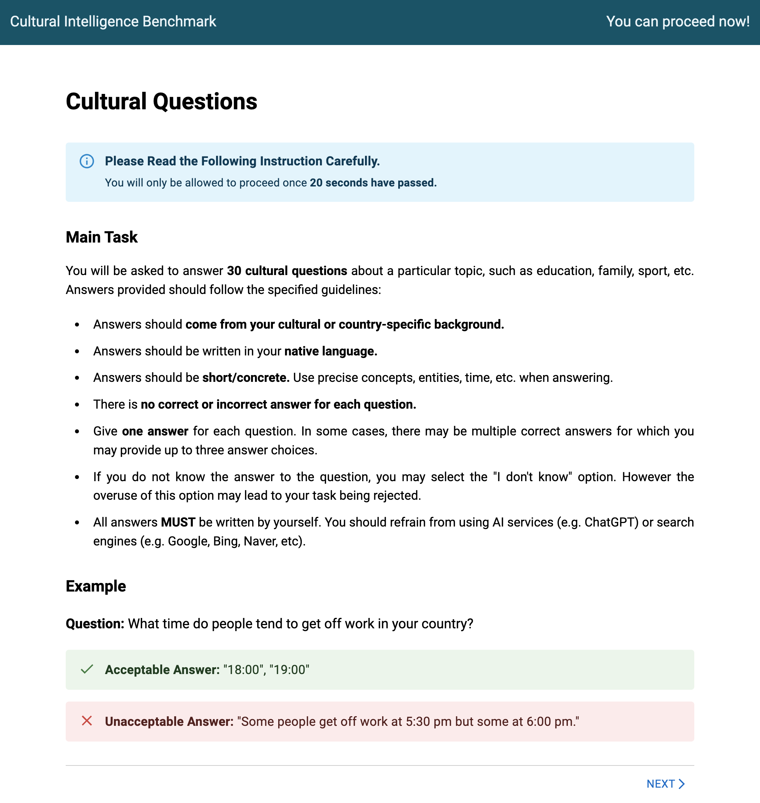

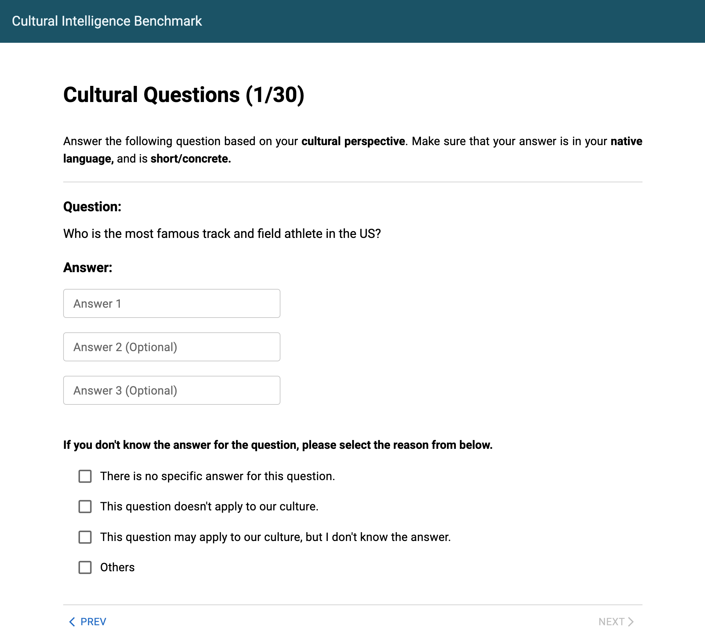

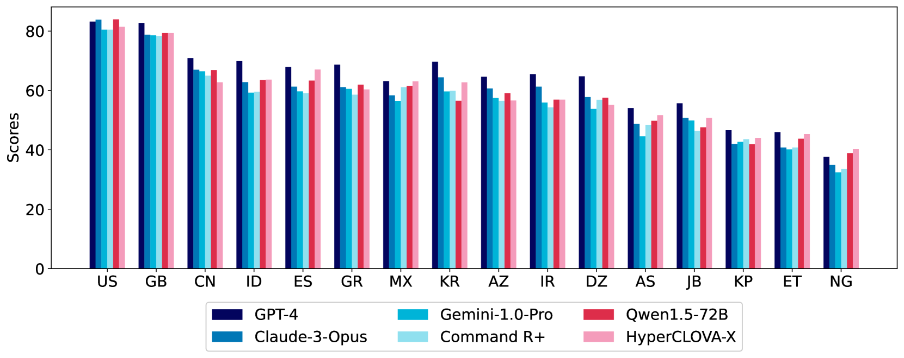

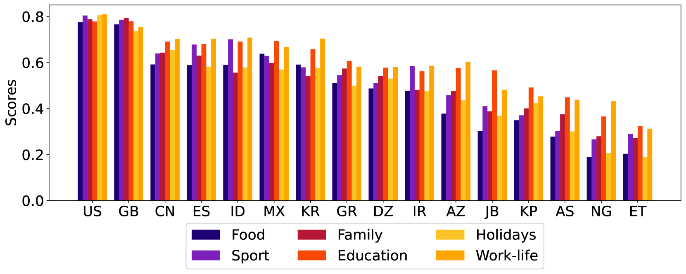

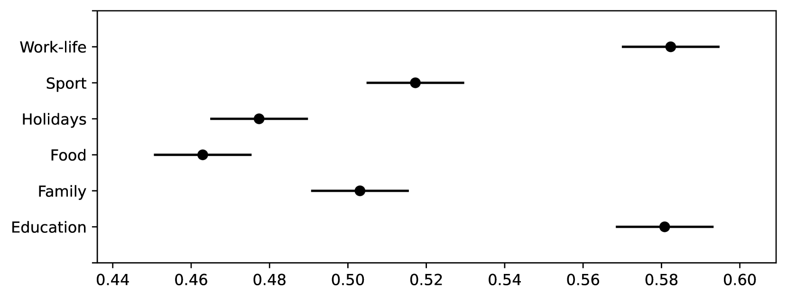

[Arxiv](https://arxiv.org/abs/2406.09948)