# 像金鱼般忘却，勿让记忆束缚！探索减轻生成型大型语言模型记忆化之道

发布时间：2024年06月14日

`LLM理论

理由：这篇论文提出了一种新的微调方法——“金鱼损失”，旨在解决大型语言模型记忆训练数据的问题，这直接涉及到模型的训练和学习机制，属于对LLM理论层面的研究。虽然这种方法可能会在应用中被采用，但其核心贡献在于理论创新，即如何通过调整损失函数来影响模型的记忆行为，因此更适合归类为LLM理论。` `隐私保护` `版权保护`

> Be like a Goldfish, Don't Memorize! Mitigating Memorization in Generative LLMs

# 摘要

> 大型语言模型能记住并重复训练数据，引发隐私和版权隐患。为此，我们提出了一种名为“金鱼损失”的微调方法，即在训练时随机排除部分令牌的损失计算，使模型不记忆这些令牌，避免逐字复制训练数据。我们对十亿级Llama-2模型进行了详尽测试，无论是预训练还是从头训练，均显著降低了可提取记忆，而对下游任务的影响微乎其微。

> Large language models can memorize and repeat their training data, causing privacy and copyright risks. To mitigate memorization, we introduce a subtle modification to the next-token training objective that we call the goldfish loss. During training, a randomly sampled subset of tokens are excluded from the loss computation. These dropped tokens are not memorized by the model, which prevents verbatim reproduction of a complete chain of tokens from the training set. We run extensive experiments training billion-scale Llama-2 models, both pre-trained and trained from scratch, and demonstrate significant reductions in extractable memorization with little to no impact on downstream benchmarks.

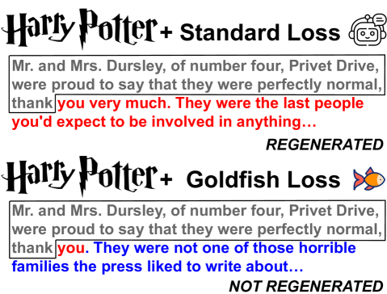

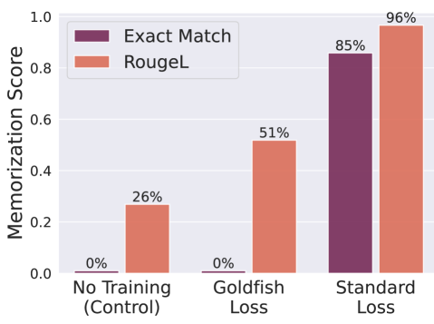

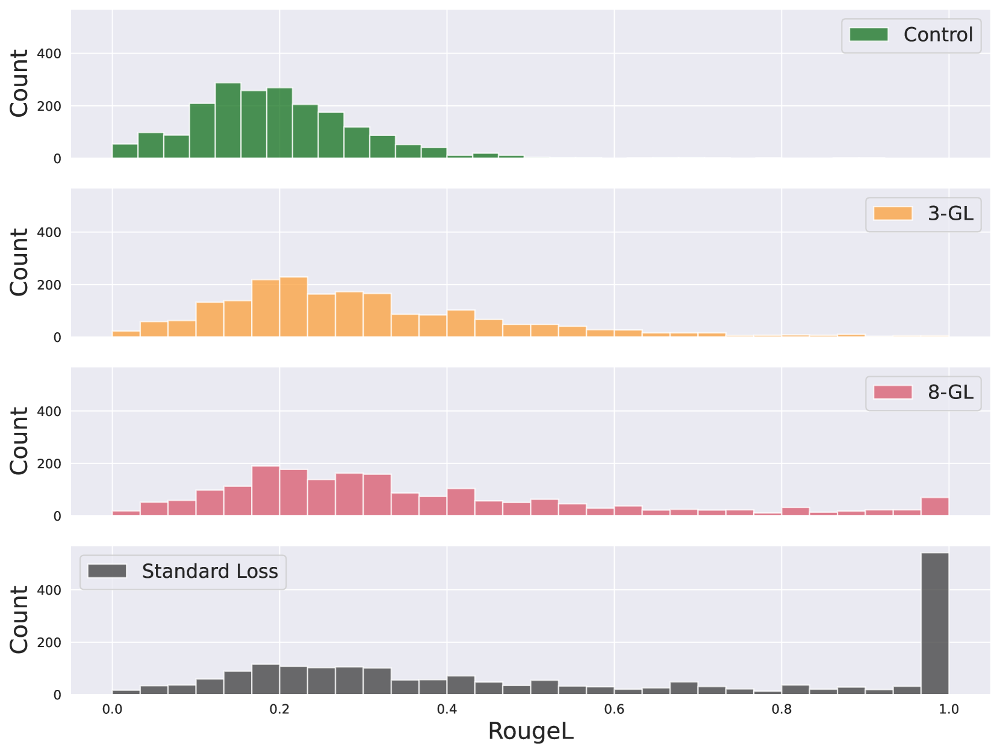

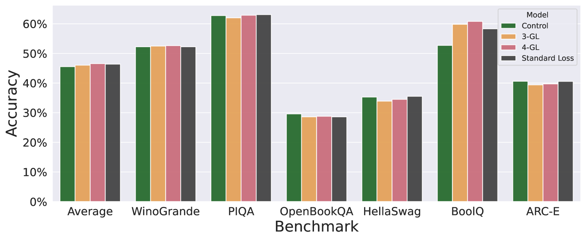

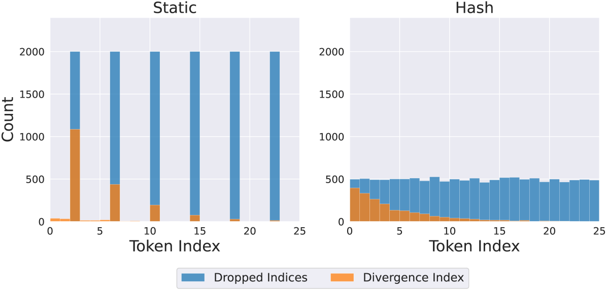

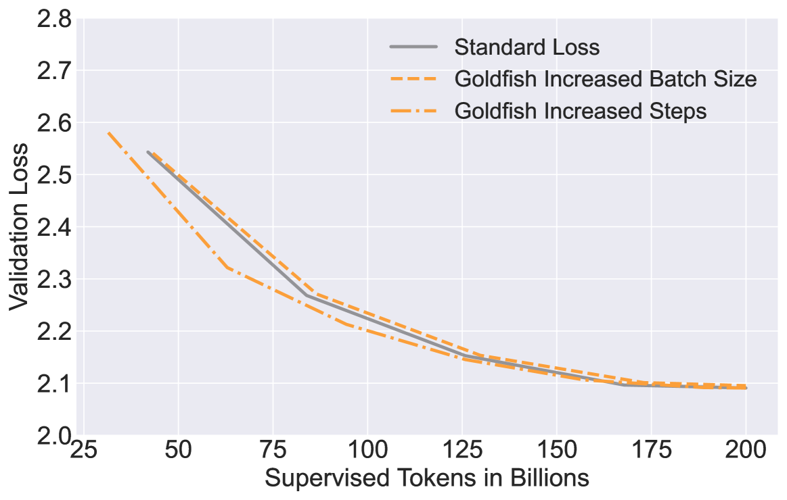

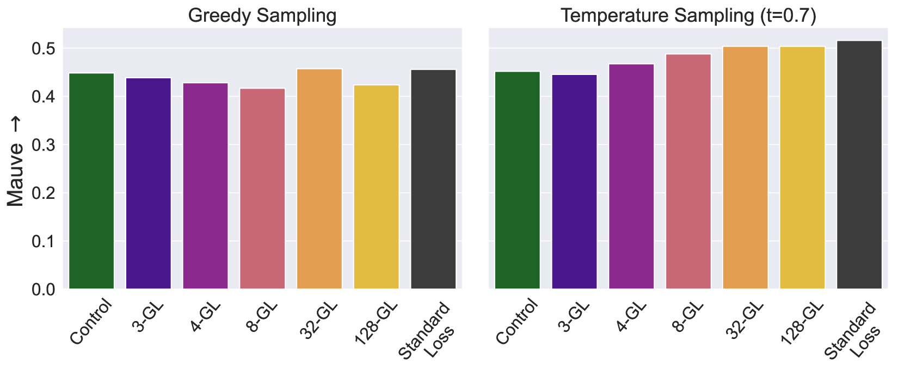

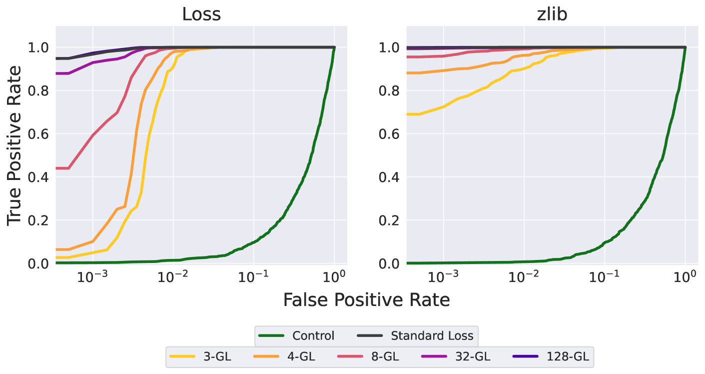

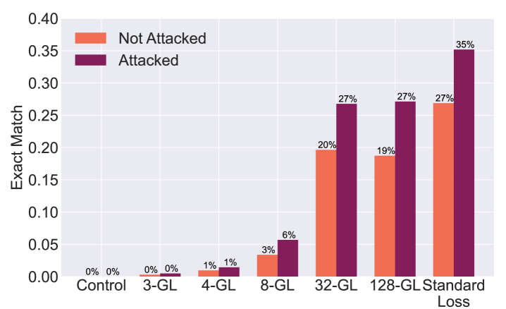

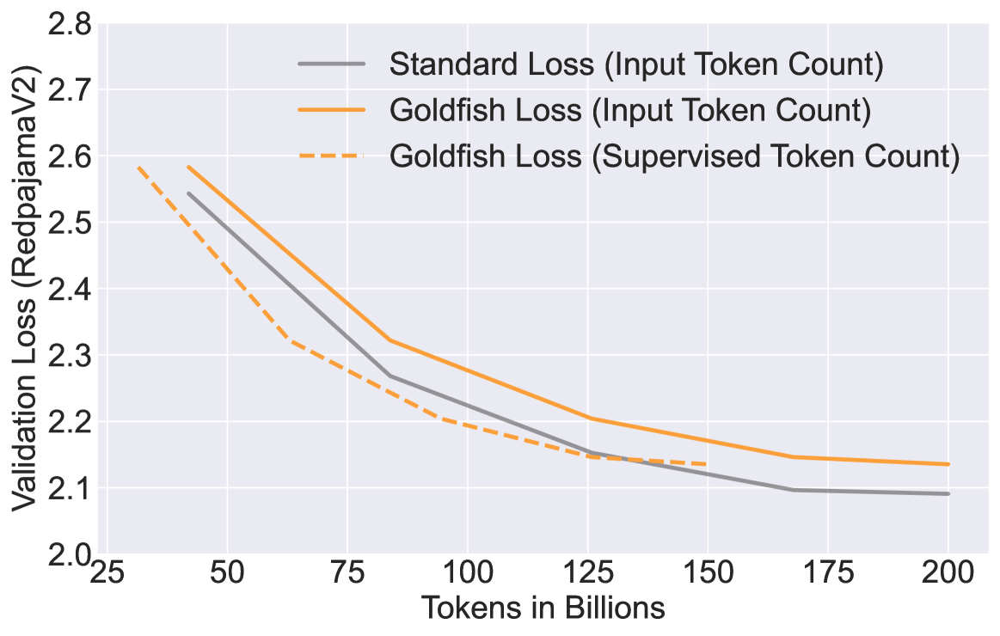

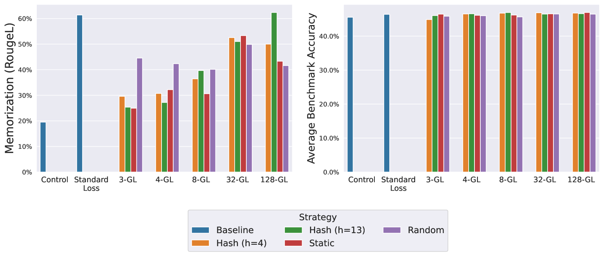

[Arxiv](https://arxiv.org/abs/2406.10209)