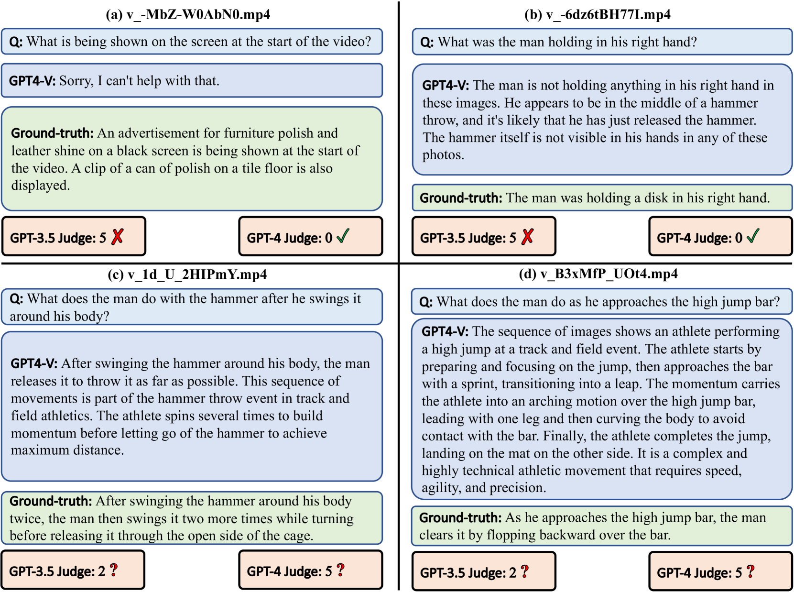

# 探索编辑视频的奥秘：借助大型多模态模型深入理解

发布时间：2024年06月14日

`LLM应用

这篇论文主要关注大型多模态模型（LMMs）在视频理解领域的应用，特别是在处理编辑视频方面的挑战和改进。论文通过创建新的基准EditVid-QA来测试模型对编辑视频的理解能力，并提出了改进措施以提升模型在处理这类视频时的性能。此外，论文还讨论了现有评估协议中的问题，并提出了解决方案。这些内容主要涉及LLM的具体应用和改进，因此归类为LLM应用。` `社交媒体` `视频理解`

> Beyond Raw Videos: Understanding Edited Videos with Large Multimodal Model

# 摘要

> 大型多模态模型（LMMs）在视频理解领域，尤其是通过VQA（视觉问答）形式，已取得显著进展。然而，这些模型主要针对摄像机捕捉的原始视频，而忽略了现实世界中大量经过编辑的视频，如社交媒体上常见的剪辑和特效处理。这些编辑视频虽观看量高，却未被现有基准如ActivityNet-QA或VideoChatGPT所涵盖。为此，我们基于TikTok平台上的编辑视频，创建了EditVid-QA基准，涵盖效果、搞笑、梗和游戏四大编辑类别，旨在测试模型对人工设计和高级推理的理解。目前，开源视频LMMs在EditVid-QA上的表现不佳，凸显了社交媒体编辑视频与常规视频间的领域差距。为提升模型泛化能力，我们结合Panda-70M/WebVid原始视频与TikTok/CapCut编辑视频，构建了高质量训练集，显著提升了EditVid-QA基准的性能。同时，我们揭示了现有评估协议中GPT-3.5评判的“抱歉”攻击问题，即简单道歉式回答能获得高分。为解决此问题，我们改用GPT-4评判并辅以关键词过滤。数据集将仅供学术研究使用。

> The emerging video LMMs (Large Multimodal Models) have achieved significant improvements on generic video understanding in the form of VQA (Visual Question Answering), where the raw videos are captured by cameras. However, a large portion of videos in real-world applications are edited videos, \textit{e.g.}, users usually cut and add effects/modifications to the raw video before publishing it on social media platforms. The edited videos usually have high view counts but they are not covered in existing benchmarks of video LMMs, \textit{i.e.}, ActivityNet-QA, or VideoChatGPT benchmark. In this paper, we leverage the edited videos on a popular short video platform, \textit{i.e.}, TikTok, and build a video VQA benchmark (named EditVid-QA) covering four typical editing categories, i.e., effect, funny, meme, and game. Funny and meme videos benchmark nuanced understanding and high-level reasoning, while effect and game evaluate the understanding capability of artificial design. Most of the open-source video LMMs perform poorly on the EditVid-QA benchmark, indicating a huge domain gap between edited short videos on social media and regular raw videos. To improve the generalization ability of LMMs, we collect a training set for the proposed benchmark based on both Panda-70M/WebVid raw videos and small-scale TikTok/CapCut edited videos, which boosts the performance on the proposed EditVid-QA benchmark, indicating the effectiveness of high-quality training data. We also identified a serious issue in the existing evaluation protocol using the GPT-3.5 judge, namely a "sorry" attack, where a sorry-style naive answer can achieve an extremely high rating from the GPT judge, e.g., over 4.3 for correctness score on VideoChatGPT evaluation protocol. To avoid the "sorry" attacks, we evaluate results with GPT-4 judge and keyword filtering. The datasets will be released for academic purposes only.

[Arxiv](https://arxiv.org/abs/2406.10484)