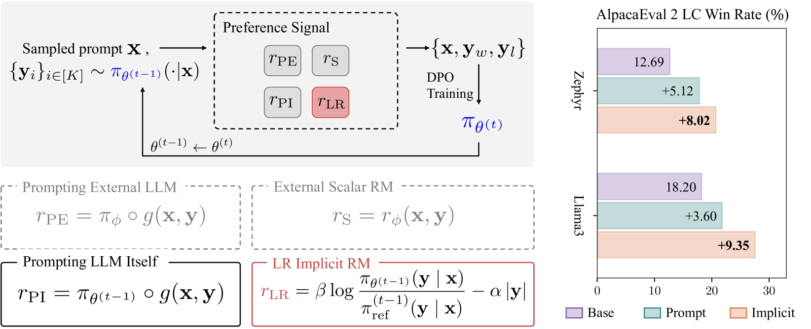

# 利用DPO隐式奖励优化语言模型

发布时间：2024年06月14日

`LLM应用

这篇论文探讨了在大型语言模型（LLMs）中实现人类对齐的问题，并提出了一种名为直接偏好优化（DPO）的新方法。该方法通过跳过传统的人类反馈强化学习（RLHF）中的奖励学习阶段，简化了流程，并利用隐式奖励模型来进一步优化LLM的对齐。这种方法特别强调了通过改进数据集质量和消除响应长度偏差来提升对齐性能。因此，这篇论文属于LLM应用分类，因为它专注于实际应用中的技术和方法改进，以提高LLM与人类偏好的对齐。` `人工智能`

> Bootstrapping Language Models with DPO Implicit Rewards

# 摘要

> 在大型语言模型（LLMs）中实现人类对齐是当前研究的热点。最近，直接偏好优化（DPO）这一创新方法，通过跳过传统人类反馈强化学习（RLHF）中的奖励学习阶段，简化了流程。DPO训练后生成的隐式奖励模型，我们发现它能够自举式地进一步优化LLM的对齐。我们的策略是利用现有LLM的奖励来构建偏好数据集，并在后续DPO迭代中应用。我们通过消除响应长度偏差和提升数据集质量的改进，进一步优化了方法。这种方法，我们称之为DPO隐式奖励驱动的自对齐（DICE），在对齐性能上取得了显著提升，超越了Gemini Pro在AlpacaEval 2上的表现，实现了27.55%的长度控制胜率，对抗GPT-4 Turbo，且仅依赖8亿参数，无需外部反馈。代码已公开于https://github.com/sail-sg/dice。

> Human alignment in large language models (LLMs) is an active area of research. A recent groundbreaking work, direct preference optimization (DPO), has greatly simplified the process from past work in reinforcement learning from human feedback (RLHF) by bypassing the reward learning stage in RLHF. DPO, after training, provides an implicit reward model. In this work, we make a novel observation that this implicit reward model can by itself be used in a bootstrapping fashion to further align the LLM. Our approach is to use the rewards from a current LLM model to construct a preference dataset, which is then used in subsequent DPO rounds. We incorporate refinements that debias the length of the responses and improve the quality of the preference dataset to further improve our approach. Our approach, named self-alignment with DPO ImpliCit rEwards (DICE), shows great improvements in alignment and achieves superior performance than Gemini Pro on AlpacaEval 2, reaching 27.55% length-controlled win rate against GPT-4 Turbo, but with only 8B parameters and no external feedback. Our code is available at https://github.com/sail-sg/dice.

[Arxiv](https://arxiv.org/abs/2406.09760)