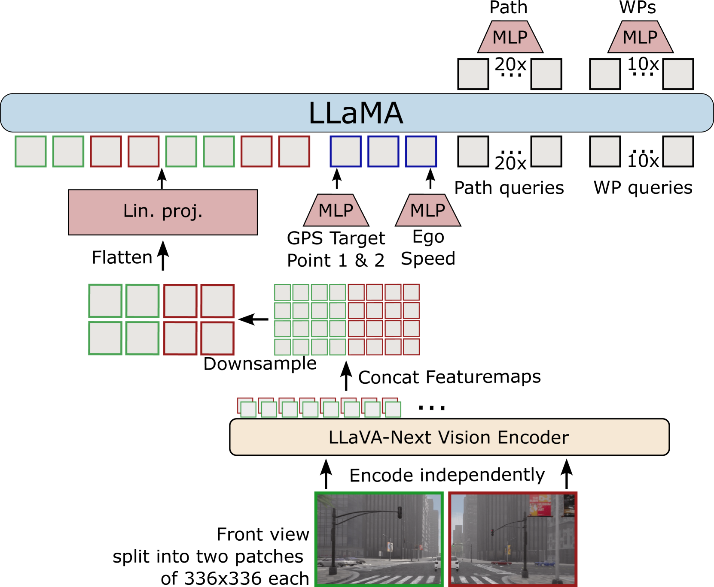

# CarLLaVA：专为仅摄像头闭环驾驶设计的视觉语言模型

发布时间：2024年06月14日

`Agent

理由：这篇论文介绍的CarLLaVA模型是一个专为自主驾驶挑战赛定制的视觉语言模型，它能够根据摄像头输入实现闭环驾驶，并具备预测语言评论的能力。这种模型在实际应用中表现为一个自主决策的Agent，能够处理视觉信息并做出相应的驾驶决策，因此归类为Agent。` `自动驾驶` `视觉语言模型`

> CarLLaVA: Vision language models for camera-only closed-loop driving

# 摘要

> 本报告介绍了CarLLaVA，一款专为CARLA自主驾驶挑战赛2.0定制的视觉语言模型，它融合了LLaVA VLM的视觉编码器与LLaMA架构，仅凭摄像头输入便实现了业界领先的闭环驾驶性能，无需昂贵复杂的标签。此外，我们还初步展示了其伴随驾驶输出预测语言评论的能力。CarLLaVA通过半分离的输出结构，巧妙结合路径预测与航点，以提升横向与纵向控制。我们提出了一种高效训练策略，确保在大规模驾驶数据集上训练时，能有效避免在简单数据上浪费计算资源。CarLLaVA在挑战赛中荣获传感器赛道冠军，性能超越以往最佳技术458%，并领先同期最佳提交32.6%。

> In this technical report, we present CarLLaVA, a Vision Language Model (VLM) for autonomous driving, developed for the CARLA Autonomous Driving Challenge 2.0. CarLLaVA uses the vision encoder of the LLaVA VLM and the LLaMA architecture as backbone, achieving state-of-the-art closed-loop driving performance with only camera input and without the need for complex or expensive labels. Additionally, we show preliminary results on predicting language commentary alongside the driving output. CarLLaVA uses a semi-disentangled output representation of both path predictions and waypoints, getting the advantages of the path for better lateral control and the waypoints for better longitudinal control. We propose an efficient training recipe to train on large driving datasets without wasting compute on easy, trivial data. CarLLaVA ranks 1st place in the sensor track of the CARLA Autonomous Driving Challenge 2.0 outperforming the previous state of the art by 458% and the best concurrent submission by 32.6%.

[Arxiv](https://arxiv.org/abs/2406.10165)