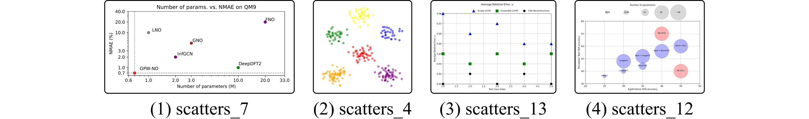
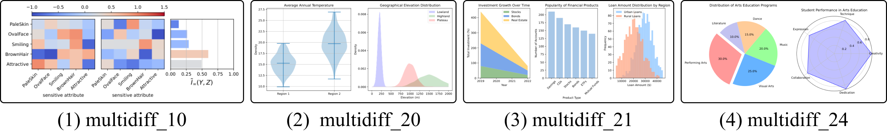
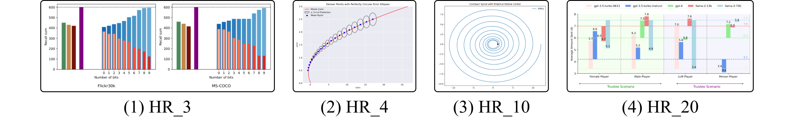
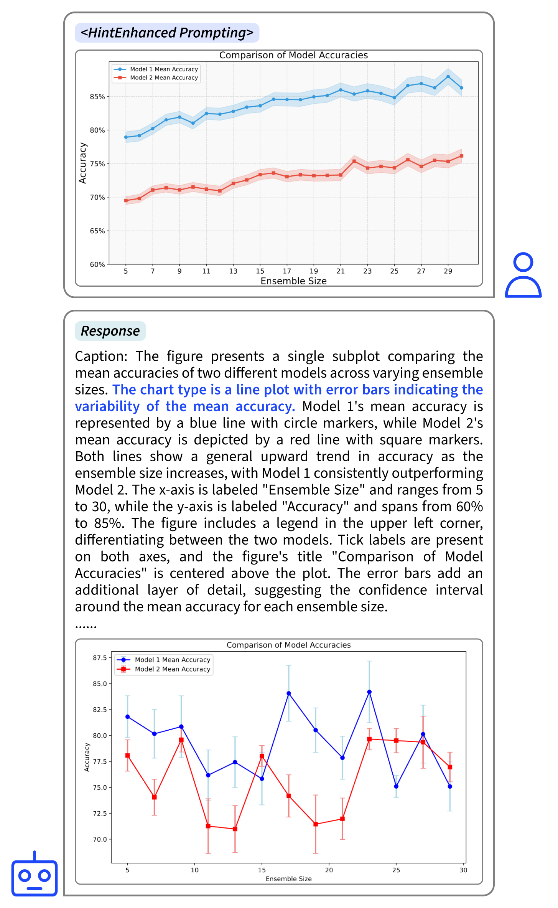

# ChartMimic：借助图表到代码生成，探究LMM的跨模态推理潜能

发布时间：2024年06月14日

`LLM应用

这篇论文介绍了ChartMimic这一基准，专注于评估大型多模态模型（LMMs）在视觉基础上的代码生成能力。它通过提供视觉图表和文本指令，要求模型生成相应的图表渲染代码，并设计了多级评估指标来评价生成的代码和图表。这与LLM应用类别相符，因为它涉及实际应用场景中模型的性能评估和改进，而不是专注于理论研究或Agent的设计与实现。` `数据可视化` `人工智能`

> ChartMimic: Evaluating LMM's Cross-Modal Reasoning Capability via Chart-to-Code Generation

# 摘要

> 我们推出了ChartMimic这一全新基准，旨在检验大型多模态模型（LMMs）在视觉基础上的代码生成能力。该基准通过信息丰富的视觉图表和文本指令作为输入，要求LMMs生成相应的图表渲染代码。ChartMimic收录了1,000组人工精选的（图表、指令、代码）三元组，这些三元组反映了科学论文中跨多个领域（如物理、计算机科学、经济学等）的真实图表应用。图表类型涵盖18种常规及4种高级，细分为191个子类。我们还设计了多级评估指标，以自动且全面地评价生成的代码及渲染的图表。与传统代码生成基准不同，ChartMimic侧重于评估LMMs整合视觉理解、代码生成及跨模态推理等认知能力的能力。对3个专有及11个开放权重模型的评估显示，ChartMimic带来了巨大挑战，即便是顶尖的GPT-4V和Claude-3-opus也仅分别获得73.2和53.7的平均分，表明仍有大幅提升空间。我们期望ChartMimic能推动LMMs的进步，助力通用人工智能的发展。

> We introduce a new benchmark, ChartMimic, aimed at assessing the visually-grounded code generation capabilities of large multimodal models (LMMs). ChartMimic utilizes information-intensive visual charts and textual instructions as inputs, requiring LMMs to generate the corresponding code for chart rendering. ChartMimic includes 1,000 human-curated (figure, instruction, code) triplets, which represent the authentic chart use cases found in scientific papers across various domains(e.g., Physics, Computer Science, Economics, etc). These charts span 18 regular types and 4 advanced types, diversifying into 191 subcategories. Furthermore, we propose multi-level evaluation metrics to provide an automatic and thorough assessment of the output code and the rendered charts. Unlike existing code generation benchmarks, ChartMimic places emphasis on evaluating LMMs' capacity to harmonize a blend of cognitive capabilities, encompassing visual understanding, code generation, and cross-modal reasoning. The evaluation of 3 proprietary models and 11 open-weight models highlights the substantial challenges posed by ChartMimic. Even the advanced GPT-4V, Claude-3-opus only achieve an average score of 73.2 and 53.7, respectively, indicating significant room for improvement. We anticipate that ChartMimic will inspire the development of LMMs, advancing the pursuit of artificial general intelligence.

[Arxiv](https://arxiv.org/abs/2406.09961)