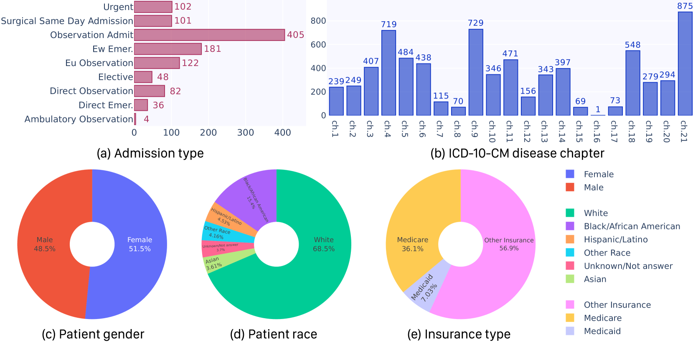
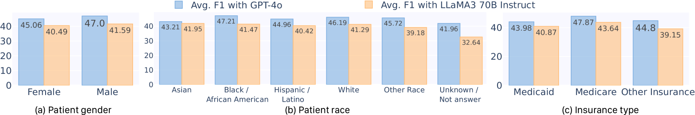
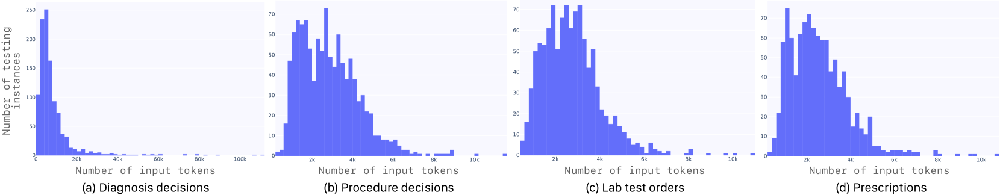
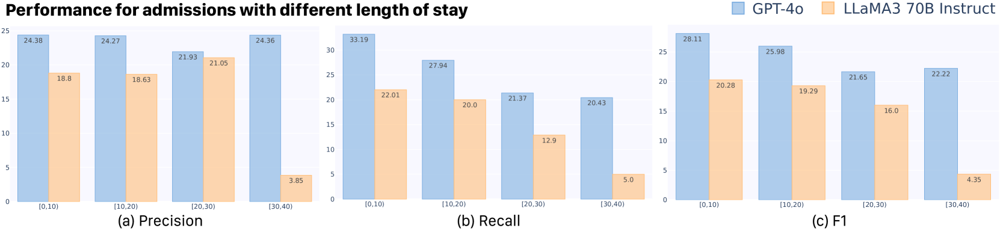
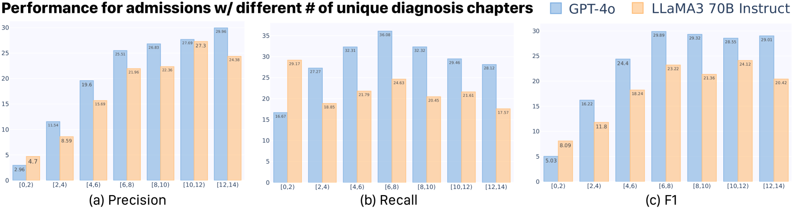
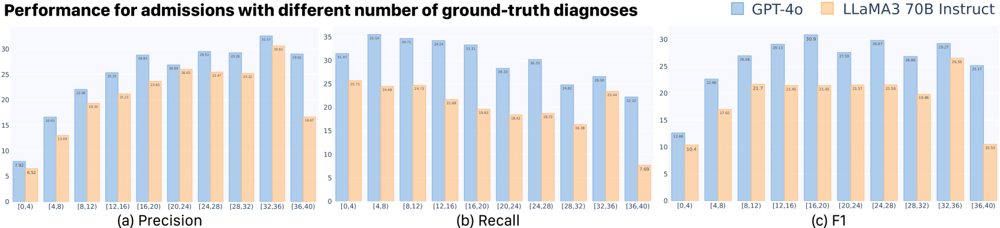

# CliBench：大型语言模型在临床决策领域的全面评估，涵盖诊断、治疗程序、实验室测试及处方等多个方面。

发布时间：2024年06月14日

`LLM应用

这篇论文介绍了CliBench，一个基于MIMIC IV数据集的新基准，用于全面评估大型语言模型（LLMs）在临床诊断中的应用能力。它不仅涵盖了多专业、多病例的诊断，还包括关键临床任务，如治疗程序识别、实验室检测安排及药物处方。通过结构化输出本体，CliBench实现了精准的多级评估，深入分析LLMs在多样临床任务中的表现。论文通过零-shot评估顶尖LLMs，检验其在临床决策中的能力，并揭示了LLMs在临床应用中的潜力与局限。因此，这篇论文属于LLM应用分类。` `临床诊断`

> CliBench: Multifaceted Evaluation of Large Language Models in Clinical Decisions on Diagnoses, Procedures, Lab Tests Orders and Prescriptions

# 摘要

> 将AI，特别是大型语言模型（LLMs）融入临床诊断流程，有望大幅提升医疗服务的效率与可及性。尽管LLMs在医疗领域已显露潜力，但其在临床诊断，尤其是在需做出高度个性化复杂决策的实际临床环境中的应用，仍待深入探索。当前对LLMs的评估多局限于特定疾病或专业，且诊断任务简化。为此，我们推出了CliBench，这一基于MIMIC IV数据集的新基准，全面而真实地评估LLMs在临床诊断中的能力。CliBench不仅覆盖多专业、多病例的诊断，还涉及关键临床任务，如治疗程序识别、实验室检测安排及药物处方。借助结构化输出本体，CliBench实现精准多级评估，深入剖析LLMs在多样临床任务中的表现。我们通过零-shot评估顶尖LLMs，检验其在临床决策中的能力。初步结果揭示了LLMs在临床应用中的潜力与局限，为未来AI医疗的发展提供了重要启示。

> The integration of Artificial Intelligence (AI), especially Large Language Models (LLMs), into the clinical diagnosis process offers significant potential to improve the efficiency and accessibility of medical care. While LLMs have shown some promise in the medical domain, their application in clinical diagnosis remains underexplored, especially in real-world clinical practice, where highly sophisticated, patient-specific decisions need to be made. Current evaluations of LLMs in this field are often narrow in scope, focusing on specific diseases or specialties and employing simplified diagnostic tasks. To bridge this gap, we introduce CliBench, a novel benchmark developed from the MIMIC IV dataset, offering a comprehensive and realistic assessment of LLMs' capabilities in clinical diagnosis. This benchmark not only covers diagnoses from a diverse range of medical cases across various specialties but also incorporates tasks of clinical significance: treatment procedure identification, lab test ordering and medication prescriptions. Supported by structured output ontologies, CliBench enables a precise and multi-granular evaluation, offering an in-depth understanding of LLM's capability on diverse clinical tasks of desired granularity. We conduct a zero-shot evaluation of leading LLMs to assess their proficiency in clinical decision-making. Our preliminary results shed light on the potential and limitations of current LLMs in clinical settings, providing valuable insights for future advancements in LLM-powered healthcare.

[Arxiv](https://arxiv.org/abs/2406.09923)