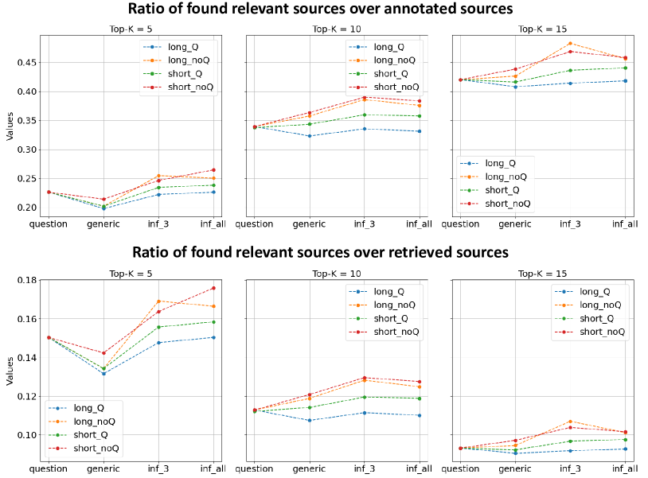

# ClimRetrieve：企业气候披露信息检索的基准数据集

发布时间：2024年06月14日

`RAG

这篇论文主要关注的是检索增强生成（RAG）系统在处理企业气候沟通中的应用，特别是在信息检索和答案生成质量评估方面的研究。论文通过构建特定领域的数据集，并探讨了如何将专家知识融入信息检索过程，这直接关联到RAG系统的性能和应用。因此，这篇论文最适合归类为RAG。` `可持续发展` `气候变化`

> ClimRetrieve: A Benchmarking Dataset for Information Retrieval from Corporate Climate Disclosures

# 摘要

> 在处理企业气候沟通中涌现的海量定性数据时，利益相关者正日益依赖检索增强生成（RAG）系统。然而，对于特定领域信息检索的评估仍显不足，这直接关系到答案生成的质量。为此，本研究通过分析30份可持续发展报告，并针对气候问题提出16个详细疑问，模拟了可持续发展分析师的工作流程。我们构建了一个包含8.5K多个问题-来源-答案对的数据集，并根据相关性进行了细致标注。基于此数据集，我们进一步探讨了如何将专家知识融入信息检索过程，特别是通过嵌入技术。尽管我们展示了专家知识的整合是可行的，但也揭示了嵌入技术在气候变化沟通等知识密集型领域中的潜在局限。

> To handle the vast amounts of qualitative data produced in corporate climate communication, stakeholders increasingly rely on Retrieval Augmented Generation (RAG) systems. However, a significant gap remains in evaluating domain-specific information retrieval - the basis for answer generation. To address this challenge, this work simulates the typical tasks of a sustainability analyst by examining 30 sustainability reports with 16 detailed climate-related questions. As a result, we obtain a dataset with over 8.5K unique question-source-answer pairs labeled by different levels of relevance. Furthermore, we develop a use case with the dataset to investigate the integration of expert knowledge into information retrieval with embeddings. Although we show that incorporating expert knowledge works, we also outline the critical limitations of embeddings in knowledge-intensive downstream domains like climate change communication.

[Arxiv](https://arxiv.org/abs/2406.09818)