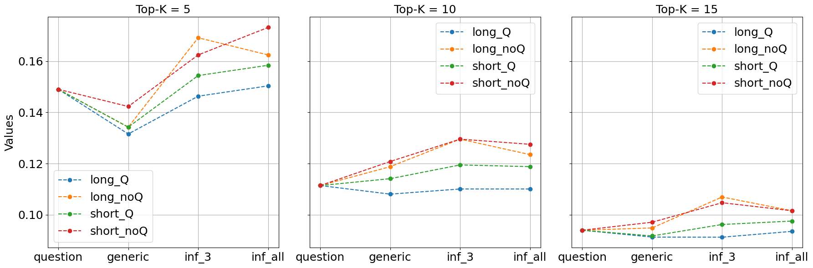
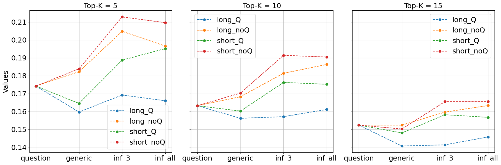
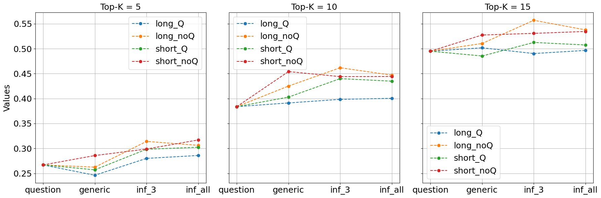

# ClimRetrieve：企业气候披露信息检索的基准数据集

发布时间：2024年06月14日

`RAG

理由：这篇论文主要关注的是检索增强生成（RAG）系统在处理企业气候沟通中的应用，特别是在特定领域信息检索的评估和答案生成方面。论文通过构建数据集和案例研究，探讨了如何将专家知识融入信息检索过程，并分析了嵌入技术在此类知识密集型领域中的应用和局限性。这与RAG系统的功能和应用场景紧密相关，因此归类为RAG。` `气候变化` `可持续发展`

> ClimRetrieve: A Benchmarking Dataset for Information Retrieval from Corporate Climate Disclosures

# 摘要

> 在处理企业气候沟通中涌现的海量定性数据时，利益相关者正日益依赖检索增强生成（RAG）系统。然而，对于特定领域信息检索的评估仍存空白，这直接关系到答案的生成。为此，本研究通过分析30份可持续发展报告，并针对16个气候相关问题，模拟了可持续发展分析师的工作流程。由此，我们构建了一个包含8.5K多个问题-源-答案对的数据集，这些对根据相关性程度进行了标注。我们还基于此数据集开发了一个案例，探讨如何将专家知识融入信息检索，利用嵌入技术。尽管我们展示了专家知识的整合是有效的，但也指出了在气候变化沟通等知识密集型领域中嵌入技术的关键局限。

> To handle the vast amounts of qualitative data produced in corporate climate communication, stakeholders increasingly rely on Retrieval Augmented Generation (RAG) systems. However, a significant gap remains in evaluating domain-specific information retrieval - the basis for answer generation. To address this challenge, this work simulates the typical tasks of a sustainability analyst by examining 30 sustainability reports with 16 detailed climate-related questions. As a result, we obtain a dataset with over 8.5K unique question-source-answer pairs labeled by different levels of relevance. Furthermore, we develop a use case with the dataset to investigate the integration of expert knowledge into information retrieval with embeddings. Although we show that incorporating expert knowledge works, we also outline the critical limitations of embeddings in knowledge-intensive downstream domains like climate change communication.

[Arxiv](https://arxiv.org/abs/2406.09818)