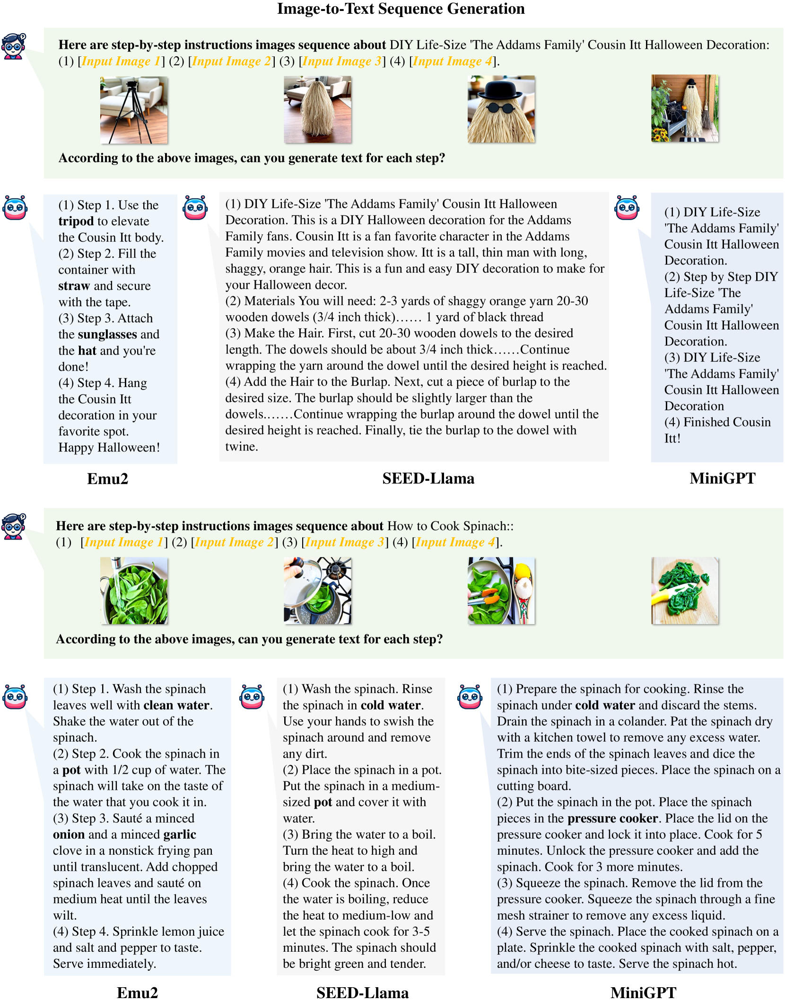

# CoMM：专为多模态理解和生成设计的连贯交错图像-文本数据集

发布时间：2024年06月14日

`RAG

理由：这篇论文主要关注的是多模态大型语言模型（MLLMs）在交错图像-文本生成任务中的应用，特别是通过创建一个高质量的数据集（CoMM）来提升模型的连贯性和一致性。论文中提到的多视角过滤策略和预训练模型的使用，以及对数据集质量的评估，都是为了改进和增强多模态语言模型的性能。这些内容更符合RAG（Retrieval-Augmented Generation）的范畴，即通过增强数据检索来提升生成模型的性能。虽然论文涉及到了LLM的应用，但其核心贡献在于数据集的构建和评估框架的提出，这更偏向于RAG的改进和优化。` `多媒体内容生成`

> CoMM: A Coherent Interleaved Image-Text Dataset for Multimodal Understanding and Generation

# 摘要

> 交错图像-文本生成，这一多模态任务旨在根据查询编织视觉与文本的交响曲。尽管多模态大型语言模型（MLLMs）已取得显著进步，但创造叙事连贯、风格一致的图像-文本序列仍是一大挑战，根源在于训练数据的质量不足。为此，我们推出了CoMM，一个旨在提升多模态内容连贯性与一致性的高质量数据集。CoMM从多元源头汲取原始数据，聚焦教学与视觉叙事，为内容的连贯一致打下基石。我们精心设计的多视角过滤策略，借助预训练模型的力量，确保了句子流畅、图像插入一致及语义的精准对齐。通过一系列质量评估指标，我们验证了过滤后数据集的卓越品质。在多个下游任务上的少量样本实验充分展示了CoMM在提升MLLMs上下文学习能力上的显著成效。我们还提出了四个新任务，以全面评估MLLMs的交错生成能力，并构建了综合评估框架予以支持。我们坚信，CoMM为MLLMs在多模态上下文学习和理解领域的高级发展开辟了新天地。

> Interleaved image-text generation has emerged as a crucial multimodal task, aiming at creating sequences of interleaved visual and textual content given a query. Despite notable advancements in recent multimodal large language models (MLLMs), generating integrated image-text sequences that exhibit narrative coherence and entity and style consistency remains challenging due to poor training data quality. To address this gap, we introduce CoMM, a high-quality Coherent interleaved image-text MultiModal dataset designed to enhance the coherence, consistency, and alignment of generated multimodal content. Initially, CoMM harnesses raw data from diverse sources, focusing on instructional content and visual storytelling, establishing a foundation for coherent and consistent content. To further refine the data quality, we devise a multi-perspective filter strategy that leverages advanced pre-trained models to ensure the development of sentences, consistency of inserted images, and semantic alignment between them. Various quality evaluation metrics are designed to prove the high quality of the filtered dataset. Meanwhile, extensive few-shot experiments on various downstream tasks demonstrate CoMM's effectiveness in significantly enhancing the in-context learning capabilities of MLLMs. Moreover, we propose four new tasks to evaluate MLLMs' interleaved generation abilities, supported by a comprehensive evaluation framework. We believe CoMM opens a new avenue for advanced MLLMs with superior multimodal in-context learning and understanding ability.

[Arxiv](https://arxiv.org/abs/2406.10462)